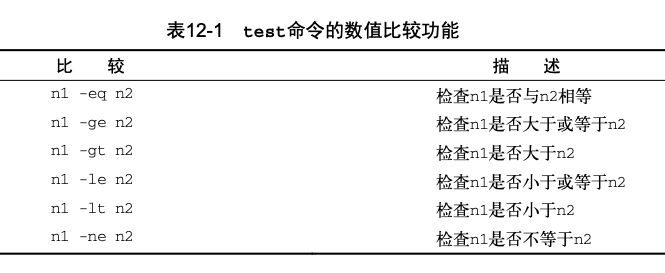
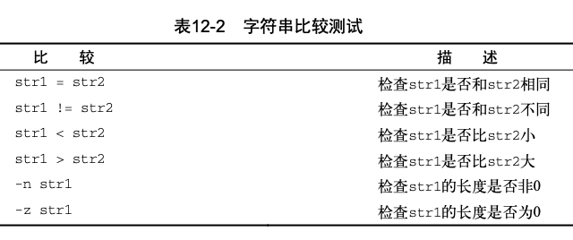
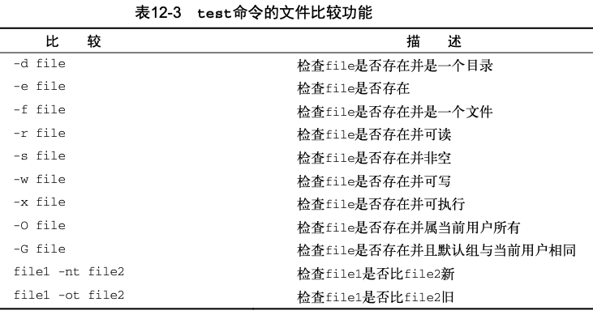

https://blog.csdn.net/yugemengjing/article/details/82469785


https://github.com/oldratlee/useful-scripts/blob/master/docs/shell.md#-a2l


https://www.macs.hw.ac.uk/~hwloidl/Courses/LinuxIntro/x945.html


[Linux命令行与shell脚本编程大全案例](https://github.com/fengyuhetao/shell)


https://github.com/tinyclub/open-shell-book


# 《Linux命令行与shell脚本编程大全-第3版》


## 一、Linux命令行

### 1. 初识Linux shell
Linux的组成：**Linux内核**、**GNU工具**、**图形化桌面环境**、**应用软件**。

内核的四种功能：**系统内存管理**、**软件程序管理**、**硬件设备管理**、**文件系统管理**

**设备文件**（Linux把硬件当成的特殊文件）
**字符型设备文件** - 处理数据时每次只能处理一个字符的设备。如调制解调器和终端。
**块设备文件** -  处理数据时每次能处理大块数据的设备。如硬盘。
**网络设备文件** - 采用数据包发送和接收数据的设备。如网卡，回环设备。

Linux内核采用**虚拟文件系统(Virtual File System，VFS)**作为和每个文件系统交互的接口。

### 2. 基础知识

* **swap space&=** 交换空间
* **page** 页面 	物理内存或交换空间
* `/proc/meminfo`
* **共享内存页面**	 多个进程可在同一块共用内存区域进行读取和写入操作。 
`ipcs -m`
* 系统开机自动启动的进程：  
`/etc/inittab`  
	`/etc/init.d`	`/etc/rcX.d`  
* 硬件设备管理
  - 编译进内核的设备驱动代码
  - 可插入讷河的设备驱动模块
* **设备文件**
  - 字符型 每次只能处理一个字符的设备。如调制解调器和终端。
  - 块设备 每次能处理大块数据的设备。如硬盘。
  - 网络设备	采用数据包发送和接收数据的设备。如网卡，回环设备。
* 设备的 **主设备号** **次设备号**	  
		[root@localhost dev]# ls -al sda* ttyS*
		brw-rw----. 1 root disk    8,  0 Dec 12  2014 sda
		brw-rw----. 1 root disk    8,  1 Dec 12  2014 sda1
		brw-rw----. 1 root disk    8,  2 Dec 12  2014 sda2
		crw-rw----. 1 root dialout 4, 64 Dec 12  2014 ttyS0
		crw-rw----. 1 root dialout 4, 65 Dec 12  2014 ttyS1
		crw-rw----. 1 root dialout 4, 66 Dec 12  2014 ttyS2
		crw-rw----. 1 root dialout 4, 67 Dec 12  2014 ttyS3
		
> mac 的 /proc/meminfo ?

* linux内核采用虚拟文件系统（VFS）作为和每个文件系统交互的接口。当每个文件系统被挂载和是使用时，VFS将信息都缓存在内存中。
* GNU工具链
	- coreutils(core utilities)软件包
		+ 处理文件
		+ 操作文本
		+ 管理进程
	- shell 为用户提供了启动程序，管理文件系统上的文件以及管理运行在Linux系统上的进程的途径。  
	**命令行提示符**  
	**shell**  
* terminfo数据库 （和终端模拟器通信时使用的控制码）  
常见位置：`/usr/share/terminfo`,`/etc/terminfo`,`/lib/terminfo`  
`infocmp`  
	`echo $TERM`	目前使用哪个终端		

### 3. 基本bash shell 命令

#### 3.5 文件和目录列表

* `ls -F` 区分目录和文件
* `ls -R` 列出包含的目录中的文件
* `ls -c` 按最后一次修改时间排序

#### 3.6 处理文件

* `touch` 
* `cp`  
    * `ls -i data_file`  查看inode编号
    *  **软连接（符号链接）**  类似于windows系统中的快捷方式，与硬链接不同，软链接就是一个普通文件，只是数据块内容有点特殊，文件用户数据块中存放的内容是另一文件的路径名的指向  `ln -s data_file sl_data_file`  
    *   **硬链接**：多个文件名指向同一索引节点(Inode)  。  `ln code_file hl_code_file` 

* `mv` 移动、重命名
*  `rm -i file`   -i提示是不是真的要删除。bash shell中没有回收站。

#### 3.7 处理目录
- mkdir
- rmdir
- `rm -ri My_Dir`  -r进入目录
`rm -rf`  谨慎使用

#### 3.8 查看文件内容
-  `stat` 查看文件信息
-  `file my_file`
-  `cat -n`  加行号
`cat -b`   只给文本加行号
`cat -T`  去除制表符
- `more`
- `less`
- `tail -n 2 log_file`
-  `head`

### 4. 更多bash shell 命令

#### 4.1 监测程序  
  + `ps`  只显示某个特定时间点的信息
    
     * `ps -ef` 查看所有进程的完整形式
     * `ps -l`	更多信息
  * `ps -H`  简单的树状形式	

+ 实时监测进程
     - linux系统管理的要点在于*如何定义系统的高负载*
     - `top`
  + 结束进程
  	 - xnix系统通过向运行的进程发送*进程信号*来已特定方式结束进程
  	 - `kill -l` 可以查看linux上的进程信号，默认是15-TERM-尽可能终止，1-HUP-挂起，2-INT-中断等
  	 - `kill -s HUP 3940` kill只能识别进程号，通过ps或top命令查看进程是否停止
  	 - `killall http*` 可通过进程名，或者通配符。**当用root登陆时，注意**

#### 4.2 监测磁盘空间

  + 挂载存储媒体
     - `mount` 
     
       提供四种信息：媒体的设备文件名，挂载点，文件系统类型，访问状态。如： `dev/sda1 on /boot type xfs (rw,relatime,seclabel,attr2,inode64,noquota)`
     
       `mount -t vfat /dev/sdb1 /media/disk` 把设备/dev/sdb1以vfat文件系统挂载到/media/disk上
     
       `mount -t iso9660 -o loop test.iso /mnt` 把test.iso文件挂载到/mnt上，`-o loop`代表挂载一个文件
     
     - `umount /mnt` 或 `umount test.iso` 卸载文件test.iso
  - `df`
  - `du -s 目录名` 查看目录的文件总大小

#### 4.3 处理数据文件
  - 排序数据
  	  + `sort tmp.txt` 以文件每行的的字符排序显示
  	  +  `sort -n tmp.txt` 把数字识别成字符而不是字符
  	  +  `sort -t ':' -k 3 -n /etc/passwd` 对/etc/passwd的每行以：分隔，再议分隔后的第三个参数排序显示
  	  +  `sort -sh | sort -nr` r是降序的意思
  - 搜索数据
     + `grep RPC /etc/passwd` 匹配/etc/passwd中 含有RPC的行
     + `grep -v RPC /etc/passwd` 反向匹配
     + `grep -n RPC /etc/passwd` 显示行号
     + `grep -c RPC /etc/passwd` 显示多少行匹配
     + `grep -e t -e f /etc/passwd` 匹配含有字符t或者f的行。类似的正则 `grep [tf] /etc/passwd`
     + grep的两个衍生版本 `egrep` `fgrep`
  - 压缩数据
     + bzip2工具 .bz2
         * `bzip2`
         * `bzcat`
         * `bunzip2`
         * `bzip2recover`
     + gzip 工具 .gz
         * `gzip`
         * `gzcat`
         * `gunzip`
     + zip工具 .zip
     	 * `zip`
     	 * `zipcloak`
     	 * `zipnote`
     	 * `zipsplit`
     	 * `unzip`
     + compress .Z 
  - `tar`   归档数据


### 5. 理解shell


#### 5.1 shell的类型


#### 5.2 shell的父子关系


```shell
andyron@Mac  ~  ps -f
  UID   PID  PPID   C STIME   TTY           TIME CMD
  501 73656 73654   0 11:33下午 ttys000    0:00.04 /Applications/iTerm.app/Contents/MacOS/iTerm2 --server login -fp andyron
  501 73658 73657   0 11:33下午 ttys000    0:00.29 -zsh
 andyron@Mac  ~  bash

The default interactive shell is now zsh.
To update your account to use zsh, please run `chsh -s /bin/zsh`.
For more details, please visit https://support.apple.com/kb/HT208050.
bash-3.2$ ps -f
  UID   PID  PPID   C STIME   TTY           TIME CMD
  501 73656 73654   0 11:33下午 ttys000    0:00.04 /Applications/iTerm.app/Contents/MacOS/iTerm2 --server login -fp andyron
  501 73658 73657   0 11:33下午 ttys000    0:00.32 -zsh
  501 73704 73658   0 11:33下午 ttys000    0:00.01 bash
bash-3.2$ exit
exit
 andyron@Mac  ~ 
```


##### 进程列表

`$ pwd ; ls ; cd /etc ; pwd ; cd ; pwd ; ls`

`$ (pwd ; ls ; cd /etc ; pwd ; cd ; pwd ; ls)`

圆括号让命令列表变成了进程列表，生成一个子shell来执行对应的命令。花括号就不会创建子shell。

```shell
 andyron@Mac  ~  pwd; ls ; echo $ZSH_SUBSHELL
/Users/andyron
Applications                    Downloads                       Music                           Virtual Machines.localized
Desktop                         Library                         Pictures                        java_error_in_pycharm_41500.log
Documents                       Movies                          Public                          myfield
0
 andyron@Mac  ~  (pwd; ls ; echo $ZSH_SUBSHELL)
/Users/andyron
Applications                    Downloads                       Music                           Virtual Machines.localized
Desktop                         Library                         Pictures                        java_error_in_pycharm_41500.log
Documents                       Movies                          Public                          myfield
1
```

##### 别出心裁的子shell用法

###### 后台模式

```shell
$ sleep 30&
[1] 28910
$ ps -f
  UID   PID  PPID   C STIME   TTY           TIME CMD
  501   501   373   0 日08上午 ttys000    0:00.05 /Applications/iTerm.app/Contents/MacOS/iTerm2 --server login -fp andyron
  501   505   504   0 日08上午 ttys000    0:01.19 -zsh
  501  8364   373   0 日06下午 ttys001    0:00.09 /Applications/iTerm.app/Contents/MacOS/iTerm2 --server login -fp andyron
  501  8366  8365   0 日06下午 ttys001    0:03.20 -zsh
  501 28910  8366   0  2:43下午 ttys001    0:00.00 sleep 30
$ jobs
[1]  + running    sleep 30
$ jobs -l
[1]  + 28910 running    sleep 30
$ 
[1]  + 28910 done       sleep 30
```

###### 将进程列表置入后台


###### 协程


#### 5.3 理解shell的内建命令

#####  **外部命令**（也称文件系统命令）

  通常位于`/bin/`，`/urs/bin`， `/sbin`， `/usr/sbin`

  `which`, `type`  能找到外部命令的位置

  <font color=#FF8C00>**衍生（forking）**</font>：**外部命令执行时，会创建一个子进程。**

```bash
$ ps -f
UID         PID   PPID  C STIME TTY          TIME CMD
andyron    1453   1452  0 22:37 pts/0    00:00:00 -bash
andyron    1473   1453  7 22:38 pts/0    00:00:00 ps -f
```


##### **内建命令**

内建命令不需要使用子进程，他是shell的组成部分。不需要借助外部程序文件来运行

```shell
$ type cd
cd is a shell builtin
```

cd, exit, history, alias等都是内建命令。

另外echo,pwd既有内建命令也有外部命令。

```bash
$ which echo
/bin/echo
$ type -a echo
echo is a shell builtin
echo is /bin/echo
```


### 6.Linux环境变量

#### 6.1 环境变量：

**环境变量**：存储有关shell会话和工作环境的信息

**全局环境变量**：在shell会话和所有生成的子shell都可见

**局部环境变量**：只对创建它的shell可见

系统环境变量用**全大写字母**，普通用户创建的用**全小写字母**。

- 显示个别环境变量

  `printenv HOME`

  `env HOME`

  `echo $HOME`

  加上`$`时，可以让变量作为命令行参数： `ls $HOME`  

+ `set` ,`env`,`printenv`区别

  `set`：全局变量、局部变量、用户自定义变量，并且排序

  `env`,`printenv`：全局变量，不排序

#### 6.2 设置用户自定义变量

```bash
$ echo $my_variable

$ my_variable=Hello 
$
$ echo $my_variable 
Hello
```

变量赋值时如有空格的字符串值，必须用引号界定首尾，否则shell会以为下一个词是另一个要执行的命令。变量名、等号和值之间也没有空格。

```bash
$ my_variable=Hello World 
-bash: World: command not found 
$
$ my_variable="Hello World"
$
$ echo $my_variable
Hello World
$
```

全局环境变量的设置是􏲟􏱷􏱸􏰨􏱆􏳍􏳎􏳁􏳂􏳃􏳄􏰾􏶇􏳯􏵕􏶺􏲭􏷶􏶈􏲱􏰖􏳍􏳁􏳂􏰤􏰣􏲟􏱷􏱸􏰨􏱆􏳍􏳎􏳁􏳂􏳃􏳄􏰾􏶇􏳯􏵕􏶺􏲭􏷶􏶈􏲱􏰖􏳍􏳁􏳂􏰤􏰣先创建一个局部环境变量，然后使用`export`导出。

```bash
$ my_variable="I am Global now" $
$ export my_variable
```

**修改子shell中全局环境变量并不会影响到父shell中该变量的值。**

#### 6.3 删除环境变量

```bash
$ echo $my_variable 
I am Global now
$
$ unset my_variable
```

**如果要用到变量，使用$；如果要操作变量，不使用.**

#### 6.4 设置PATH环境变量

```bash
$ PATH=$PATH:/home/christine/Scripts
```

如果希望子shell也能用你的程序位置，一定要记得把PATH导出。

对PATH的修改只能持续到退出或重启系统。

#### 6.5 定位系统环境变量  

登入Linux系统启动一个bash shell时，默认会在几个**启动文件（环境文件）**中查找命令。

不同启动bash shell的方式，bash启动的文件不同。三种启动bash shell的方式：

- 登录shell
- 交互式shell
- 非交互式shell

##### 登录shell

正常登录Linux系统，bash shell作为登录shell启动，会从5个文件里读取命令：

```bash
/etc/profile
􏰓$HOME/.bash_profile 􏰓 
$HOME/.bashrc
􏰓$HOME/.bash_login 􏰓 
$HOME/.profile
```

`/etc/profile`是主启动文件，每一个用户登录都会执行。不同发行版Linux系统，`/etc/profile`内容会有不同，不过一般都会迭代执行`/etc/profile.d`目录下的所有文件。

centOS  `/etc/profile.d`文件一般是：

```bash
$ ls -l /etc/profile.d
total 80
-rw-r--r--. 1 root root 1127 Mar 5 07:17 colorls.csh
-rw-r--r--. 1 root root 1143 Mar 5 07:17 colorls.sh
-rw-r--r--. 1 root root 92 Nov 22 2013 cvs.csh
-rw-r--r--. 1 root root 78 Nov 22 2013 cvs.sh
-rw-r--r--. 1 root root 192 Feb 24 09:24 glib2.csh
-rw-r--r--. 1 root root 192 Feb 24 09:24 glib2.sh
-rw-r--r--. 1 root root 58 Nov 22 2013 gnome-ssh-askpass.csh 
-rw-r--r--. 1 root root 70 Nov 22 2013 gnome-ssh-askpass.sh 
-rwxr-xr-x. 1 root root 373 Sep 23 2009 kde.csh
-rwxr-xr-x. 1 root root 288 Sep 23 2009 kde.sh
-rw-r--r--. 1 root root 1741 Feb 20 05:44 lang.csh
-rw-r--r--. 1 root root 2706 Feb 20 05:44 lang.sh
-rw-r--r--. 1 root root 122 Feb 7 2007 less.csh
-rw-r--r--. 1 root root 108 Feb 7 2007 less.sh
-rw-r--r--. 1 root root 976 Sep 23 2011 qt.csh
-rw-r--r--. 1 root root 912 Sep 23 2011 qt.sh
-rw-r--r--. 1 root root 2142 Mar 13 15:37 udisks-bash-completion.sh 
-rw-r--r--. 1 root root 97 Apr 5 2012 vim.csh
-rw-r--r--. 1 root root 269 Apr 5 2012 vim.sh
-rw-r--r--. 1 root root 169 May 20 2009 which2.sh
$
```

这个目录里文件大体分为两类：一类供bash shell使用，一类供c shell使用。

其它四个在用户目录下的启动文件，一般只用到一到两个。


##### 交互式shell

不是登录系统启动的，而是在命令行输入`bash`启动的shell叫做**交互式shell**。这种情况下，不会访问`/etc/profile`文件，只会检查用户HOME目录中的`.bashrc`文件。

```bash
$ cat ~/.bashrc

#
# Source global definitions 
if [ -f /etc/bashrc ]; then
	. /etc/bashrc
fi
# User specific aliases and functions
$
```

`~/.bashrc`文件两个作用：

- 查看`/etc`下的通用bashrc文件
- 为用户提供一个定制自己的命令别名和私有函数的地方

##### 非交互shell

系统执行shell脚本时用的就是这种shell。


##### 环境变量持久化

不放在`/etc/profile`中，因为系统升级后这个文件会被更新，最好是在`/etc/profile.d`目录中创建一个以.sh结尾的文件，把所有新的或修过过的全局环境变量设置放在这个文件中。


#### 6.6 数组变量

```bash
$ mytest=(one two three four five)
$ echo ${mytest[2]} 
three
$ echo ${mytest[*]}
one two three four five
$
$ mytest[2]=seven
$
$ echo ${mytest[*]}
one two seven four five
$ unset mytest[2]
$
$ echo ${mytest[*]} one two four five
```

`ps -f`	  


### 7.Linux文件权限

#### 7.1 Linux的安全性

`/etc/passwd` 用户有关的信息

```shell
mysql:x:27:27:MySQL Server:/var/lib/mysql:/bin/bash
```

**系统账户**  UID<500

`/etc/shadow`   密码单独保存，只有root能访问这个文件。

```shell
rich:$1$.FfcK0ns$f1UgiyHQ25wrB/hykCn020:11627:0:99999:7:::
```

##### 添加新用户

`useradd`  使用系统的默认值以及命令行参数来设置用户账户。

`useradd -D`  查看这些默认值。

```shell
# useradd -D
GROUP=100
HOME=/home
INACTIVE=-1
EXPIRE=
SHELL=/bin/bash
SKEL=/etc/ske1
CREATE_MAIL_SPOOL=yes
```

倒数第二行的意思是：系统会将`/etc/ske1`目录下的内容复制到用户的HOME目录下。

```shell
# useradd -m test
# ls -al /home/test
total 24
drwxr-xr-x 2 test test 4096 2010-09-23 19:01 .
drwxr-xr-x 4 root root 4096 2010-09-23 19:01 ..
-rw-r--r-- 1 test test 220 2010-04-18 21:51 .bash_logout 
-rw-r--r-- 1 test test 3103 2010-04-18 21:51 .bashrc 
-rw-r--r-- 1 test test 179 2010-03-26 08:31 examples.desktop 
-rw-r--r-- 1 test test 675 2010-04-18 21:51 .profile
```

##### 删除用户

`userdel`  只会删除`/etc/passwd`中的用户信息

`userdel -r` 会删除用户的HOME目录以及邮件目录

##### 修改用户

`usermod`

`passwd`

`chpasswd`

`chage`

`chfn`

`chsh`

#### 7.2 使用Linux组

`etc/group`

##### 创建新组

`groupadd`

##### 修改组

`groupmod`


#### 7.3 理解文件权限

**文件权限符**

`-`  d l c b n

**访问权限**

r w x


#### 7.4 改变安全性设置

##### 改变权限

`chmod options mode file`

`chmod 760 newfile`

`chmod o+r newfile`

u􏳭􏰲􏱔􏳽 用户
􏳬g􏳭􏰲􏱄 组
􏳬o􏳭􏰲􏱲 其它
a􏳭􏰲􏱐􏱧􏲅􏰚 上述所有

##### 改变所属关系

`chown options owner[.group] file`

`chown dan newfile`   

`chown .shared newfile`

`chown dan.shared newfile`   同时改变文件的属主和属组


#### 7.5 共享文件

Linux系统上共享文件的方法是创建组。


### 8 管理文件系统


#### 8.1 探索Linux文件系统

**Linux的文件系统为硬盘中存储的0、1和应用中使用的文件与目录之间搭建了一座桥梁。**

##### 基本文件系统

1. 扩展文件系统（extended filesystem, **ext**）

   Linux通过唯一的数值（称作**索引节点号**）来引用**索引节点表**中的每个**索引节点**。

2. **ext2**

3. 日志文件系统

   **ext3**

   **ext4**

   **Reiser文件系统**

   **JFS文件系统**

   **XFS**

4. 写时复制文件系统

   ZFS文件系统

   Btrf文件系统

#### 8.2 操作文件系统

##### 创建分区

`fdisk`

##### 创建文件系统

##### 文件系统的检查与修复

`fsck`


#### 8.3 逻辑卷管理

Linux逻辑卷管理器（logical volume manager, **LVM**）


### 9 安装软件程序

包管理系统(package management system, **PMS**)

#### 9.1 包管理基础

PMS的数据库记录：

- Linux系统上已安装了什么软件包
- 每个包安装了什么文件
- 每个已安装软件包的版本


#### 9.2 基于Debian系统

`dpkg`

`apt-get`

`apt-cache`

`aptitude`

#### 9.3 基于Red Hat系统

`yum`

`urpm`

`zypper`

#### 9.4 从源码安装

`tar` -> `./configure` -> `make` -> `make install`


### 10 使用编辑器

#### Vim

#### nano编辑器

#### emacs编辑器

#### KDE系编辑器

#### GNOME编辑器


## 二、shell脚本编程基础

### 11 构建基本脚本

#### 11.1 使用多个命令

`$ date;who`

#### 11.2 创建shell脚本文件

```shell
#!/bin/bash
date
who
```

让shell找到命令的脚本，两种方法：

- 将脚本目录添加的`PATH`环境变量中
- 使用绝对或相对文件路径

#### 11.3 显示消息

`echo`


#### 11.4 使用变量

环境变量

用户变量

##### 命令替换

将命令输出赋给变量：

```shell
testing=`date`
testing=$(date)
```

```shell
#!/bin/bash

today=$(date +%Y%m%d)
ls -al /usr/bin > log.$today
```


#### 11.5 重定向输入和输出

##### 输出重定向

`command > outputfile`  覆盖

`command >> outputfile`   追加


##### 输入重定向

``command < outputfile``

```shell
$ wc < test6   #行数 词数  字节数
3      16     112
```

**<u>内联输入重定向</u>**

#### 11.6 管道

将一个命令的输出作为另一个命令的输入

`command1 | command2`

`ls /usr/bin | sort | less`

#### 11.7 执行数学表达式

##### expr

`$ expr 1 + 5`


##### 使用方括号

```shell
$ var1=$[1 + 5]
$ echo $var1
6
$ var2=$[$var1 * 2]
$ echo $var2
12
```

##### 浮点解决方案

1. `bc`计算器
2. 在基本中使用bc

`varibale=$(echo "options; expression" | bc)`

```shell
#!/bin/bash
var1=100
var2=45
var3=$(echo "scale=4; $var1 / $var2" | bc)
echo 答案是$var3
```

#### 11.8 退出脚本

shell中运行的每个命令都使用**退出状态码(exit status)**（0~255）告诉shell它已运行完毕。

`$?`

```shell
$ date
2019年 9月21日 星期六 10时26分24秒 CST
$ echo $?
0

$ dfd
zsh: command not found: dfd
$ echo $?
127
```


可以通过`exit`命令修改退出状态码。


### 12 使用结构化命令


#### 12.1 if-then

```
if command 
then
	commands
fi
```

command命令成功运行（退出状态码为0）时，then的命令commands就被执行。

另一种表示方式：

```
if command; then 
	commands
fi
```

```shell
#! /bin/bash
# test the if statment

if pwd
then
  echo "It worked"
fi
```

```shell
#! /bin/bash
# 测试then中的多命令

testUser=andyron

if grep $testUser /etc/passwd
then
  echo "This is my first command"
  echo "This is my second command"
  echo "显示用户bash相关文件："
  ls -a /home/$testUser/.b*
fi
```


#### 12.2 if-then-else

```
if command 
then
  commands
else
  commands
fi
```

```shell
#! /bin/bash
# 测试else

testUser=andyron2

if grep $testUser /etc/passwd
then
  echo "用户$testUser的bash相关文件："
  ls -a /home/$testUser/.b*
  echo
else
  echo "系统中不存在用户$testUser."
  echo
fi
```


#### 12.3 嵌套if

if-then-else􏲟􏴨􏿢语句的else代码块中可以嵌套if-then语句。􏴶􏵛􏶝􏻀

```shell
#! /bin/bash
# 测试嵌套if

testUser=NoSuchUser

if grep $testUser /etc/passwd
then
  echo "系统中存在用户$testUser。"
else
  echo "系统中不存在用户$testUser."
  if ls -d /home/$testUser/
  then
    echo "但是，$testUser用户有一个用户目录。"
  fi
fi
```

else部分的另一种形式： **elif**。

```
if command1 
then
  commands 
elif command2 
then
  more commands 
fi
```

```shell
#! /bin/bash
# 测试嵌套if,使用elif

testUser=andyron2

if grep $testUser /etc/passwd
then
  echo "系统中存在用户$testUser。"
elif ls -d /home/$testUser/
then
  echo "系统中不存在用户$testUser."
  echo "但是，$testUser用户有一个用户目录。"
else
  echo "系统中不存在用户$testUser."
  echo "而且，$testUser用户也没有用户目录。"
fi
```

当然也可以将多了elif语句穿起来使用。(可以被之后的case替代)

```
if command1 
then
  command set 1 
elif command2
then
  command set 2 
elif command3 
then
  command set 3 
elif command4 
then
  command set 4
fi
```


#### 12.4 **test**􏴦􏴧命令

if-then语句只能用于测试**命令退出状态码**。其它就要是test命令了。

```
if test condition 
then
  commands
fi
```

如果test命令中列出的条件成立，test命令就会退出并返回退出状态码0。

```shell
#! /bin/bash
# 测试 test命令

my_var="Full"

if test $my_var
then
  echo "表示式$my_var 的返回结果是True"
else
  echo "表示式$my_var 的返回结果是False"
fi
```

另一种条件测试方法（注意[]中的空格）：

```
if [ condition ]
then 
  commands
fi
```

test􏱖􏸛􏱡􏼡􏽵􏽷􏵍􏲻􏴭􏴖􏰨命令的三类条件判断：数值比较，字符串比较，文件比较


##### 数值比较 􏲉 􏲾􏵦􏸒􏴔􏶣

 􏲉 􏿝􏴖􏴔􏶣

```shell
#! /bin/bash
# test命令的数值比较

value1=10
value2=11

if [ $value1 -gt 5 ]
then
  echo "值$value1大于(greater than) 5。"
fi

if [ $value1 -eq $value2 ]
then
  echo "两个值是相等的(equal)。"
else
  echo "两个值不相等。"
fi
```

bash shell只能处理整数。下面浮点数的条件测试是不行的：

```shell
#! /bin/bash
# 测试浮点数比较

value1=5.555

echo "测试的浮点数是：$value1"

if [ $value1 -gt 5 ]
then
 echo "测试的数$value1是大于5的。"
fi
```

```shell
$ ./floating_point_test.sh
测试的浮点数是：5.555
./floating_point_test.sh: line 8: [: 5.555: integer expression expected
```


##### 字符串比较



```shell
#! /bin/bash
# 字符串相等测试

testUser=badUser


if [ $USER != $testUser ]
then
  echo "当前用户不是$testUser"
else
  echo "Welcome $testUser"
fi
```


??

##### 文件比较

􏳯􏺡􏿬􏿭

文件比较测试是shell编程中最为强大、使用最多的比较形式。

1. 检查目录

```shell
// test11.sh

#!/bin/bash
# 检查目录
 
jump_directory=/home/arthur 

if [ -d $jump_directory ] 
then
	echo "The $jump_directory directory exists" 
	cd $jump_directory
	ls
else
	echo "The $jump_directory directory does not exist"
fi 
```


2. 检查对象是否存在

```shell
// test12.sh

#! /bin/bash
# 检查对象是否存在

location=$HOME
file_name="sentinel"

if [ -e $location ]
then #Directory does exist
  echo "OK on the $location directory."
  echo "Now checking on the file, $file_name."

  if [ -e $location/$file_name ]
  then #File does exist
    echo "OK on the filename"
    echo "Updating Current Date..."
    date >> $location/$file_name
  else #File does not exist
    echo "File does not exist"
    echo "Nothing to update"
  fi

else   #Directory does not exist
  echo "The $location directory does not exist."
  echo "Nothing to update"
fi
```

3. 检查文件

```shell
// test13.sh

#! /bin/bash

item_name=$HOME
echo
echo "正在检查的是：$item_name"
echo

if [ -e $item_name ]
then
  echo "$item_name是存在的。"
  echo "但是否是文件呢？"
  echo 
  if [ -f $item_name ]
  then 
    echo "Yes, $item_name是一个文件。"
  else
    echo "No, $item_name不是一个文件。"
  fi
else
  echo "$item_name不存在。"
fi
```


4. 检查是否可读

```shell
// test14.sh

#! /bin/bash
# 测试是否为可读文件

pwfile=/etc/shadow


if [ -f $pwfile ]
then
  if [ -r $pwfile ]
  then
    tail $pwfile
  else
    echo "Sorry, 不能阅读$pwfile文件"
  fi
else
  echo "Sorry, 文件$pwfile不存在"
fi
```


5. 检查空文件

```shell
// test15.sh

#! /bin/bash
# 检查空文件

file_name=$HOME/sentinel

if [ -f $file_name ]
then
  if [ -s $file_name ]
  then
    echo "$file_name是存在的，并且不为空。"
  else
    echo "$file_name存在，但为空。"
  fi
else
  echo "文件$file_name不存在。"
fi
```


6. 检查是否可写


7. 检查文件是否可以执行


8. 检查所属关系

```shell
// test18.sh

# 检查所属关系

if [ -O /etc/passwd ] # 检查文件或目录是否属于当前用户
then
  echo "/etc/passwd 属于当前用户$USER。"
else
  echo "/etc/passwd 不属于当前用户。"
fi
```


9. 检查默认属组关系


10. 检查文件日期


#### 12.5 复合条件测试

```
 [ condition1 ] && [ condition2 ]
􏲉 [ condition1 ] || [ condition2 ]
```

```shell
if [ -d $HOME ] && [ -w $HOME/testing ]
```


#### 12.6 if-then的高级特性

##### 使用双圆括号(可以使用更多的数学表达式)

```
(( expression ))
```


```shell
$ cat test23.sh
#!/bin/bash
# using double parenthesis 

val1=10

if (( $val1 ** 2 > 90 )) then
(( val2 = $val1 ** 2 ))
echo "The square of $val1 is $val2" 
fi

$ ./test23.sh
The square of 10 is 100
```


##### 使用双方括号(字符串比较的高级特效)

```
[[ expression ]]
```


#### 12.7 case命令

```
case variable in
pattern1 | pattern2) commands1;; 
pattern3) commands2;;
*) default commands;;
esac
```


```shell
#! /bin/bash
# case

case $USER in
rich | andyron)
  echo "Welcom, $USER"
  echo "Please enjoy your visit";;
testing)
  echo "特殊的测试账号";;
andyron2)
  echo ".....";;
esac
```


### 13 更多的结构化命令

#### 13.1 for

```
for var in list 
do
  commands
done
```

```shell
#! /bin/bash

for test in 江苏 浙江 山东 安徽 广东 黑龙江 河南 河北 吉林 福建 台湾 广西 云南 四川 新疆
do
 echo "有一个省份的名字叫$test"
done

echo "最后一个省份是$test"

test=上海

echo "现在test是$test"
```

??


### 14 处理用户输入


