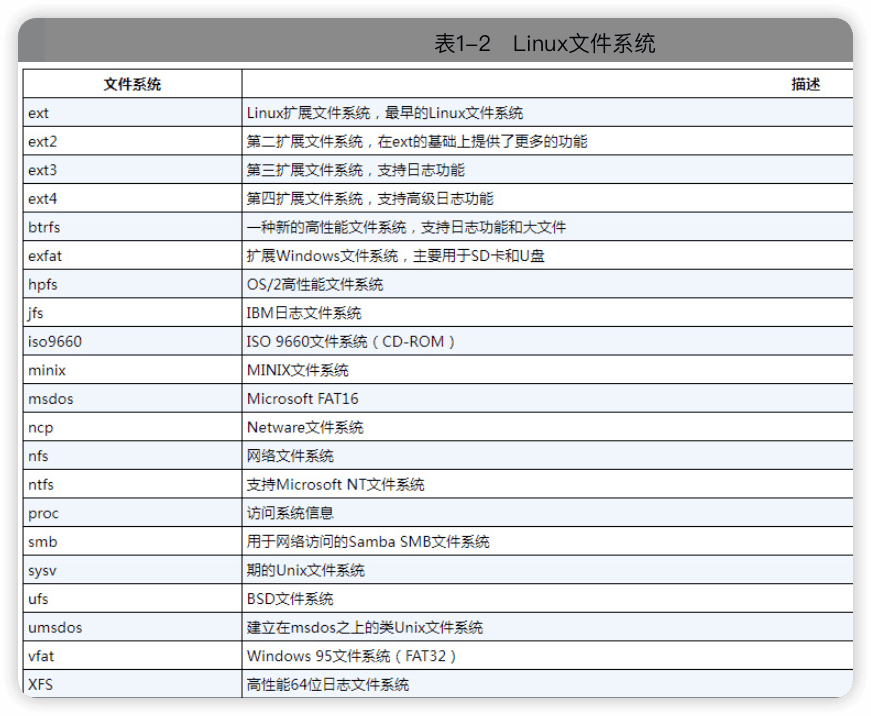
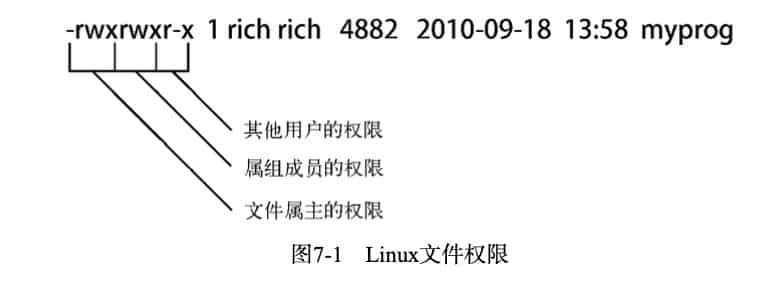
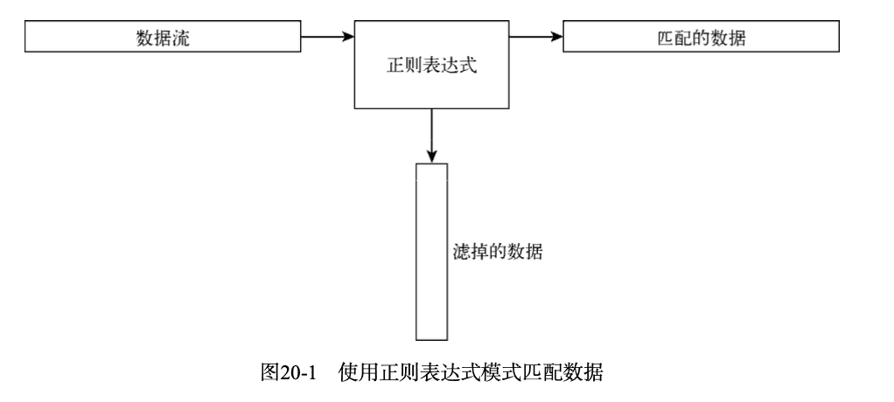

《Linux命令行与shell脚本编程大全》
---------

第3版（pdf）和第4版（微信读书）

https://www.wiley.com/go/linuxcommandline

# 一、Linux命令行

## 1 初识Linux shell

### 1.1 Linux初探

Linux系统有四个部分组成：**Linux内核**、**GNU工具**、**图形化桌面环境**、**应用软件**。


#### Linux内核

内核控制着计算机系统的所有硬件和软件，==在必要时分配硬件，并根据需要执行软件==。

内核的主要四种功能：**系统内存管理**、**软件程序管理**、**硬件设备管理**、**文件系统管理**。

##### 1 系统内存管理

内核不仅管理==物理内存==，还可以创建和管理==虚拟内存==。

**交换空间**（Swap space）在物理内存（RAM）被充满时被使用。如果系统需要更多的内存资源，而物理内存已经充满，内存中不活跃的页就会被移到交换空间去。

**虚拟内存**是文件数据交叉链接的活动文件。


内存存储单元按组划分成很多块，这些块就是**页面（page）**。内核将每个内存页面放在物理内存或交换空间。然后，内核会维护一个**内存页面表**，指明哪些页面位于物理内存内，哪些页面被换到了磁盘上。
内核会记录哪些内存页面正在使用中，并自动把一段时间未访问的内存页面复制到交换空间区域（称为**换出**，swapping out）——即使还有可用内存。

当程序要访问一个已被换出的内存页面时，内核必须从物理内存换出另外一个内存页面给它让出空间，然后从交换空间**换入**请求的内存页面。显然，这个过程要花费时间，拖慢运行中的进程。只要Linux系统在运行，为运行中的程序换出内存页面的过程就不会停歇。

##### 2 软件程序管理

Linux操作系统称==运行中的程序==为==进程==。

内核创建了第一个进程（称为**<font color=#FF8C00>init进程</font>**）来启动系统上所有其他进程。当内核启动时，它会将init进程加载到虚拟内存中。内核在启动任何其他进程时，都会在虚拟内存中给新进程分配一块专有区域来存储该进程用到的数据和代码。

Linux中，有多种init进程实现，主流有两种：

- **SysVinit**：Linux最初使用的，基于Unix System V初始化方法。

​	`/etc/inittab`文件定义了系统的默认运行级。特定运行级下启动的进程是在`/etc/rc.d`目录下的各个子目录中定义的。可以使用`runlevel`命令随时查看当前运行级。

```shell
$ runlevel
N 5
$
```


- **systemd**：systemd初始化方法诞生于2010年，现在是最流行的初始化和进程管理系统。

systemd初始化方法得以流行起来的原因在于==能够根据不同的事件启动进程==：

> 系统启动时
>
> 连接到特定的硬件设备时
>
> 服务启动时
>
> 建立好网络连接时
>
> 计时器到期时


🔖[systemd介绍](systemd.md)

##### 3 硬件设备管理

任何Linux系统需要与之通信的设备，都需要在内核代码中加入其**驱动程序**。驱动程序代码相当于应用程序和硬件设备的中间人，允许内核与设备之间交换数据。

向Linux内核中插入设备驱动的方法有两种：

- 将驱动程序编译入内核
- 将设备驱动模块加入内核

以前，插入设备驱动代码的唯一途径是重新编译内核。每次给系统添加新设备，都要重新编译一遍内核代码。随着Linux内核支持的硬件设备越来越多，这个过程变得越来越低效。不过好在Linux开发人员设计出了一种更好的将驱动代码插入运行中的内核的方法。

开发人员提出了**内核模块**的概念。它允许将驱动代码插入到运行中的内核而无需重新编译内核。同时，当设备不再使用时也可将内核模块从内核中移走。这种方式极大地简化和扩展了硬件设备在Linux上的使用。

Linux把硬件当成的特殊文件，称为**设备文件**，分为3类：

- **字符型设备文件** —— 处理数据时每次只能处理一个字符的设备。如调制解调器和终端。
- **块设备文件**   处理数据时每次能处理大块数据的设备。如硬盘。
- **网络设备文件** —— 采用数据包发送和接收数据的设备。如网卡，回环设备。

##### 4 文件系统管理



Linux内核采用**虚拟文件系统(Virtual File System，VFS)**作为和每个文件系统交互的接口。

这为Linux内核同任何类型文件系统通信提供了一个标准接口。当每个文件系统都被挂载和使用时，VFS将信息都缓存在内存中。

#### GNU工具

除了由内核控制硬件设备外，操作系统还需要工具来执行一些标准功能，比如<u>控制文件和程序</u>。

Linus在创建Linux系统内核时，并没有可用的系统工具。然而他很幸运，就在开发Linux内核的同时，有一群人正在互联网上共同努力，模仿Unix操作系统开发一系列标准的计算机系统工具。
[GNU组织](https://www.gnu.org/)（GNU是**<font color=#FF8C00>GNU’s Not Unix</font>**的缩写）开发了一套完整的Unix工具，但没有可以运行它们的内核系统。这些工具是在名为开源软件（open source software，**OSS**）的软件理念下开发的。
开源软件理念允许程序员开发软件，并将其免费发布。任何人都可以使用、修改该软件，或将该软件集成进自己的系统，无需支付任何授权费用。将Linus的Linux内核和GNU操作系统工具整合起来，就产生了一款完整的、功能丰富的免费操作系统。
尽管通常将Linux内核和GNU工具的结合体称为Linux，但你也会在互联网上看到一些Linux纯粹主义者将其称为**GNU/Linux系统**，藉此向GNU组织所作的贡献致意。

##### 1 GNU核心工具

###### 用以处理文件的工具

###### 用以操作文件的工具

###### 用以管理进程的工具


##### 2 shell

GNU/Linux shell是一种特殊的交互式工具。它为用户提供了启动程序、管理文件系统中的文件以及运行在Linux系统上的进程的途径。

sell的核心是命令行提示符。命令行提示符是shell负责交互的部分。它允许你输人文本命令，然后解释命令，并在内核中执行。

| shell | 描述                                                         |
| ----- | ------------------------------------------------------------ |
| bash  | 默认的shell                                                  |
| ash   | 一种运行在内存受限环境中简单的轻量级shell，但与bash shell完全兼容 |
| korn  | 一种与Bourne shell兼容的编程shell，但支持如关联数组和浮点运算等一些高级的编程特性 |
| tcsh  | 一种将C语言中的一些元素引人到shell脚本中的shell              |
| zsh   | 一种结合了bash、tcsh和korm的特性，同时提供高级编程特性、共享历史文件和主题化提示符的高级shell |


#### Linux桌面环境

##### 1 X Window系统

##### 2 KDE桌面

##### 3 GNOME桌面

##### 4 其它桌面


### 1.2 Linux发行版

不同Linux发行版通常可以分为：

- 完整的核心Linux发行版
- 特定用途的发行版
- LiveCD测试发行版




## 2 走进shell


## 3 基本bash shell 命令

#### 3.1 启动shell

`/etc/passwd`文件包含了所有系统用户账户列表以及每个用户的基本配置信息。

```
christine:x:501:501:ChristineBresnahan:/home/christine:/bin/bash
```

#### 3.2 shell提示符

`$`

#### 3.3 bash手册

`man`

忘记命令名时：

```shell
man -k 关键字

man -k terminal
```


> 注意阅读命令的手册，特别是**DESCRIPTION**的前两段，这里有各种技术行话。

在手册第一行左右的命令名后括号里有个数字，叫做区域号，它们的意思：

| 区域号 | 所涵盖的内容             |
| ------ | ------------------------ |
| 1      | 可执行程序或shell命令    |
| 2      | 系统调用                 |
| 3      | 库调用                   |
| 4      | 特殊文件                 |
| 5      | 文件格式与约定           |
| 6      | 游戏                     |
| 7      | 概览、约定及杂项         |
| 8      | 超级用户和系统管理员命令 |
| 9      | 内核例程                 |

#### 3.4 浏览文件系统


#### 3.5 文件和目录列表

```shell
# 区分目录和文件
ls -F
# 列出包含的目录中的文件
ls -R
# 按最后一次修改时间排序
ls -c
ls -a
ls -l
# 列出目录本身信息，不列出其中的内容
ls -d

ls -l my_script
ls -l my_scr?pt
ls -l my_*
ls -l my_sc*t
ls -l my_scr[ai]pt
ls -l f[a-i]ll
ls -l f[!a]ll
```

#### 3.6 处理文件

##### 创建文件

```bash
touch test_one
# 改变文件的修改时间
touch test_one
# 修改文件访问时间
touch -a test_one
# 查看文件访问时间
ls -l --time=atime test_one
```

##### 复制文件

```bash
cp source destination

cp test_one test_two
ls -l test_*
-rw-rw-r--. 1 andy andy 0 1月  30 11:53 test_one
-rw-rw-r--. 1 andy andy 0 1月  30 11:53 test_two
# -i让shell询问是否覆盖已有文件
cp -i test_one test_two
cp：是否覆盖"test_two"？ n

# 复制整个目录
cp -R Scripts/ Mod_scropts
```

##### 制表键自动补全


##### 链接文件

**软连接（符号链接）**  类似于windows系统中的快捷方式，与硬链接不同，软链接就是一个普通文件，只是数据块内容有点特殊，文件用户数据块中存放的内容是另一文件的路径名的指向。 

**硬链接**：多个文件名指向同一索引节点(Inode)  ，本质是同一个文件，知识文件名不同。

```bash
# 软连接
ln -s data_file sl_data_file 
ls -li *data_file
17241917 -rw-rw-r--. 1 andy andy 5452 1月  30 15:46 data_file
17241918 lrwxrwxrwx. 1 andy andy    9 1月  30 15:47 sl_data_file -> data_file

# 硬链接
ln code_file hl_code_file
ls -li *code_file
19178791 -rw-rw-r--. 2 andy andy 144 1月  30 15:45 code_file
19178791 -rw-rw-r--. 2 andy andy 144 1月  30 15:45 hl_code_file
```

##### 重命名文件

`mv` 移动、重命名

##### 删除文件

```bash
# -i提示是不是真的要删除，加入-i是个好习惯。bash shell中没有回收站。
rm -i file  
rm -i f?le
```


#### 3.7 处理目录
```bash
mkdir
# 删除空目录
rmdir
# -r进入目录
rm -ri My_Dir
# 谨慎使用，特别是拥有超级用户权限
rm -rf 
```


#### 3.8 查看文件内容

```bash
# 查看文件类型
file my_file
# 查看文件信息
stat

# 加行号
cat -n  
# 只给文本加行号
cat -b  
# 去除制表符
cat -T
more
# more的升级版
less

# 显示最后两行
tail -n 2 log_file
head
```


## 4 更多bash shell 命令

#### 4.1 监测程序  

##### 探查进程

默认`ps`命令只会显示运行在当前控制台下的属于当前用户的进程。

```bash
$ ps
   PID TTY          TIME CMD
 74299 pts/0    00:00:00 bash
 74824 pts/0    00:00:00 ps
```

`ps`命令支持3种不同类型的命令行参数：

###### **1.Unix风格——单破折线**

```bash
$ ps -ef
UID         PID   PPID  C STIME TTY          TIME CMD
root          1      0  0 1月29 ?       00:00:07 /usr/lib/systemd/systemd --system --deserialize 16
root          2      0  0 1月29 ?       00:00:00 [kthreadd]
root          4      2  0 1月29 ?       00:00:00 [kworker/0:0H]
root          6      2  0 1月29 ?       00:00:35 [ksoftirqd/0]
root          7      2  0 1月29 ?       00:00:00 [migration/0]
root          8      2  0 1月29 ?       00:00:00 [rcu_bh]
root          9      2  0 1月29 ?       00:00:07 [rcu_sched]
root         10      2  0 1月29 ?       00:00:00 [lru-add-drain]
...
```

`-e`显示所有进程，`-f`完整格式。

**C**：进程生命周期中的CPU利用率。

**STIME**：进程启动时的系统时间。

**TTY**：进程启动时的终端设备。

**TIME**：运行进程需要的累计CPU时间。

**CMD**：启动的程序名称。

```bash
$ ps -l
F S   UID    PID   PPID  C PRI  NI ADDR SZ WCHAN  TTY          TIME CMD
4 S  1000  74299  74298  0  80   0 - 28917 do_wai pts/0    00:00:00 bash
0 R  1000  74901  74299  0  80   0 - 38331 -      pts/0    00:00:00 ps
```

`-l`长格式输出。

**F**：内核分配给进程的系统标记。
**S**：进程的状态（0代表正在运行；S代表在休眠；R代表可运行，正等待运行；Z代表僵化，进程已结束但父进程已不存在；T代表停止）。
**PRI**：进程的优先级（越大的数字代表越低的优先级）。
**NI**：谦让度值用来参与决定优先级。
**ADDR**：进程的内存地址。
**sz**：假如进程被换出，所需交换空间的大致大小。
**WCHAN**：进程休眠的内核函数的地址。



```bash
ps -eH
```


###### **2.BSD风格——不加破折线**

BSD (Berkeley Software Distribution，伯克利软件套件)是Unix的衍生系统，在1977至1995年间由加州大学伯克利分校开发和发布的。

BSD风格与Unix风格有许多细小的不同。

```bash
$ ps l
F   UID    PID   PPID PRI  NI    VSZ   RSS WCHAN  STAT TTY        TIME COMMAND
4  1000  74299  74298  20   0 115668  2172 do_wai S    pts/0      0:00 bash
0  1000  74921  74299  20   0 153324  1492 -      R+   pts/0      0:00 ps l
```


###### **3.GNU风格长参数——双破折线**


```bash
$ ps --forest
   PID TTY          TIME CMD
 74299 pts/0    00:00:00 bash
 74927 pts/0    00:00:00  \_ ps
```

##### 实时监测进程

`ps`只能显示某个特定时间点的信息，`top`实时显示进程信息。

```bash
top - 16:26:25 up 1 day,  5:54,  2 users,  load average: 0.00, 0.01, 0.05
Tasks: 104 total,   1 running, 103 sleeping,   0 stopped,   0 zombie
%Cpu(s):  0.3 us,  0.3 sy,  0.0 ni, 99.3 id,  0.0 wa,  0.0 hi,  0.0 si,  0.0 st
KiB Mem :   995684 total,   134288 free,   230560 used,   630836 buff/cache
KiB Swap:  2097148 total,  2093820 free,     3328 used.   599672 avail Mem

   PID USER      PR  NI    VIRT    RES    SHR S %CPU %MEM     TIME+ COMMAND
 19521 root      20   0  264996   2972   1832 S  1.0  0.3   9:05.58 vmtoolsd
   403 root      20   0       0      0      0 S  0.3  0.0   3:39.28 xfsaild/dm-0
  1427 root      20   0  156792   1924    596 S  0.3  0.2   0:17.08 sshd
 74900 root      20   0       0      0      0 S  0.3  0.0   0:00.77 kworker/0:0
 74928 root      20   0       0      0      0 S  0.3  0.0   0:00.01 kworker/0:2
     1 root      20   0   46348   5428   2804 S  0.0  0.5   0:07.18 systemd
     2 root      20   0       0      0      0 S  0.0  0.0   0:00.61 kthreadd
     4 root       0 -20       0      0      0 S  0.0  0.0   0:00.00 kworker/0:0H
     6 root      20   0       0      0      0 S  0.0  0.0   0:36.28 ksoftirqd/0
     7 root      rt   0       0      0      0 S  0.0  0.0   0:00.00 migration/0
     8 root      20   0       0      0      0 S  0.0  0.0   0:00.00 rcu_bh
     9 root      20   0       0      0      0 S  0.0  0.0   0:07.20 rcu_sched
    10 root       0 -20       0      0      0 S  0.0  0.0   0:00.00 lru-add-drain
    11 root      rt   0       0      0      0 S  0.0  0.0   1:09.96 watchdog/0
    13 root      20   0       0      0      0 S  0.0  0.0   0:00.00 kdevtmpfs
    14 root       0 -20       0      0      0 S  0.0  0.0   0:00.00 netns
    15 root      20   0       0      0      0 S  0.0  0.0   0:00.14 khungtaskd
    16 root       0 -20       0      0      0 S  0.0  0.0   0:00.00 writeback
    17 root       0 -20       0      0      0 S  0.0  0.0   0:00.00 kintegrityd
    18 root       0 -20       0      0      0 S  0.0  0.0   0:00.00 bioset
    19 root       0 -20       0      0      0 S  0.0  0.0   0:00.00 bioset
...
```

```bash
top - 16:26:25 up 1 day,  5:54,  2 users,  load average: 0.00, 0.01, 0.05
```

第一行分别是当前时间、系统运行时间、登录的用户数以及系统的平均负载。

平均负载有3个值：最近1分钟的、最近5分钟的和最近15分钟的平均负载。值越大说明系统的负载越高。由于进程短期的突发性活动，出现最近1分钟的高负载值也很常见，但如果近15分钟内的平均负载都很高，就说明系统可能有问题。

> Linux系统管理的要点在于定义究竟到什么程度才算是高负载。这个值取决于系统的硬件配置以及系统上通常运行的程序。对某个系统来说是高负载的值可能对另一系统来说就是正常值。通常，如果系统的负载值超过了**2**，就说明系统比较繁忙了。

第二行显示了**进程概要信息**，top命令的输出中将进程叫作**任务（task）**：有多少进程处在运行、休眠、停止或是僵化状态（僵化状态是指进程完成了，但父进程没有响应）。 

第三行显示了**CPU的概要信息**。top根据进程的属主（用户还是系统）和进程的状态（运行、空闲还是等待）将CPU利用率分成几类输出。

第四、五行说明了**系统内存的状态**。第四行是系统的物理内存：总共有多少内存，当前用了多少，还有多少空闲。第五行说的是同样的信息，不过是针对系统交换空间（如果分配了的话）的状态而言的。

再下面显示的就是当前运行中的进程的详细列表，有些列跟ps命令的输出类似。
**PID**：进程的ID。
**USER**：进程属主的名字。
**PR**：进程的优先级。
**NI**：进程的谦让度值。
**VIRT**：进程占用的虚拟内存总量。
**RES**：进程占用的物理内存总量。
**SHR**：进程和其他进程共享的内存总量。
**S**：进程的状态（D代表可中断的休眠状态，R代表在运行状态，S代表休眠状态，T代表跟踪状态或停止状态，Z代表僵化状态）。
**%CPU**：进程使用的CPU时间比例。
**%MEM**：进程使用的内存占可用内存的比例。
**TIME+**：自进程启动到目前为止的CPU时间总量。
**COMMAND**：进程所对应的命令行名称，也就是启动的程序名。

默认情况下，top命令在启动时会按照**%CPU**值对进程排序。

可以在top运行时使用多种交互命令重新排序。每个交互式命令都是**单字符**，在top命令运行时键入可改变top的行为。

键入`f`进入选择排序字段界面，键入`d`允许你修改轮询间隔，键入`q`可以退出top。

##### 结束进程

作为系统管理员，很重要的一个技能就是知道**何时以及如何结束一个进程**。有时进程挂起了只需要动动手让进程重新运行或结束就行了。但有时，有的进程会耗尽CPU且不释放资源。在这两种情景下，你就需要能控制进程的命令。Linux沿用了Unix进行进程间通信的方法。

在Linux中，进程之间通过**信号**来通信。进程的信号就是预定义好的一个消息，进程能识别它并决定忽略还是作出反应。

进程如何处理信号是由开发人员通过编程来决定的。大多数编写完善的程序都能接受和处理标准Unix进程信号。


Linux上有两个命令可以向运行中的进程发出进程信号。

###### 1.`kill`

`kill`命令只能通过进程ID（PID）个进程发信号。默认，`kill`会向给出PID发送一个**TERM**信号。

只有进程的属主或root用户才能发送进程信号。

```bash
kill 3940

kill -s HUP 3940
```

###### 2.`killall`

`killall`支持通过进程名而不是PID来结束进程，支持通配符,当用root登陆时要小心。

```bash
killall http*
```

#### 4.2 监测磁盘空间🔖

##### 挂载存储媒体

- `mount` 

  提供四种信息：媒体的设备文件名，挂载点，文件系统类型，访问状态。如： `dev/sda1 on /boot type xfs (rw,relatime,seclabel,attr2,inode64,noquota)`

  `mount -t vfat /dev/sdb1 /media/disk` 把设备/dev/sdb1以vfat文件系统挂载到/media/disk上

  `mount -t iso9660 -o loop test.iso /mnt` 把test.iso文件挂载到/mnt上，`-o loop`代表挂载一个文件

- `umount /mnt` 或 `umount test.iso` 卸载文件test.iso

  - `df`
  - `du -s 目录名` 查看目录的文件总大小

#### 4.3 处理数据文件
##### 排序数据

  	  + `sort tmp.txt` 以文件每行的的字符排序显示
  	  +  `sort -n tmp.txt` 把数字识别成字符而不是字符
  	  +  `sort -t ':' -k 3 -n /etc/passwd` 对/etc/passwd的每行以：分隔，再议分隔后的第三个参数排序显示
  	  +  `sort -sh | sort -nr` r是降序的意思
##### 搜索数据

+ `grep RPC /etc/passwd` 匹配/etc/passwd中 含有RPC的行
+ `grep -v RPC /etc/passwd` 反向匹配
+ `grep -n RPC /etc/passwd` 显示行号
+ `grep -c RPC /etc/passwd` 显示多少行匹配
+ `grep -e t -e f /etc/passwd` 匹配含有字符t或者f的行。类似的正则 `grep [tf] /etc/passwd`
+ grep的两个衍生版本 `egrep` `fgrep`

##### 压缩数据

+ bzip2工具 .bz2
    * `bzip2`
    * `bzcat`
    * `bunzip2`
    * `bzip2recover`
+ gzip 工具 .gz
    * `gzip`
    * `gzcat`
    * `gunzip`
+ zip工具 .zip
	 * `zip`
	 * `zipcloak`
	 * `zipnote`
	 * `zipsplit`
	 * `unzip`
+ compress .Z 

##### `tar`   归档数据


## 5. 理解shell


#### 5.1 shell的类型


#### 5.2 shell的父子关系


```shell
andyron@Mac  ~  ps -f
  UID   PID  PPID   C STIME   TTY           TIME CMD
  501 73656 73654   0 11:33下午 ttys000    0:00.04 /Applications/iTerm.app/Contents/MacOS/iTerm2 --server login -fp andyron
  501 73658 73657   0 11:33下午 ttys000    0:00.29 -zsh
 andyron@Mac  ~  bash

The default interactive shell is now zsh.
To update your account to use zsh, please run `chsh -s /bin/zsh`.
For more details, please visit https://support.apple.com/kb/HT208050.
bash-3.2$ ps -f
  UID   PID  PPID   C STIME   TTY           TIME CMD
  501 73656 73654   0 11:33下午 ttys000    0:00.04 /Applications/iTerm.app/Contents/MacOS/iTerm2 --server login -fp andyron
  501 73658 73657   0 11:33下午 ttys000    0:00.32 -zsh
  501 73704 73658   0 11:33下午 ttys000    0:00.01 bash
bash-3.2$ exit
exit
 andyron@Mac  ~ 
```


##### 进程列表

`$ pwd ; ls ; cd /etc ; pwd ; cd ; pwd ; ls`

`$ (pwd ; ls ; cd /etc ; pwd ; cd ; pwd ; ls)`

圆括号让命令列表变成了进程列表，生成一个子shell来执行对应的命令。花括号就不会创建子shell。

```shell
 andyron@Mac  ~  pwd; ls ; echo $ZSH_SUBSHELL
/Users/andyron
Applications                    Downloads                       Music                           Virtual Machines.localized
Desktop                         Library                         Pictures                        java_error_in_pycharm_41500.log
Documents                       Movies                          Public                          myfield
0
 andyron@Mac  ~  (pwd; ls ; echo $ZSH_SUBSHELL)
/Users/andyron
Applications                    Downloads                       Music                           Virtual Machines.localized
Desktop                         Library                         Pictures                        java_error_in_pycharm_41500.log
Documents                       Movies                          Public                          myfield
1
```

##### 别出心裁的子shell用法

###### 后台模式

```shell
$ sleep 30&
[1] 28910
$ ps -f
  UID   PID  PPID   C STIME   TTY           TIME CMD
  501   501   373   0 日08上午 ttys000    0:00.05 /Applications/iTerm.app/Contents/MacOS/iTerm2 --server login -fp andyron
  501   505   504   0 日08上午 ttys000    0:01.19 -zsh
  501  8364   373   0 日06下午 ttys001    0:00.09 /Applications/iTerm.app/Contents/MacOS/iTerm2 --server login -fp andyron
  501  8366  8365   0 日06下午 ttys001    0:03.20 -zsh
  501 28910  8366   0  2:43下午 ttys001    0:00.00 sleep 30
$ jobs
[1]  + running    sleep 30
$ jobs -l
[1]  + 28910 running    sleep 30
$ 
[1]  + 28910 done       sleep 30
```

###### 将进程列表置入后台


###### 协程


#### 5.3 理解shell的内建命令

#####  **外部命令**（也称文件系统命令）

  通常位于`/bin/`，`/urs/bin`， `/sbin`， `/usr/sbin`

  `which`, `type`  能找到外部命令的位置

  <font color=#FF8C00>**衍生（forking）**</font>：**外部命令执行时，会创建一个子进程。**

```bash
$ ps -f
UID         PID   PPID  C STIME TTY          TIME CMD
andyron    1453   1452  0 22:37 pts/0    00:00:00 -bash
andyron    1473   1453  7 22:38 pts/0    00:00:00 ps -f
```


##### **内建命令**

内建命令不需要使用子进程，他是shell的组成部分。不需要借助外部程序文件来运行

```shell
$ type cd
cd is a shell builtin
```

cd, exit, history, alias等都是内建命令。

另外echo,pwd既有内建命令也有外部命令。

```bash
$ which echo
/bin/echo
$ type -a echo
echo is a shell builtin
echo is /bin/echo
```


## 6.Linux环境变量

#### 6.1 环境变量：

**环境变量**：存储有关shell会话和工作环境的信息

**全局环境变量**：在shell会话和所有生成的子shell都可见

**局部环境变量**：只对创建它的shell可见

系统环境变量用**全大写字母**，普通用户创建的用**全小写字母**。

- 显示个别环境变量

  `printenv HOME`

  `env HOME`

  `echo $HOME`

  加上`$`时，可以让变量作为命令行参数： `ls $HOME`  

+ `set` ,`env`,`printenv`区别

  `set`：全局变量、局部变量、用户自定义变量，并且排序

  `env`,`printenv`：全局变量，不排序

#### 6.2 设置用户自定义变量

```bash
$ echo $my_variable

$ my_variable=Hello 
$
$ echo $my_variable 
Hello
```

变量赋值时如有空格的字符串值，必须用引号界定首尾，否则shell会以为下一个词是另一个要执行的命令。变量名、等号和值之间也没有空格。

```bash
$ my_variable=Hello World 
-bash: World: command not found 
$
$ my_variable="Hello World"
$
$ echo $my_variable
Hello World
$
```

全局环境变量的设置是􏲟􏱷􏱸􏰨􏱆􏳍􏳎􏳁􏳂􏳃􏳄􏰾􏶇􏳯􏵕􏶺􏲭􏷶􏶈􏲱􏰖􏳍􏳁􏳂􏰤􏰣􏲟􏱷􏱸􏰨􏱆􏳍􏳎􏳁􏳂􏳃􏳄􏰾􏶇􏳯􏵕􏶺􏲭􏷶􏶈􏲱􏰖􏳍􏳁􏳂􏰤􏰣先创建一个局部环境变量，然后使用`export`导出。

```bash
$ my_variable="I am Global now" $
$ export my_variable
```

**修改子shell中全局环境变量并不会影响到父shell中该变量的值。**

#### 6.3 删除环境变量

```bash
$ echo $my_variable 
I am Global now
$
$ unset my_variable
```

**如果要用到变量，使用$；如果要操作变量，不使用.**

#### 6.4 设置PATH环境变量

```bash
$ PATH=$PATH:/home/christine/Scripts
```

如果希望子shell也能用你的程序位置，一定要记得把PATH导出。

对PATH的修改只能持续到退出或重启系统。

#### 6.5 定位系统环境变量  

登入Linux系统启动一个bash shell时，默认会在几个**启动文件（环境文件）**中查找命令。

不同启动bash shell的方式，bash启动的文件不同。三种启动bash shell的方式：

- 登录shell
- 交互式shell
- 非交互式shell

##### 登录shell

正常登录Linux系统，bash shell作为登录shell启动，会从5个文件里读取命令：

```bash
/etc/profile
􏰓$HOME/.bash_profile 􏰓 
$HOME/.bashrc
􏰓$HOME/.bash_login 􏰓 
$HOME/.profile
```

`/etc/profile`是主启动文件，每一个用户登录都会执行。不同发行版Linux系统，`/etc/profile`内容会有不同，不过一般都会迭代执行`/etc/profile.d`目录下的所有文件。

centOS  `/etc/profile.d`文件一般是：

```bash
$ ls -l /etc/profile.d
total 80
-rw-r--r--. 1 root root 1127 Mar 5 07:17 colorls.csh
-rw-r--r--. 1 root root 1143 Mar 5 07:17 colorls.sh
-rw-r--r--. 1 root root 92 Nov 22 2013 cvs.csh
-rw-r--r--. 1 root root 78 Nov 22 2013 cvs.sh
-rw-r--r--. 1 root root 192 Feb 24 09:24 glib2.csh
-rw-r--r--. 1 root root 192 Feb 24 09:24 glib2.sh
-rw-r--r--. 1 root root 58 Nov 22 2013 gnome-ssh-askpass.csh 
-rw-r--r--. 1 root root 70 Nov 22 2013 gnome-ssh-askpass.sh 
-rwxr-xr-x. 1 root root 373 Sep 23 2009 kde.csh
-rwxr-xr-x. 1 root root 288 Sep 23 2009 kde.sh
-rw-r--r--. 1 root root 1741 Feb 20 05:44 lang.csh
-rw-r--r--. 1 root root 2706 Feb 20 05:44 lang.sh
-rw-r--r--. 1 root root 122 Feb 7 2007 less.csh
-rw-r--r--. 1 root root 108 Feb 7 2007 less.sh
-rw-r--r--. 1 root root 976 Sep 23 2011 qt.csh
-rw-r--r--. 1 root root 912 Sep 23 2011 qt.sh
-rw-r--r--. 1 root root 2142 Mar 13 15:37 udisks-bash-completion.sh 
-rw-r--r--. 1 root root 97 Apr 5 2012 vim.csh
-rw-r--r--. 1 root root 269 Apr 5 2012 vim.sh
-rw-r--r--. 1 root root 169 May 20 2009 which2.sh
$
```

这个目录里文件大体分为两类：一类供bash shell使用，一类供c shell使用。

其它四个在用户目录下的启动文件，一般只用到一到两个。


##### 交互式shell

不是登录系统启动的，而是在命令行输入`bash`启动的shell叫做**交互式shell**。这种情况下，不会访问`/etc/profile`文件，只会检查用户HOME目录中的`.bashrc`文件。

```bash
$ cat ~/.bashrc

#
# Source global definitions 
if [ -f /etc/bashrc ]; then
	. /etc/bashrc
fi
# User specific aliases and functions
$
```

`~/.bashrc`文件两个作用：

- 查看`/etc`下的通用bashrc文件
- 为用户提供一个定制自己的命令别名和私有函数的地方

##### 非交互shell

系统执行shell脚本时用的就是这种shell。


##### 环境变量持久化

不放在`/etc/profile`中，因为系统升级后这个文件会被更新，最好是在`/etc/profile.d`目录中创建一个以.sh结尾的文件，把所有新的或修过过的全局环境变量设置放在这个文件中。


#### 6.6 数组变量

```bash
$ mytest=(one two three four five)
$ echo ${mytest[2]} 
three
$ echo ${mytest[*]}
one two three four five
$
$ mytest[2]=seven
$
$ echo ${mytest[*]}
one two seven four five
$ unset mytest[2]
$
$ echo ${mytest[*]} one two four five
```

`ps -f`	  


## 7.Linux文件权限

#### 7.1 Linux的安全性

`/etc/passwd` 用户有关的信息

```shell
mysql:x:27:27:MySQL Server:/var/lib/mysql:/bin/bash
```

**系统账户**  UID<500

`/etc/shadow`   密码单独保存，只有root能访问这个文件。

```shell
rich:$1$.FfcK0ns$f1UgiyHQ25wrB/hykCn020:11627:0:99999:7:::
```

##### 添加新用户

`useradd`  使用系统的默认值以及命令行参数来设置用户账户。

`useradd -D`  查看这些默认值。

```shell
# useradd -D
GROUP=100
HOME=/home
INACTIVE=-1
EXPIRE=
SHELL=/bin/bash
SKEL=/etc/ske1
CREATE_MAIL_SPOOL=yes
```

倒数第二行的意思是：系统会将`/etc/ske1`目录下的内容复制到用户的HOME目录下。

```shell
# useradd -m test
# ls -al /home/test
total 24
drwxr-xr-x 2 test test 4096 2010-09-23 19:01 .
drwxr-xr-x 4 root root 4096 2010-09-23 19:01 ..
-rw-r--r-- 1 test test 220 2010-04-18 21:51 .bash_logout 
-rw-r--r-- 1 test test 3103 2010-04-18 21:51 .bashrc 
-rw-r--r-- 1 test test 179 2010-03-26 08:31 examples.desktop 
-rw-r--r-- 1 test test 675 2010-04-18 21:51 .profile
```

##### 删除用户

`userdel`  只会删除`/etc/passwd`中的用户信息

`userdel -r` 会删除用户的HOME目录以及邮件目录

##### 修改用户

`usermod`

`passwd`

`chpasswd`

`chage`

`chfn`

`chsh`

#### 7.2 使用Linux组

`etc/group`

##### 创建新组

`groupadd`

##### 修改组

`groupmod`


#### 7.3 理解文件权限

**文件权限符**

`-`  d l c b n

**访问权限**

r w x


#### 7.4 改变安全性设置

##### 改变权限

`chmod options mode file`

`chmod 760 newfile`

`chmod o+r newfile`

u􏳭􏰲􏱔􏳽 用户
􏳬g􏳭􏰲􏱄 组
􏳬o􏳭􏰲􏱲 其它
a􏳭􏰲􏱐􏱧􏲅􏰚 上述所有

##### 改变所属关系

`chown options owner[.group] file`

`chown dan newfile`   

`chown .shared newfile`

`chown dan.shared newfile`   同时改变文件的属主和属组


#### 7.5 共享文件

Linux系统上共享文件的方法是创建组。


## 8 管理文件系统


#### 8.1 探索Linux文件系统

**Linux的文件系统为硬盘中存储的0、1和应用中使用的文件与目录之间搭建了一座桥梁。**

##### 基本文件系统

1. 扩展文件系统（extended filesystem, **ext**）

   Linux通过唯一的数值（称作**索引节点号**）来引用**索引节点表**中的每个**索引节点**。

2. **ext2**

3. 日志文件系统

   **ext3**

   **ext4**

   **Reiser文件系统**

   **JFS文件系统**

   **XFS**

4. 写时复制文件系统

   ZFS文件系统

   Btrf文件系统

#### 8.2 操作文件系统

##### 创建分区

`fdisk`

##### 创建文件系统

##### 文件系统的检查与修复

`fsck`


#### 8.3 逻辑卷管理

Linux逻辑卷管理器（logical volume manager, **LVM**）


## 9 安装软件程序

包管理系统(package management system, **PMS**)

#### 9.1 包管理基础

PMS的数据库记录：

- Linux系统上已安装了什么软件包
- 每个包安装了什么文件
- 每个已安装软件包的版本


#### 9.2 基于Debian系统

`dpkg`

`apt-get`

`apt-cache`

`aptitude`

#### 9.3 基于Red Hat系统

`yum`：用于Red Hat、CentOS和Fedora。

`zypper`：用于openSUSE。

`dnf`：yum的升级版。

##### 列出已安装的软件包

```shell
dnf list installed
```

查看软件包的详细描述：

```shell
dnf list xterm
```

查看某个软件包是否已经安装：

```shell
dnf list installed xterm
```

查看某个文件时有那个软件包安装的：

```shell
dnf provides file_name
```

```shell
$ dnf provides /usr/bin/gzip
Last metadata expiration check: 0:12:06 ago on Sat 16 May 2020 12:10:24 PM EDT.
gzip-1.10-1.fc31.x86_64 : The GNU data compression program
Repo        : @System
Matched from:
Filename    : /usr/bin/gzip

gzip-1.10-1.fc31.x86_64 : The GNU data compression program
Repo        : fedora
Matched from:
Filename    : /usr/bin/gzip

$
```

dnf分别检查了两个仓库：本地系统和默认的fedora仓库。


#### 9.4 从源码安装

`tar` -> `./configure` -> `make` -> `make install`


## 10 使用编辑器

#### Vim

#### nano编辑器

#### emacs编辑器

#### KDE系编辑器

#### GNOME编辑器


# 二、shell脚本编程基础

### 11 构建基本脚本

#### 11.1 使用多个命令

`$ date;who`

#### 11.2 创建shell脚本文件

```shell
#!/bin/bash
date
who
```

让shell找到命令的脚本，两种方法：

- 将脚本目录添加的`PATH`环境变量中
- 使用绝对或相对文件路径

#### 11.3 显示消息

`echo`


#### 11.4 使用变量

环境变量

用户变量

##### 命令替换

将命令输出赋给变量：

```shell
testing=`date`
testing=$(date)
```

```shell
#!/bin/bash

today=$(date +%Y%m%d)
ls -al /usr/bin > log.$today
```


#### 11.5 重定向输入和输出

##### 输出重定向

`command > outputfile`  覆盖

`command >> outputfile`   追加


##### 输入重定向

``command < outputfile``

```shell
$ wc < test6   #行数 词数  字节数
3      16     112
```

**<u>内联输入重定向</u>**

#### 11.6 管道

将一个命令的输出作为另一个命令的输入

`command1 | command2`

`ls /usr/bin | sort | less`

#### 11.7 执行数学表达式

##### expr

`$ expr 1 + 5`


##### 使用方括号

```shell
$ var1=$[1 + 5]
$ echo $var1
6
$ var2=$[$var1 * 2]
$ echo $var2
12
```

##### 浮点解决方案

1. `bc`计算器
2. 在基本中使用bc

`varibale=$(echo "options; expression" | bc)`

```shell
#!/bin/bash
var1=100
var2=45
var3=$(echo "scale=4; $var1 / $var2" | bc)
echo 答案是$var3
```

#### 11.8 退出脚本

shell中运行的每个命令都使用**退出状态码(exit status)**（0~255）告诉shell它已运行完毕。

##### 查看退出状态码

`$?`

```shell
$ date
2019年 9月21日 星期六 10时26分24秒 CST
$ echo $?
0

$ dfd
zsh: command not found: dfd
$ echo $?
127
```


权限不够的退出状态码是126：

```shell
$ ./code_file
-bash: ./code_file: 权限不够
$ echo $?
126
```

某个命令的无效参数会返回一般性未知错误状态码1：

```shell
$ date %t
date: 无效的日期"%t"
$ echo $?
1
```

##### exit命令

默认，shell脚本会以脚本中最后一个命令的退出状态码退出。

可以改变这种默认行为，通过`exit`命令返回自己的退出状态码。

```shell
#!/bin/bash
var1=10
var2=20
var3=$[$var1 + $var2]
echo The answer is $var3
exit 5
```

`exit`中的参数可以是变量，但要注意退出状态码最大只能是255，当大于这个数时，shell会把结果与256进行取模。

```shell
exit $var3
```


### 12 使用结构化命令


#### 12.1 if-then

```
if command 
then
	commands
fi
```

command命令成功运行（退出状态码为0）时，then的命令commands就被执行。

另一种表示方式：

```
if command; then 
	commands
fi
```

```shell
#! /bin/bash
# test the if statment

if pwd
then
  echo "It worked"
fi
```

```shell
#! /bin/bash
# 测试then中的多命令

testUser=andyron

if grep $testUser /etc/passwd
then
  echo "This is my first command"
  echo "This is my second command"
  echo "显示用户bash相关文件："
  ls -a /home/$testUser/.b*
fi
```


#### 12.2 if-then-else

```
if command 
then
  commands
else
  commands
fi
```

```shell
#! /bin/bash
# 测试else

testUser=andyron2

if grep $testUser /etc/passwd
then
  echo "用户$testUser的bash相关文件："
  ls -a /home/$testUser/.b*
  echo
else
  echo "系统中不存在用户$testUser."
  echo
fi
```


#### 12.3 嵌套if

if-then-else􏲟􏴨􏿢语句的else代码块中可以嵌套if-then语句。􏴶􏵛􏶝􏻀

```shell
#! /bin/bash
# 测试嵌套if

testUser=NoSuchUser

if grep $testUser /etc/passwd
then
  echo "系统中存在用户$testUser。"
else
  echo "系统中不存在用户$testUser."
  if ls -d /home/$testUser/
  then
    echo "但是，$testUser用户有一个用户目录。"
  fi
fi
```

else部分的另一种形式： **elif**。

```
if command1 
then
  commands 
elif command2 
then
  more commands 
fi
```

```shell
#! /bin/bash
# 测试嵌套if,使用elif

testUser=andyron2

if grep $testUser /etc/passwd
then
  echo "系统中存在用户$testUser。"
elif ls -d /home/$testUser/
then
  echo "系统中不存在用户$testUser."
  echo "但是，$testUser用户有一个用户目录。"
else
  echo "系统中不存在用户$testUser."
  echo "而且，$testUser用户也没有用户目录。"
fi
```

当然也可以将多了elif语句穿起来使用。(可以被之后的case替代)

```
if command1 
then
  command set 1 
elif command2
then
  command set 2 
elif command3 
then
  command set 3 
elif command4 
then
  command set 4
fi
```


#### 12.4 test命令

if-then语句只能用于测试**命令退出状态码**。其它就要是test命令了。

```
if test condition 
then
  commands
fi
```

如果test命令中列出的条件成立，test命令就会退出并返回退出状态码0。

```shell
#! /bin/bash
# 测试 test命令

my_var="Full"

if test $my_var
then
  echo "表示式$my_var 的返回结果是True"
else
  echo "表示式$my_var 的返回结果是False"
fi
```

另一种条件测试方法（注意[]中的空格）：

```
if [ condition ]
then 
  commands
fi
```

test命令的三类条件判断：数值比较，字符串比较，文件比较


##### 数值比较 

 

```shell
#! /bin/bash
# test命令的数值比较

value1=10
value2=11

if [ $value1 -gt 5 ]
then
  echo "值$value1大于(greater than) 5。"
fi

if [ $value1 -eq $value2 ]
then
  echo "两个值是相等的(equal)。"
else
  echo "两个值不相等。"
fi
```

bash shell只能处理整数。下面浮点数的条件测试是不行的：

```shell
#! /bin/bash
# 测试浮点数比较

value1=5.555

echo "测试的浮点数是：$value1"

if [ $value1 -gt 5 ]
then
 echo "测试的数$value1是大于5的。"
fi
```

```shell
$ ./floating_point_test.sh
测试的浮点数是：5.555
./floating_point_test.sh: line 8: [: 5.555: integer expression expected
```


##### 字符串比较


```shell
#! /bin/bash
# 字符串相等测试

testUser=badUser


if [ $USER != $testUser ]
then
  echo "当前用户不是$testUser"
else
  echo "Welcome $testUser"
fi
```


??

##### 文件比较


文件比较测试是shell编程中最为强大、使用最多的比较形式。

1. 检查目录

```shell
// test11.sh

#!/bin/bash
# 检查目录
 
jump_directory=/home/arthur 

if [ -d $jump_directory ] 
then
	echo "The $jump_directory directory exists" 
	cd $jump_directory
	ls
else
	echo "The $jump_directory directory does not exist"
fi 
```


2. 检查对象是否存在

```shell
// test12.sh

#! /bin/bash
# 检查对象是否存在

location=$HOME
file_name="sentinel"

if [ -e $location ]
then #Directory does exist
  echo "OK on the $location directory."
  echo "Now checking on the file, $file_name."

  if [ -e $location/$file_name ]
  then #File does exist
    echo "OK on the filename"
    echo "Updating Current Date..."
    date >> $location/$file_name
  else #File does not exist
    echo "File does not exist"
    echo "Nothing to update"
  fi

else   #Directory does not exist
  echo "The $location directory does not exist."
  echo "Nothing to update"
fi
```

3. 检查文件

```shell
// test13.sh

#! /bin/bash

item_name=$HOME
echo
echo "正在检查的是：$item_name"
echo

if [ -e $item_name ]
then
  echo "$item_name是存在的。"
  echo "但是否是文件呢？"
  echo 
  if [ -f $item_name ]
  then 
    echo "Yes, $item_name是一个文件。"
  else
    echo "No, $item_name不是一个文件。"
  fi
else
  echo "$item_name不存在。"
fi
```


4. 检查是否可读

```shell
// test14.sh

#! /bin/bash
# 测试是否为可读文件

pwfile=/etc/shadow


if [ -f $pwfile ]
then
  if [ -r $pwfile ]
  then
    tail $pwfile
  else
    echo "Sorry, 不能阅读$pwfile文件"
  fi
else
  echo "Sorry, 文件$pwfile不存在"
fi
```


5. 检查空文件

```shell
// test15.sh

#! /bin/bash
# 检查空文件

file_name=$HOME/sentinel

if [ -f $file_name ]
then
  if [ -s $file_name ]
  then
    echo "$file_name是存在的，并且不为空。"
  else
    echo "$file_name存在，但为空。"
  fi
else
  echo "文件$file_name不存在。"
fi
```


6. 检查是否可写


7. 检查文件是否可以执行


8. 检查所属关系

```shell
// test18.sh

# 检查所属关系

if [ -O /etc/passwd ] # 检查文件或目录是否属于当前用户
then
  echo "/etc/passwd 属于当前用户$USER。"
else
  echo "/etc/passwd 不属于当前用户。"
fi
```


9. 检查默认属组关系


10. 检查文件日期


#### 12.5 复合条件测试

```
 [ condition1 ] && [ condition2 ]
 [ condition1 ] || [ condition2 ]
```

```shell
if [ -d $HOME ] && [ -w $HOME/testing ]
```


#### 12.6 if-then的高级特性

##### 使用双圆括号(可以使用更多的数学表达式)

```
(( expression ))
```


```shell
$ cat test23.sh
#!/bin/bash
# using double parenthesis 

val1=10

if (( $val1 ** 2 > 90 )) then
(( val2 = $val1 ** 2 ))
echo "The square of $val1 is $val2" 
fi

$ ./test23.sh
The square of 10 is 100
```


##### 使用双方括号(字符串比较的高级特效)

```
[[ expression ]]
```


#### 12.7 case命令

```
case variable in
pattern1 | pattern2) commands1;; 
pattern3) commands2;;
*) default commands;;
esac
```


```shell
#! /bin/bash
# case

case $USER in
rich | andyron)
  echo "Welcom, $USER"
  echo "Please enjoy your visit";;
testing)
  echo "特殊的测试账号";;
andyron2)
  echo ".....";;
esac
```


### 13 更多的结构化命令

#### 13.1 for

```
for var in list 
do
  commands
done
```

```shell
#! /bin/bash

for test in 江苏 浙江 山东 安徽 广东 黑龙江 河南 河北 吉林 福建 台湾 广西 云南 四川 新疆
do
 echo "有一个省份的名字叫$test"
done

echo "最后一个省份是$test"

test=上海

echo "现在test是$test"
```

??


### 14 处理用户输入


#### 14.1 命令行参数

##### 读取参数

`$0`是程序名， `$1`是第一个参数，`$2`是第二参数，...，直到第九个参数`$9`；第十个以后用花括号表示，如${10}。

```shell
#! /bin/bash
#


factorial=1

for (( number = 1; number <= $1 ; number++ ))
do
  factorial=$[ $factorial * $number ]
done

echo The factorial of $1 is $factorial.
```

```shell
$ ./test1.sh 5
The factorial of 5 is 120.
```


##### 读取脚本名

`$0`包括路径，`$(basename $0)`获得脚本名


```shell
$ cat test6.sh
#! /bin/bash
#

name=$(basename $0)

if [ $name = "addem" ]
then
  total=$[ $1 + $2 ]
elif [ $name = "multem" ]
then
  total=$[ $1 * $2 ]
fi

echo
echo 计算结果为$total。

$ cp test6.sh addem
$ chmod u+x addem
$ ln -s test6.sh multem
$ ll *em
-rwxrw-r--. 1 andyron andyron 181 3月  19 04:24 addem
lrwxrwxrwx. 1 andyron andyron   8 3月  19 04:24 multem -> test6.sh
$ ./addem 2 5

计算结果为7。
$ ./multem 2 5

计算结果为10。
$
```


##### 测试参数


```shell
if [ -n "$1" ]   # 测试参数是否存在
```


#### 14.2 特殊参数变量

##### 参数统计

`$#`表示命令行参数的个数

##### 抓取所有的数据

`$*` ：所有命令行参数以空格组合成的单独字符串

`$@`：所有命令行参数以空格组合各自独立的单词，可以遍历。

```shell
$ cat test12.sh
#! /bin/bash
# 测试 $* $@
echo
count=1

for param in "$*"
do
  echo "\$* Parameter #$count = $param"
  count=$[ $count + 1 ]
done

echo
count=1

for param in "$@"
do
  echo "\$@ Parameter #$count = $param"
  count=$[ $count + 1 ]
done
$ chmod u+x test12.sh
$ ./test12.sh andy jack tony lee

$* Parameter #1 = andy jack tony lee

$@ Parameter #1 = andy
$@ Parameter #2 = jack
$@ Parameter #3 = tony
$@ Parameter #4 = leeca
```

#### 14.3 移动变量

`shift`命令


#### 14.4 处理选项

**选项**：跟在单波折线后面的单个字母。

##### 查找选项


##### 使用getopt命令


##### 使用更高级的getopts


#### 14.5 将选项标准化


#### 14.6 获得用户输入

##### 基本的读取

`read`

```shell
echo -n "Enter your name: "
read name
echo "Hello $name, welcome to my program. "
```

```shell
read -p "Please enter your age: " age 
days=$[ $age * 365 ]
echo "That makes you over $days days old! "
```

```shell
read -p "Enter your name: " first last 
echo "Checking data for $last, $first..."
```

`$REPLY`

```shell
read -p "Enter your name: "
echo
echo Hello $REPLY, welcome to my program.
```

##### 超时

```shell
if read -t 5 -p "Please enter your name: " name
then
  echo "Hello $name, welcome to my script" 
else
  echo 
  echo "Sorry, too slow! "
fi
```


##### 隐藏方式读取


##### 从文件中读取


### 15 呈现数据

#### 15.1 理解输入和输出

 脚本输出的方法：

- 在显示器屏幕上显示输出；
- 将输出重定向到文件中；

- 一部分在显示器上显示，一部分不保存到文件中；


##### 标准文件描述符

Linux将每个对象当作文件处理，用**文件描述符（file descriptor）**来标识，它为非负整数。前三个（0、1、2）用来：

| 文件描述符 | 缩写   | 描述     |
| ---------- | ------ | -------- |
| 0          | STDIN  | 标准输入 |
| 1          | STDOUT | 标准输出 |
| 2          | STDERR | 标准错误 |

`>` 是重定向到文件，`>>`是追加到文件

当命令上场错误消息时，shell并未将错误消息重定向到输出重定向文件。

shell对于错误消息的处理是跟普通输出分开的。

##### 重定向错误


1. 只重定向错误

```shell
# ll -a badfile 2>test4
# cat test4
ls: 无法访问badfile: 没有那个文件或目录
```

2. 重定向错误和数据

```shell
# ll -a test test3 test4 badtest 2>test6 1>test7
# cat test6
ls: 无法访问test: 没有那个文件或目录
ls: 无法访问badtest: 没有那个文件或目录
# cat test7
-rw-r--r--. 1 root root  0 6月   2 17:13 test3
-rw-r--r--. 1 root root 53 6月   2 17:19 test4
```

3. 特殊的重定向符号`&>`

STDOUT和STDERR都重定向到同一个输出文件。

```shell
# ll -a test test3 test4 badtest &>test7
# cat test7
ls: 无法访问test: 没有那个文件或目录
ls: 无法访问badtest: 没有那个文件或目录
-rw-r--r--. 1 root root  0 6月   2 17:13 test3
-rw-r--r--. 1 root root 53 6月   2 17:19 test4
```


#### 15.2 在脚本中重定向输出

##### 临时重定向

```shell
$ vim test8
#!/bin/bash
# tsting STDERR messages

echo "This is an error" >&2
echo "This is normal output"
```

`>&2`表示将输出信息重定向为STDERR文件描述符

```shell
$ chmod u+x test8
$ ./test8
This is an error
This is normal output
```

默认情况下，Linux会将STDERR导向到STDOUT。

```shell
$ ./test8 2>test9
This is normal output
$ cat test9
This is an error
```

##### 永久重定向

```shell
$ vim test10
#!/bin/bash
# redirecting all output to a file

exec 1>testout
echo "This is a test of redirecting all output"
echo "from a script to another file."
echo "without having to redirect every individual line"
```


```shell
$ chmod u+x test10
$ ./test10
$ cat testout
This is a test of redirecting all output
from a script to another file.
without having to redirect every individual line
```

`exec`命令会重启一个新shell并将STDOUT文件描述符重定向到文件中。

```shell
$ cat test11
#!/bin/bash
# redirecting output to different locations

exec 2>testerror

echo "This is the start of the script"
echo "now redirecting all output to another location"
    
exec 1>testout

echo "This output should go to the testout file" 
echo "but this should go to the testerror file" >&2 

$ ./test11
This is the start of the script
now redirecting all output to another location
$ cat testout
This output should go to the testout file
$ cat testerror
but this should go to the testerror file
```


#### 15.2 在脚本中重定向输入

将STDIN从键盘重定向到其它位置。

```shell
$ vim test12
#!/bin/bash
# redirecting file input

exec 0< testfile 
count=1

while read line
do
	echo "Line #$count: $line"
	count=$[ $count + 1 ] 
done
```


```shell
$ cat testfile
This is testfile's first line.
This is testfile's second line.
This is testfile's third line.
```


```shell
$ chmod u+x test12
$ ./test12
Line #1: This is testfile's first line.
Line #2: This is testfile's second line.
Line #3: This is testfile's third line.
```


??


### 16 控制脚本

以实时模式在命令行界面运行

以shell脚本运行

#### 16.1 处理信号

Linux利用信号与运行系统中的进程进行通信。

##### 重温Linux信号

Linux系统和应用程序可以生成超过30个信号。Linux编程时常见有：

| 信号 | 值      | 描述                           |
| ---- | ------- | ------------------------------ |
| 1    | SIGHUP  | 挂起进程                       |
| 2    | SIGINT  | 终止进程                       |
| 3    | SIGQUIT | 停止进程                       |
| 9    | SIGKILL | 无条件终止进程                 |
| 15   | SIGTERM | 尽可能终止进程                 |
| 17   | SIGSTOP | 无条件停止进程，但不是终止进程 |
| 18   | SIGTSTP | 停止或暂停进程，但不终止进程   |
| 19   | SIGCONT | 继续运行停止的进程             |

??

# 三、高级shell脚本编程

### 17 创建函数

#### 17.1 基本的脚本函数

##### 两种创建函数格式

```shell
function name {
		commands
}
```

```shell
name() {
		commands
}
```

##### 使用函数

```shell
$ cat test1
#!/bin/bash

function func1 {
	echo "This is an example of a function"
}

count=1
while [ $count -le 5 ]
do 
	func1
	count=$[ $count + 1 ]
done

echo "This is the end of the loop"
func1
echo "Now this is the end of the script"
$
$ ./test1
This is an example of a function
This is an example of a function
This is an example of a function
This is an example of a function
This is an example of a function
This is the end of the loop
This is an example of a function
Now this is the end of the script
```

<font color=#FF8C00>注意</font>：函数名必须是唯一的，如果重定义了函数，新定义会覆盖原来函数的定义，这不会产生任何错误消息。

#### 17.2 返回值

##### 默认退出状态码

函数的默认退出状态码是函数中最后一条命令返回的退出状态码。

```bash
$ cat 17.2.1.sh
#!/bin/bash
# testing the exit status of the function

func1() {
	echo "trying to display a non-existent file"
	ls -l badfile
}

echo "testing the function: "
func1
echo "The exit status is: $?"
$ ./17.2.1.sh
testing the function:
trying to display a non-existent file
ls: 无法访问badfile: 没有那个文件或目录
The exit status is: 2
```

##### 使用return命令

```bash
$ cat 17.2.2.sh
#!/bin/bash
# using the return command in a function

function dbl {
	read -p "Enter a value: " value
	echo "doubling the value"
	return $[$value * 2]
}

dbl
echo "The new value is $?"
$ ./17.2.2.sh
Enter a value: 4
doubling the value
The new value is 8
```

##### 使用函数输出

```bash
$ cat 17.2.3.sh
#!/bin/bash
# using the echo to return a value

function dbl {
	read -p "Enter a value: " value
	echo $[ $value * 2 ]
}
result=$(dbl)
echo "The new value is $result"
$ ./17.2.3.sh
Enter a value: 234
The new value is 468
```

#### 17.3 在函数中使用变量

##### 向函数传递参数

函数被可被当作小型脚本。函数可以使用标准的参数环境变量来表示命令上传给函数的参数，例如：`$0`、`$1`、`$2`等表示对应函数，`$#`表示参数数目。

```bash
$ cat 17.3.1.sh
#!/bin/bash
# passing parameters to a function

function addem {
	if [ $# -eq 0 ] || [ $# -gt 2 ]
	then
		echo -1
	elif [ $# -eq 1 ]
	then
		echo $[ $1 + $1 ]
	else
		echo $[ $1 + $2 ]
	fi
}

echo -n "Adding 10 and 15: "
value=$(addem 10 15)
echo $value
echo -n "Let's try adding just one number: "
value=$(addem 10)
echo $value
echo -n "Now trying adding no  numbers: "
value=$(addem)
echo $value
echo -n "Finally, try adding three numbers: "
value=$(addem 10 15 20)
echo $value
$ ./17.3.1.sh
Adding 10 and 15: 25
Let's try adding just one number: 20
Now trying adding no  numbers: -1
Finally, try adding three numbers: -1
```

`echo -e`中的额`-e`表示不换行。

由于函数使用了`$0`、`$1`、`$#`等特殊参数环境变量作为自己的参数值，因此它无法直接获取脚本在命令行中的参数值，必须在调用函数时手动将它们传过去。

```bash
$ cat 17.3.1-2.sh
#!/bin/bash
# 手动传输脚本参数给函数

function func7 {
	echo $[ $1 * $2 ]
}

if [ $# -eq 2 ]
then
	value=$(func7 $1 $2)
	echo "The result is $value"
else
	echo "Usage: badtest1 a b"
fi
$ ./17.3.1-2.sh
Usage: badtest1 a b
$ ./17.3.1-2.sh 10 11
The result is 110
```

##### 在函数中处理变量

全局变量

局部变量  `local`


🔖

#### 17.4 数组变量和函数


##### 向函数传数组参数


##### 从函数返回数组


#### 17.5 函数递归


#### 17.6 创建库


#### 17.7 在命令行上使用函数


##### 在命令行上创建函数


##### 在`.bashrc`文件中定义函数


#### 17.8 实例


### 18 图形化桌面环境中的脚本编程

#### 18.1 创建文本菜单


#### 18.2 制作窗口


#### 18.3 使用图形


### 19 初始sed和gawk

shell脚本最常见的用途就是**处理文本文件**（检查日志文件、读取配置文件、处理数据元素等），shell脚本可以帮助我们将文本文件中各种数据的日常处理任务**自动化**。

sed和gawk工具极大简化了shell脚本需要进行的数据处理任务。

#### 19.1 文本处理

##### sed编辑器

sed（stream editor，**<font color=#FF8C00>流编辑器</font>**），和普通的交互式文本编辑器（如vim）恰好相反。

在交互式文本编辑器中，可以用键盘命令来交互式插入、删除或替换数据中的文本，而流编辑器则会在编辑器处理数据之前基于预先提供的一组规则来编辑数据流，它善于自动处理文本文件。

sed编辑器会执行下列操作：

1. 一次从输入中读取一行数据。
2. 根据所提供的编辑器命令匹配数据。
3. 按照命令修改流中的数据。
4. 将新的数据输出到STDOUT。

由于命令是按顺序逐行给出，sed编辑器只需要对数据流进行==处理一遍（one pass through）==就可以完成编辑操作。

sed命令的格式：

```shell
sed options script file
```

*options*参数可用选项：

- `-e commands` 在处理输入时，加入额外的sed命令

- `-f file` 在处理输入时，将file中指定的命令添加到已有的命令中
- `-n` 不产生命令输出，使用p（print）命令完成输出

###### 1.在命令行定义编辑器命令

在默认情况下，sed编辑器会将指定的命令应用于==STDIN==输入流中。因此，可以直接将数据通过管道传入sed编辑器进行处理。

```shell
$ echo "This is a test" | sed "s/test/big test"
```

`s`命令指定用第二个文本字符替换第一个文本字符。

> mac 报错`... unterminated substitute in regular expression`，因为定界符不同，改成`|`即可：
>
> ```bash
> $ echo "This is a test" | sed 's|test|big test|'
> ```

```shell
$ cat data1.txt
The quick brown fox jumps over the lazy dog.
The quick brown fox jumps over the lazy dog.
The quick brown fox jumps over the lazy dog.
The quick brown fox jumps over the lazy dog.
$ sed 's|dog|cat|' data1.txt
The quick brown fox jumps over the lazy cat.
The quick brown fox jumps over the lazy cat.
The quick brown fox jumps over the lazy cat.
The quick brown fox jumps over the lazy cat.
```

`sed`不会修改文本文件的数据，只是将修改后的数据发送到==STDOUT==。

###### 2.使用多个编辑器命令

```shell
$ sed -e 's|brown|green|;s|dog|cat|' data1.txt
The quick green fox jumps over the lazy cat.
The quick green fox jumps over the lazy cat.
The quick green fox jumps over the lazy cat.
The quick green fox jumps over the lazy cat.
```

分号隔开，命令末尾和分好之间不能有空格（有的版本是可以有）。

> 分隔可用`/`，也可以用`|`。

也可以换行输入，只要首尾有单引号就可以：

```shell
$ sed -e '
> s|brow|green|
> s|fox|elephant|
> s|dog|cat|' data1.txt
The quick greenn elephant jumps over the lazy cat.
The quick greenn elephant jumps over the lazy cat.
The quick greenn elephant jumps over the lazy cat.
The quick greenn elephant jumps over the lazy cat.
```

###### 3.从文件中读取编辑器命令

```shell
$ cat script1.sed
s|brow|green|
s|fox|elephant|
s|dog|cat|
$ sed -f script1.sed data1.txt
The quick greenn elephant jumps over the lazy cat.
The quick greenn elephant jumps over the lazy cat.
The quick greenn elephant jumps over the lazy cat.
The quick greenn elephant jumps over the lazy cat.
```

> 为了区分sed编辑器脚本文件与bash shell脚本文件搞混，用`.sed`。

##### gawk编辑器

gawk比sed编辑器跟进一步，提供一个更贴近编程的环境，修改和重新组织文件中的数据。

gawk程序是Unix中原始awk程序的GNU版本。

gawk提供一种编程语言，而不仅仅是编辑器命令，它可以实现：

- 定义变量来保存数据。

- 使用算术和字符串运算符来处理数据。

- 使用结构化编程概念（比如if-then语句和循环）为数据处理添加处理逻辑。

- 提取文件中的数据将其重新排列组合，最后生成格式化报告。

  多用于从大文本文件中提取数据并将其格式化成可读性报告。最完美的应用案例是==格式化日志文件==。

###### 1.gawk命令格式

```shell
gawk options program file
```

gawk的可用选项：

- `-F fs`：指定行中划分数据字段的字段分隔符（field separator）
- `-f file`：从指定文件中读取gawk脚本代码
- `-v var=value`：定义gawk脚本中的变量及其默认值
- `-L [keyword]`：指定gawk的兼容模式或警告级别

###### 2.从命令行读取gawk脚本

和sed编辑器一样，gawk会对数据流中的每一行文本都执行脚本。

###### 3.使用数据字段变量

gawk会自动为文本文件中每一行的各个数据元素分配一个变量。默认：

- `$0`代表整个文本行。
- `$1`代表文本行中的第一个数据字段。
- `$2`代表文本行中的第二个数据字段。
- `$n`代表文本行中的第n个数据字段。

```shell
$ cat data2.txt
One line of test text.
Two lines of test text.
Three lines of test text.
$
$ gawk '{print $1}' data2.txt
One
Two
Three
$
```

gawk会用预先定义好的==字段分隔符==（默认是空白字符）划分出各个数据字段。

通过`-F`选项指定字段分隔符：

```shell
$ gawk -F : '{print $1}' /etc/passwd
root
daemon
bin
[...]
christine
sshd
$
```

###### 4.在脚本中使用多条命令

多条命令使用分号分开即可：

```shell
$ echo 'My name is Rich' | gawk '{$4="Andy"; print $0}'
My name is Andy
```


```shell
$ gawk '{$4="Andy"; print $0}'
My name is Rich
My name is Andy
```

当运行这个脚本的时候，它会等着读取来自STDIN的文本。

###### 5.从文件中读取脚本

```shell
$ cat script2.gawk
{ print $1 "'s home directory is " $6 }
$
$ gawk -F: -f script2.gawk /etc/passwd
root's home directory is /root
daemon's home directory is /usr/sbin
bin's home directory is /bin
[...]
christine's home directory is /home/christine
sshd's home directory is /run/sshd
$
```

也可以写成：

```shell
$ cat script3.gawk
{
text = "'s home directory is "
print $1 text $6
}
```

> 注意，在gawk脚本中，引用变量值时无须像shell脚本那样使用美元符号。

##### 6.在处理数据前运行脚本

`BEGIN`关键字会强制gawk在读取数据前执行BEGIN关键字之后指定的脚本：

```shell
$ gawk 'BEGIN {print "Hello World!"}'
Hello World!
$
```

这次print命令会在读取数据前显示文本。但在显示过文本后，脚本就直接结束了，不等待任何数据。

原因在于BEGIN关键字在处理任何数据之前仅应用指定的脚本。如果想使用正常的脚本来处理数据，则必须用另一个区域来定义脚本：

```shell
$ cat data3.txt
Line 1
Line 2
Line 3
$
$ gawk 'BEGIN {print "The data3 File Contents:"}
> {print $0}' data3.txt
The data3 File Contents:
Line 1
Line 2
Line 3
$
```

现在，在gawk执行了BEGIN脚本后，会用第二段脚本来处理文件数据。

###### 7.在处理数据后运行脚本

和BEGIN关键字类似，END关键字允许指定一段脚本，gawk会在处理完数据后执行这段脚本：

```shell
$ gawk 'BEGIN {print "The data3 File Contents:"} 
> {print $0}
> END {print "End of File"}' data3.txt
The data3 File Contents:
Line 1
Line 2
Line 3
End of File
$
```

gawk脚本在打印完文件内容后，会执行END脚本中的命令。这是在处理完所有正常数据后给报告添加页脚的最佳方法。

一个小型脚本文件：

```shell
$ cat script4.gawk
BEGIN {
print "The latest list of users and shells"
print "UserID  \t Shell"
print "------- \t -------"
FS=":"
}

{
print $1 "       \t "  $7
}

END {
print "This concludes the listing"
}
$
```

其中，BEGIN脚本用于为报告创建标题。另外还定义了一个殊变量FS。这是定义字段分隔符的另一种方法。

输出：

```shell
$ gawk -f script4.gawk /etc/passwd
The latest list of users and shells
UserID           Shell
--------         -------
root             /bin/bash
daemon           /usr/sbin/nologin
[...]
christine        /bin/bash
sshd             /usr/sbin/nologin
This concludes the listing
$
```

#### 19.2 sed编辑器基础命令


### 20 正则表达式  

在shell脚本中成功运用sed编辑器和gawk程序的关键在于熟练使用正则表达式。

#### 20.1 什么是正则表达式

**模式模板（pattern template）**


##### 正则表达式的类型

Linux中的不同应用程序可能会用不同类型的正则表达式。这其中包括编程语言（Java、Perl和Python）、Linux实用工具（sed、gawk和grep等）以及主流应用（MySQL、PostgreSQL等）。

正则表达式是通过**正则表达式引擎**（regular expression engine）实现的，它是一套底层软件，负责解释正则表达模式并使用这些模式进行文本匹配。

Linux中，有两种流行的正则表达式引擎：

- POSIX基础正则表达式（basic regular expression，**BRE**）引擎
- POSIX扩展正则表达式（extended regular expression，B、**ERE**）引擎

sed因为速度方面考虑，只符合了BRE引擎规范的子集。

gawk用ERE引擎来处理它的正则表达式模式。


#### 20.2 定义BRE模式

##### 纯文本

```shell
 $ echo "This is a test" | sed -n '/test/p'
 This is a test
 $ echo "This is a test" | sed -n '/trial/p'
 $
 $ echo "This is a test" | gawk '/test/{print $0}'
 This is a test
 $ echo "This is a test" | gawk '/trial/{print $0}'
 $
```


##### 特殊字符


##### 锚字符


##### 点号字符


##### 字符组


##### 排除型字符组


##### 区间


##### 特殊的字符组


```shell
$ echo "abc" | sed -n '/[[:digit:]]/p'
$
$ echo "abc" | sed -n '/[[:alpha:]]/p'
abc
$ echo "abc123" | sed -n '/[[:digit:]]/p'
abc123
$ echo "This is, a test" | sed -n '/[[:punct:]]/p'
This is, a test
$ echo "This is a test" | sed -n '/[[:punct:]]/p'
$
```


##### 星号

在字符后面放置星号表明该字符必须在匹配模式的文本中出现0次或多次。

```shell
$ echo "ik" | sed -n '/ie*k/p'
ik
$ echo "iek" | sed -n '/ie*k/p'
iek
$ echo "ieek" | sed -n '/ie*k/p'
ieek
$ echo "ieeek" | sed -n '/ie*k/p'
ieeek
$ echo "ieeeek" | sed -n '/ie*k/p'
ieeeek
$
```


#### 20. 3 扩展正则表达式（ERE）

##### 问号

问号表示前面的字符可以出现0次或1次。

```shell
 $ echo "bt" | gawk '/be?t/{print $0}'
 bt
 $ echo "bet" | gawk '/be?t/{print $0}'
 bet
 $ echo "beet" | gawk '/be?t/{print $0}'
 $
 $ echo "beeet" | gawk '/be?t/{print $0}'
 $
```


##### 加号

加哈表明前面的字符可以出现1次或多次。


##### 花括号


##### 管道符号


##### 表达式分组


#### 20.4 正则实战

##### 目录文件技术

```shell

```


##### 验证电话号码


##### 解析邮件地址


### 21 sed进阶

#### 21.1 多行命令


##### next


##### 多行删除命令


##### 多行打印命令


#### 21.2 保存空间

**模式空间**（pattern space）是一块活跃的缓冲区，在sed编辑器执行命令时它会保存待检查的文本。

sed编辑器有另外一块称作**保持空间**（hold space）的缓冲区域，在处理模式空间中的某些行时，可以用保持空间来临时保存一些行。


#### 21.3 排除命令


#### 21.4 改变流


#### 21.5 模式替代


#### 21.6 在脚本中使用sed


#### 21.7 创建sed实用工具


##### 加倍行间距


##### 对可能含有空白行的文件加倍行间距


##### 给文件中的行编号


##### 打印末尾行


##### 删除行


##### 删除HTML标签


### 22 gawk进阶


#### 22.1 使用变量


#### 22.2 处理数组


#### 22.3 使用模式


#### 22.4 结构化命令


#### 22.5 格式化打印


#### 22.6 内建函数


#### 22.7 自定义函数


### 23 使用其他shell


#### dash shell


#### zsh shell


# 四、创建实用的脚本


### 24 编写简单的脚本实用工具


#### 归档


#### 管理用户账户


#### 监测磁盘空间


### 25 创建于数据库、Web及电子邮件相关的脚本


### 26 一些小有意思的脚本