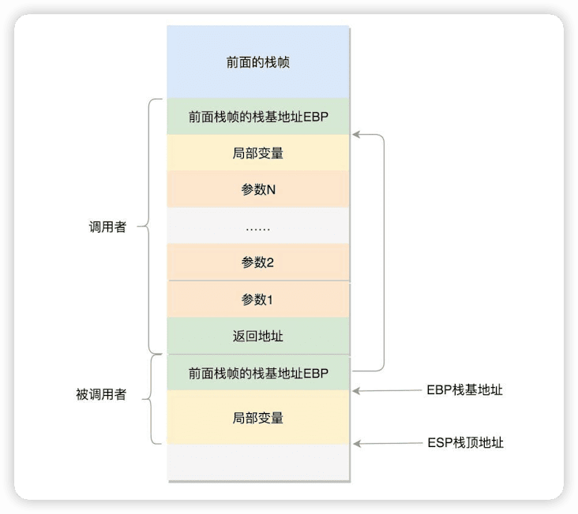

趣谈Linux操作系统
---

https://time.geekbang.org/column/intro/100024701

> 学前巩固一下C语言

### 介绍

**Linux操作系统这个“大管家”的角色，就好比一家公司的老板**。把这家公司做上市至少要经历以下四个发展阶段：

进入Linux内部，全方位理解计算机的工作原理，掌握程序的运行机制。如此，你的并发编程、程序设计和性能分析能力都会上升一个层次，开发效率会得到质的提升。在遇到实际问题时，你也能从系统层面出发，去编写代码和解决问题。

### 0-为什么要学习Linux操作系统？

#### 打开Linux这扇门，才是合格的软件工程师

#### 研究Linux内核代码，能学到数据结构与设计模式的落地实践

在 Linux 内核里，你会看到数据结构和算法的经典使用案例；你甚至还会看到并发情况下的保护这种复杂场景；在实践中遇到问题的时候，你可以直接参考内核中的实现。

例如，平时看起来最简单的文件操作，通过阅读 Linux 代码，你能学到从应用层、系统调用层、进程文件操作抽象层、虚拟文件系统层、具体文件系统层、缓存层、设备 I/O 层的完美分层机制，尤其是虚拟文件系统对于接入多种类型文件系统的抽象设计，在很多复杂的系统里面，这个思想都能用得上。

再如，当你写代码的时候，大部分情况下都可以使用现成的数据结构和算法库，但是有些场景对于内存的使用需要限制到很小，对于搜索的时间需要限制到很小的时候，我们需要定制化一些数据结构，这个时候内核里面这些实现就很有参考意义了。

#### 了解Linux生态，能事半功倍地学会新技术

只要你能想象到的技术领域，几乎都能在里面找到 Linux 的身影。

Linux管理的这家公司的发展阶段分为这样几个时期：

- 初创期：这个老板基于开放的营商环境（x86 体系结构），创办一家外包公司（系统的启动）。因为一开始没有其他员工，老板需要亲自接项目（实模式）。
- 发展期：公司慢慢做大，项目越接越多（保护模式、多进程），为了管理各个外包项目，建立了项目管理体系（进程管理）、会议室管理体系（内存管理）、文档资料管理系统（文件系统）、售前售后体系（输入输出设备管理）。
- 壮大期：公司越来越牛，开始促进内部项目的合作（进程间通信）和外部公司合作（网络通信）。
- 集团化：公司的业务越来越多，会成立多家子公司（虚拟化），或者鼓励内部创业（容器化），这个时候公司就变成了集团。大管家的调度能力不再局限于一家公司，而是集团公司（Linux 集群），从而成功上市（==从单机操作系统到数据中心操作系统==）。

文件操作在各个层的数据结构的关联：

### 02-学习路径：爬过这六个陡坡，你就能对Linux了如指掌

熟练使用Linux命令行、使用Linux进行程序设计、了解Linux内核机制、阅读Linux内核代码、实验定制Linux组件，以及最后落到生产实践上

#### 第一个坡：熟练使用Linux命令行

《鸟哥的Linux私房菜》。

如再深入一点，《Linux系统管理技术手册》](https://book.douban.com/subject/10747453/)

#### 第二个坡：通过系统调用或者glibc，学会自己进行程序设计

命令行工具也是程序，只不过是别人写的程序。从用别人写的程序，到自己能够写程序，通过程序来操作Linux，这是第二个要爬的坡。

用代码操作Linux，可以直接使用Linux系统调用，也可以使用glibc的库。

如果要进一步学习Linux程序设计，推荐你阅读《UNIX环境高级编程》，这本书有代码，有介绍，有原理，非常实用。

#### 第三个坡：了解Linux内核机制，反复研习重点突破

看看系统调用背后到底做了什么

《深入理解LINUX内核》

#### 第四个坡：阅读Linux内核代码，聚焦==核心逻辑和场景==

在了解内核机制的时候，你肯定会遇到困惑的地方，因为**理论的描述和提炼虽然能够让你更容易看清全貌，但是容易让你忽略细节**。

《LINUX内核源代码情景分析》

##### 第五个坡：实验定制化Linux组件，已经没人能阻挡你成为内核开发工程师了

#### 最后一个坡：面向真实场景的开发，实践没有终点

---

> 核心原理篇

## 一、Linux操作系统综述

### 04-快速上手几个Linux命令：每家公司都有自己的黑话

### 05-学会几个系统调用：咱们公司能接哪些类型的项目？

#### 立项服务与进程管理

#### 会议室管理与内存管理

brk和mmap

#### 档案库管理与文件管理

对于文件的操作，下面这六个系统调用是最重要的：

- 对于已经有的文件，可以使用open打开这个文件，close关闭这个文件；
- 对于没有的文件，可以使用creat创建文件；
- 打开文件以后，可以使用lseek跳到文件的某个位置；
- 可以对文件的内容进行读写，读的系统调用是read，写是write。

但是别忘了，Linux里有一个特点，那就是一切皆文件。

- 启动一个进程，需要一个程序文件，这是一个二进制文件。
- 启动的时候，要加载一些配置文件，例如yml、properties等，这是文本文件；启动之后会打印一些日志，如果写到硬盘上，也是文本文件。
- 但是如果我想把日志打印到交互控制台上，在命令行上唰唰地打印出来，这其实也是一个文件，是标准输出stdout文件。
- 这个进程的输出可以作为另一个进程的输入，这种方式称为管道，管道也是一个文件。
- 进程可以通过网络和其他进程进行通信，建立的Socket，也是一个文件。
- 进程需要访问外部设备，设备也是一个文件。
- 文件都被存储在文件夹里面，其实文件夹也是一个文件。
- 进程运行起来，要想看到进程运行的情况，会在/proc下面有对应的进程号，还是一系列文件。

#### 项目异常处理与信号处理

#### 项目组间沟通与进程间通信

消息队列（Message Queue）

Semaphore

#### 公司间沟通与网络通信

#### 查看源代码中的系统调用

#### 中介与Glibc

Glibc是Linux下使用的开源的标准C库，它是GNU发布的libc库。Glibc为程序员提供丰富的 API，除了例如字符串处理、数学运算等用户态服务之外，最重要的是封装了操作系统提供的系统服务，即系统调用的封装。

每个特定的系统调用对应了至少一个Glibc封装的库函数，比如说，系统提供的打开文件系统调用sys_open对应的是Glibc中的open函数。

有时候，Glibc一个单独的API可能调用多个系统调用，比如说，Glibc提供的printf函数就会调用如sys_open、sys_mmap、sys_write、sys_close等等系统调用。

也有时候，多个API也可能只对应同一个系统调用，如Glibc下实现的malloc、calloc、free等函数用来分配和释放内存，都利用了内核的sys_brk的系统调用。

#### 练习

> 有个命令strace，常用来跟踪进程执行时系统调用和所接收的信号。你可以试一下咱们学过的命令行，看看都执行了哪些系统调用。

## 二、系统初始化

### 06-x86架构：有了开放的架构，才能打造开放的营商环境

#### 计算机的工作模式是什么样的？

#### x86成为开放平台历史中的重要一笔

#### 从8086的原理说起

CPU里面的组件:

#### 再来说32位处理器

### 07-从BIOS到bootloader：创业伊始，有活儿老板自己上

### 08-内核初始化：生意做大了就得成立公司

这个过程就是这样的：用户态-系统调用-保存寄存器-内核态执行系统调用-恢复寄存器-返回用户态，然后接着运行。

### 09-系统调用：公司成立好了就要开始接项目

#### glibc对系统调用的封装

#### 32位系统调用过程

#### 54位系统调用过程

#### 系统调用表

#### 

### 三、进程管理

### 10-进程：公司接这么多项目，如何管？

#### 进程树

### 11-线程：如何让复杂的项目并行执行？

一个普通线程的创建和运行过程

#### 线程的数据

线程访问的数据细分为三类：

1. 第一类是线程栈上的本地数据

`ulimit -a`

2. 第二类是整个进程里共享的全局数据

3. 线程私有数据

#### 数据的保护

共享的数据保护问题

Mutex，全称Mutual Exclusion，中文叫互斥

Mutex的使用流程：

#### 小结

### 12-进程数据结构（上）：项目多了就需要项目管理系统

### 13-进程数据结构（中）：项目多了就需要项目管理系统

### 14-进程数据结构（下）：项目多了就需要项目管理系统

### 15-调度（上）：如何制定项目管理流程？

### 16-调度（中）：主动调度是如何发生的？

### 17-调度（下）：抢占式调度是如何发生的？

### 18-进程的创建：如何发起一个新项目？

### 19-线程的创建：如何执行一个新子项目？

## 四、内存管理

20-内存管理（上）：为客户保密，规划进程内存空间布局

21-内存管理（下）：为客户保密，项目组独享会议室封闭开发

22-进程空间管理：项目组还可以自行布置会议室

23-物理内存管理（上）：会议室管理员如何分配会议室？

24-物理内存管理（下）：会议室管理员如何分配会议室？

25-用户态内存映射：如何找到正确的会议室？

26-内核态内存映射：如何找到正确的会议室？

## 五、文件系统

27-文件系统：项目成果要归档，我们就需要档案库

28-硬盘文件系统：如何最合理地组织档案库的文档？

29-虚拟文件系统：文件多了就需要档案管理系统

30-文件缓存：常用文档应该放在触手可得的地方

## 六、输入输出系统

31-输入与输出：如何建立售前售后生态体系？

32-字符设备（上）：如何建立直销模式？

33-字符设备（下）：如何建立直销模式？

34-块设备（上）：如何建立代理商销售模式？

35-块设备（下）：如何建立代理商销售模式？

## 七、进程间通信

36-进程间通信：遇到大项目需要项目组之间的合作才行

37-信号（上）：项目组A完成了，如何及时通知项目组B？

38-信号（下）：项目组A完成了，如何及时通知项目组B？

39-管道：项目组A完成了，如何交接给项目组B？

40-IPC（上）：不同项目组之间抢资源，如何协调？

41-IPC（中）：不同项目组之间抢资源，如何协调？

42-IPC（下）：不同项目组之间抢资源，如何协调？

## 八、网络系统

43 预习-Socket通信之网络协议基本原理

43-Socket通信：遇上特大项目，要学会和其他公司合作

44-Socket内核数据结构：如何成立特大项目合作部？

45-发送网络包（上）：如何表达我们想让合作伙伴做什么？

46-发送网络包（下）：如何表达我们想让合作伙伴做什么？

47-接收网络包（上）：如何搞明白合作伙伴让我们做什么？

48-接收网络包（下）：如何搞明白合作伙伴让我们做什么？

## 九、虚拟化

49-虚拟机：如何成立子公司，让公司变集团？

50-计算虚拟化之CPU（上）：如何复用集团的人力资源？

51-计算虚拟化之CPU（下）：如何复用集团的人力资源？

52-计算虚拟化之内存：如何建立独立的办公室？

53-存储虚拟化（上）：如何建立自己保管的单独档案库？

54-存储虚拟化（下）：如何建立自己保管的单独档案库？

55-网络虚拟化：如何成立独立的合作部？

## 十、容器化

56-容器：大公司为保持创新，鼓励内部创业

57-Namespace技术：内部创业公司应该独立运营

58-cgroup技术：内部创业公司应该独立核算成本

59-数据中心操作系统：上市敲钟

---

> 实战篇

## 实战

60-搭建操作系统实验环境（上）：授人以鱼不如授人以渔

61-搭建操作系统实验环境（下）：授人以鱼不如授人以渔

62-知识串讲：用一个创业故事串起操作系统原理（一）

63-知识串讲：用一个创业故事串起操作系统原理（二）

64-知识串讲：用一个创业故事串起操作系统原理（三）

65-知识串讲：用一个创业故事串起操作系统原理（四）

66-知识串讲：用一个创业故事串起操作系统原理（五）

结束语-永远别轻视任何技术，也永远别轻视自己
