《鸟哥的Linux私房菜》笔记
-----------

更新为第四版

[鸟哥的首页](https://linux.vbird.org/)

### 准备

学习环境：Mac的VMware Fusion虚拟机，CentOS 7 64位；腾讯云 CentOS 7

查看IP地址的方法：

```shell
cat /etc/sysconfig/network-scripts/ifcfg-eth0
ifconfig
ip add
```


# Linux的学习曲线和建议


# 一、Linux 的规划与安装

## 0 计算器概论

### 0.1 电脑：辅助人脑的好工具

#### 计算机硬件的五大单元


输入单元、输出单元、CPU 内部的控制单元、算数逻辑单元、内存

#### 一切设计的起点： CPU 的架构

- 精简指令集（RISC，Reduced Instruction Set Computer）   ARM架构

- 复杂指令集（CISC，Complex Instruction Set Computer）   x86架构

#### 计算单位

- 容量单位

> 1 Byte = 8 bits
>
> K M G T P E Z

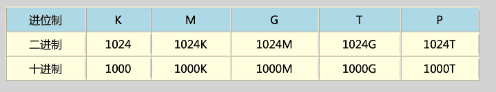

<font color=#FF8C00>一般，文件大小使用二进制的方式，所以 1GBytes 的文件大小实际上为：1024x1024x1024Bytes 这么大！ 速度单位则常使用十进制，例如 1GHz 就是1000x1000x1000Hz 的。</font>

- 速度单位

CPU运算速度常用MHz、GHz等，Hz表示秒分之一。

网速常用的是bit为单位，Mbps（Mbits per second），常说100M网速，要除以8，大约12.5MBps。

### 0.2 个人电脑架构与相关设备元件

#### CPU

##### CPU的工作频率：外频与倍频

外频：CPU与外部元件进行数据传输时的速度；

倍频：CPU内部用来加速工作性能的一个倍数。

**CPU的工作频率（内频） = 外频 * 倍频**

> 例如 Intel Core 2 E8400 的内频为 3.0GHz，而外频是333MHz，因此倍频就是9倍啰！（3.0G=333Mx9, 其中1G=1000M）

“超频”： 将CPU的倍频或者是外频通过主板的设置功能更改成较高频率的一种方式。（但一般倍频出厂时被锁定无法修改）

##### 32位与64位的CPU与总线“宽度”


##### CPU等级

2023年桌面端CPU综合性能天梯图：


##### 超线程 （Hyper-Threading, HT）


#### 内存（main memory）

不论是软件程序还是数据，都必须要读入内存后CPU才能利用。

动态随机存取内存（Dynamic Random Access Memory, DRAM）

静态随机存取内存（Static Random Access Memory, SRAM）

BIOS（Basic Input Output System）是一套程序，这套程序是写死到主板上面的一个内存芯片中， 这个内存芯片在没有通电时也能够将数据记录下来，那就是**只读存储器（Read Only Memory, ROM）**。


#### 显卡

显卡又称为VGA（Video Graphics Array）。

一般对于图形影像的显示重点在于**分辨率与色彩深度**，因为每个图像显示的颜色会占用掉内存， 因此显卡上面会有一个内存的容量（<font color=#FF8C00>**显存**</font>）。也就是说显存会影响图像的分辨率与色彩深度。

由于3D游戏和动画的流行，除了显存，显卡的“运算能力”也越来越重要。**图形处理器（graphics processing unit，GPU）**。


#### 硬盘与存储设备

##### 硬盘的物理组成


磁头（head）

##### 盘片上的数据

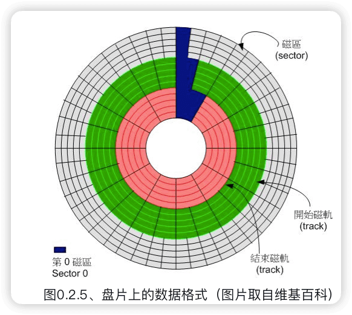

扇区 （sector）

磁道（track）

柱面 （cylinder）：所有盘片上面的同一个磁道


##### 磁盘与主板<font color=#FF8C00>传输接口</font>

传输接口： SATA、SAS、 IDE 与 SCSI ，其它USB, eSATA 等等。

主要：SATA, USB 与 SAS。

##### 固态硬盘 （Solid State Disk, SSD）


#### 扩展卡与接口

PCI (peripheral component interconnect)

**PCIe**（PCI-Express）速度快，主流。

一般主板大多还是会保留一两个 PCI 插槽，其他的则是以 PCIe 来设计。


#### 主板

##### 发挥扩展卡性能须考虑的插槽位置


##### 设备I/O位址与IRQ中断信道


##### CMOS与BIOS

CMOS主要的功能为记录主板上面的重要参数， 包括系统时间、CPU电压与频率、各项设备的I/O位址与IRQ等，由于这些数据的记录要花费电力，因此主板上面才有电池。 BIOS为写入到主板上某一块 flash 或 EEPROM 的程序，他可以在开机的时候执行，以载入CMOS当中的参数， 并尝试调用储存设备中的开机程序，进一步进入操作系统当中。

BIOS程序也可以修改CMOS中的数据， 每种主板调用BIOS设置程序的按键都不同，一般台式机常见的是使用[del]按键进入BIOS设置画面。


##### 连接周边设备的接口

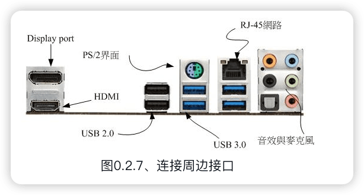


#### 电源供应器


### 0.3 数据表示方式

### 0.4 软件程序运行


#### 操作系统

##### 操作系统核心（Kernel）


##### 系统调用（System Call）


##### 操作系统核心的功能：

- 系统调用接口（System call interface）
- 程序管理（Process control）  cpu有效分配，cpu排程机制
- 内存管理（Memory management）
- 文件系统管理（Filesystem management）
- 设备的驱动（Device drivers）   可加载模块


##### 操作系统与驱动程序


#### 应用程序

### 小结

`cat /proc/cpuinfo`

`lspci`   显示系统中所有PCI总线设备或连接到该总线上的所有设备的工具


## 1 Linux是什么与如何学习

### 1.1 Linux是什么


####  Linux之前，Unix的历史

GNU 是 GNU is Not Unix 

GNU C Compiler(gcc)

自由软件基金会(FSF, Free Software Foundation)

GNU的**通用公共许可证**(General Public License, GPL) ， copyleft(相对于专利软件的copyright！)

GNU所开发的几个重要软件，如：

```
Emacs
GNU C （GCC）
GNU C Library （glibc）
Bash shell
```


#### 关于GNU计划、自由软件与开放源代码

##### 自由软件的活动


##### 自由软件的版权GNU GPL：


##### 自由（Free）的真谛：

使用者可以自由的执行、复制、再发行、学习、修改与强化自由软件。

一个软件挂上了GPL版权宣告之后，他自然就成了自由软件！这个软件就具有下面的特色：

```
取得软件与源代码：你可以根据自己的需求来执行这个自由软件；

复制：你可以自由的复制该软件；

修改：你可以将取得的源代码进行程序修改工作，使之适合你的工作；

再发行：你可以将你修改过的程序，再度的自由发行，而不会与原先的撰写者冲突；

回馈：你应该将你修改过的程序码回馈于社群！
```

但请特别留意，你所修改的任何一个自由软件都不应该也不能这样：

```
修改授权：你不能将一个GPL授权的自由软件，在你修改后而将他取消GPL授权～

单纯贩卖：你不能单纯的贩卖自由软件。
```


##### 自由软件与商业行为：

Linux开发商大多都是贩售“售后服务！”


##### 开放源代码：

自由软件（free software）

常见的开放源代码授权有哪些呢？

Apache License 2.0

BSD 3-Clause "New" or "Revised" license

BSD 2-Clause "Simplified" or "FreeBSD" license

GNU General Public License （GPL）

GNU Library or "Lesser" General Public License （LGPL）

MIT license

Mozilla Public License 2.0

Common Development and Distribution License

##### 专属软件/专利软件 （close source）

相对于Open Source的软件会释出源代码，Close source的程序则仅推出可执行的二进制程序（binary program）而已。

优点是有专人维护，你不需要去更动他；缺点则是灵活度大打折扣，使用者无法变更该程序成为自己想要的样式！


### 1.2 Torvalds的Linux发展

#### 与Minix之间


#### 对386硬件的多任务测试


#### 初次释出Linux 0.02

**POSIX**是可携式操作系统接口(Portable Operating System Interface)，重点在规范核心与应用程序之间的接口。


#### Linux 的发展：虚拟团队的产生


#### Linux的核心版本

Linux的核心版本编号类似：


#### Linux distributions

各大Linux Distributions的主要异同：支持标准！

为了让所有的Linux distributions开发不致于差异太大，且让这些开发商在开发的时候有所依据，还有[Linux Standard Base （LSB）]( http://www.linuxbase.org/)等标准来规范开发者，以及目录架构的[File system Hierarchy Standard （FHS）](https://www.pathname.com/fhs/)标准规范！


Linux distributions可以以软件安装方式分为两大主流 ：

1. 使用RPM （Red Hat，Fedora，SuSE）
2. 使用dpkg(Debian,Ubuntu等)


### 1.3 Linux当前用在哪里

#### 企业

1. 网络服务器
2. 关键任务的应用（金融数据库、大型企业网管环境）
3. 学术机构的高性能运算任务

#### 个人

1. 桌面电脑

2. 手持系统（PDA、手机）

3. 嵌入式系统。

   家电产品、数码相机、路由器、防火墙、IP分享器、交换器、机器人控制芯片等

#### 云端运用

1. 云程序
2. 端设备


### 1.4 Linux 该如何学习

[TLDP](http://www.tldp.org/)（The Linux Documentation Project）


linux上的图形界面： KDE ， GNOME

**平行运算**是将原本的工作分成多样，然后交给多部主机去运算，最终再将结果收集起来。

要让linux解决问题

Linux最强的地方在于**网络**，而Windows是赢在用户接口较为亲善。

> 作为一个使用者，人要迁就机器；做为一个开发者，要机器迁就人。

**TLDP**是 The Linux Documentation Project 。

异步的磁盘/内存数据传输模式。

`/usr/share/doc/`   Linux自己的文档存储位置

`/var/log/`   Linux系统日志

不同环境下，解决问题的方法有很多种，只要行的通，就是好方法。


## 2 主机规划与磁盘分区

### 2.1 Linux与硬件的搭配

#### 硬件设备在Linux中的文件名

> **在Linux系统中，每个设备都被当成一个文件来对待。**

*   IDE接口 /dev/hd[a-d] 
*   SATA接口（目前磁盘，u盘等） /dev/sd\[a-p][1-\] (a-p的顺序是安装磁盘被检测的先后，数字是分隔槽)

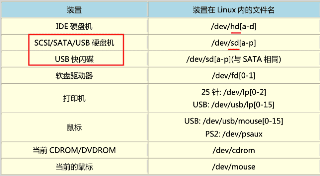


### 2.2 磁盘分区🔖

#### 磁盘连接的方式与设备文件名的关系

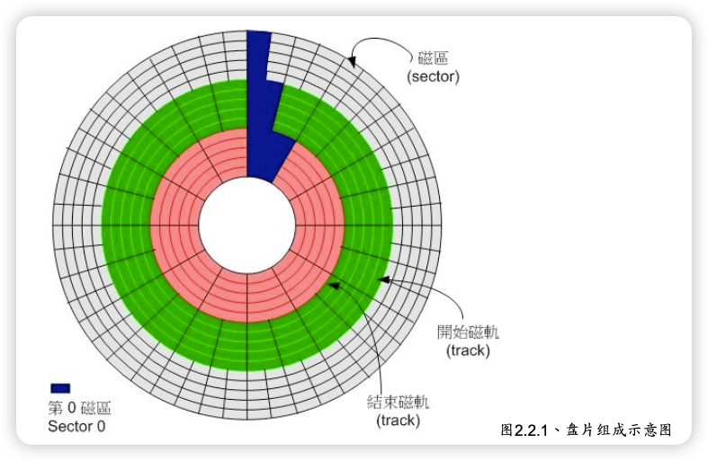

#### MSDOS（MBR） 与 GPT 磁盘分区表（partition table）

##### 磁盘的组成

> sector 扇区，磁区(512字节)。  
> track 磁道。由于磁盘是旋转的，则连续写入的数据是排列在一个圆周上的。所以这个圆周上的所有sector组成一个track。  
> side/head 磁面/磁头。每个磁面都有一个用于读取存储数据的磁头，所以side数与head数相同  
> cylinder 磁柱，柱面(这个翻译貌似不好理解)。

*   磁盘的第一个sector： 1，主要启动记录区(Master Boot Record, MBR)：可以安装开机管理程序的地方，有446 bytes 2，分割表(partition table)：记录整颗硬盘分割的状态，有64 bytes 3，结束标志：2bytes
*   partition table 
    *   最多纪录四条分割信息（开始和结束的磁柱号码，主和延伸分割槽；其中延伸最多一个，可以进行逻辑分割）
    *   分隔槽最小单位是cylinder
    *   延伸分割槽使用额外的扇区来纪录分割信息（在延伸分隔槽中）

##### MSDOS （MBR） 分区表格式与限制


##### 开机流程与MBR 

由于**开机管理程序**是操作系统在安装的时候所提供的，所以他会认识硬盘内的文件系统格式。 
1.  BIOS：开机主动执行的韧体（写在硬件上的一个软件程序），会认识第一个可开机的装置；
2.  MBR：第一个可开机装置的第一个扇区内的主要启动记录区块，内含开机管理程序；
3.  开机管理程序(boot loader)：一支可读取 核心档案 来执行的软件；
4.  核心档案：开始操作系统的功能... 

##### 多重引导 

开机管理程序也可以安装在每个分隔槽的**启动扇区**(boot sector)

每个分割槽都拥有自己的启动扇区

实际可开机的核心档案是放置到各分隔槽中

windows安装程序会主动的覆盖掉MBR以及自己所在分割槽的启动扇区 ，所以先安装windows

##### 磁盘分区的选择 

**挂载** 就是利用一个目录当成进入点，将磁盘分隔槽的数据放置在该目录下

SAMBA （与windows文件共享） /home

邮件服务器 /var


#### Linux安装模式下，磁盘分区的选择（极重要）

##### 目录树结构 （directory tree）


##### 文件系统与目录树的关系（挂载）

<font color=#FF8C00>“挂载”</font>就是利用一个目录当成进入点，将磁盘分区的数据放置在该目录下； 也就是说，进入该目录就可以读取该分区。

由于整个Linux系统最重要的是根目录，因此根目录一定需要挂载到某个分区的。 至于其他的目录则可依使用者自己的需求来给予挂载到不同的分区。

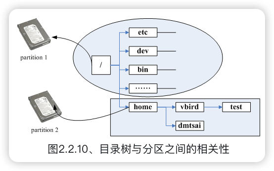

### 2.3 安装Linux前的规划


## 3 安装CentOS7.x🔖


## 4 首次登录与man page

### 4.1 首次登陆系统


### 4.2 文字模式下命令的下达

#### 开始下达的命令

格式一般是：

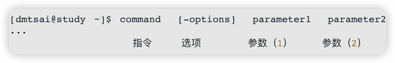

第一个被输入的数据绝对是指令或者是可执行的文件。

##### 语系的支持

 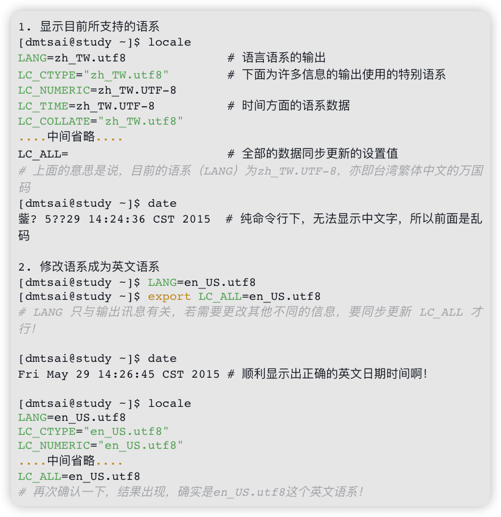

#### 基础命令

`locale`

`date` 

`cal`

`bc`

在命令行下达命令后，会有两种情况：

- 一种是该指令会直接显示结果然后回到命令提示字符等待下一个指令的输入；
- 一种是进入到该指令的环境，直到结束该指令才回到命令提示字符的环境。（需要结束命令，如bc的就是quit）

#### 重要的几个热键

[Tab]

ctrl-c 中断目前程序 

ctrl-z 把程序掉到背景中

ctrl-d 键盘输入结束 (End Of File, EOF 或 End Of Input) 类似于 exit

[shift]+{[PageUP]|[Page Down]}    翻页


#### 错误信息的查看

```shell
DATE: command not found
```

两个原因：

1. 没安装
2. 命令所在目录不在命令搜寻路径中（PATH）


### 4.3 Linux系统的线上求助man page与info page

#### 命令的--help 求助说明

```shell
[dmtsai@study ~]# date --help
Usage: date [OPTION]... [+FORMAT]                           # 这里有基本语法
  or:  date [-u|--utc|--universal] [MMDDhhmm[[CC]YY][.ss]]  # 这是设置时间的语法
Display the current time in the given FORMAT, or set the system date.
# 下面是主要的选项说明
Mandatory arguments to long options are mandatory for short options too.
  -d, --date=STRING         display time described by STRING, not 'now'
  -f, --file=DATEFILE       like --date once for each line of DATEFILE
....（中间省略）....
  -u, --utc, --universal    print or set Coordinated Universal Time （UTC）
      --help     显示此求助说明并离开
      --version  显示版本信息并离开
# 下面则是重要的格式 （FORMAT） 的主要项目
FORMAT controls the output.  Interpreted sequences are:

  %%   a literal %
  %a   locale's abbreviated weekday name （e.g., Sun）
  %A   locale's full weekday name （e.g., Sunday）
....（中间省略）....
# 下面是几个重要的范例 （Example）
Examples:
Convert seconds since the epoch （1970-01-01 UTC） to a date
  $ date --date='@2147483647'
....（下面省略）....
```


#### man page

```shell
[dmtsai@study ~]$ man date
DATE（1）                          User Commands                         DATE（1）
# 请注意上面这个括号内的数字
NAME  <==这个指令的完整全名，如下所示为date且说明简单用途为设置与显示日期/时间
       date - print or set the system date and time

SYNOPSIS  <==这个指令的基本语法如下所示
       date [OPTION]... [+FORMAT]                            <==第一种单纯显示的用法
       date [-u|--utc|--universal] [MMDDhhmm[[CC]YY][.ss]]   <==这种可以设置系统时间的用法

DESCRIPTION  <==详细说明刚刚语法谈到的选项与参数的用法
       Display the current time in the given FORMAT, or set the system date.

       Mandatory arguments to long options are mandatory for short options too.

       -d, --date=STRING  <==左边-d为短选项名称，右边--date为完整选项名称
              display time described by STRING, not 'now'

       -f, --file=DATEFILE
              like --date once for each line of DATEFILE

       -I[TIMESPEC], --iso-8601[=TIMESPEC]
              output  date/time  in  ISO  8601  format.   TIMESPEC='date' for date only （the
              default）, 'hours', 'minutes', 'seconds', or 'ns' for  date  and  time  to  the
              indicated precision.
....（中间省略）....
       # 找到了！下面就是格式化输出的详细数据！
       FORMAT controls the output.  Interpreted sequences are:

       %%     a literal %

       %a     locale's abbreviated weekday name （e.g., Sun）

       %A     locale's full weekday name （e.g., Sunday）
....（中间省略）....
ENVIRONMENT  <==与这个指令相关的环境参数有如下的说明
       TZ     Specifies the timezone, unless overridden by command line parameters.  
              If neither is specified, the setting from /etc/localtime is used.

EXAMPLES     <==一堆可用的范本
       Convert seconds since the epoch （1970-01-01 UTC） to a date

              $ date --date='@2147483647'
....（中间省略）....

DATE STRING  <==上面曾提到的 --date 的格式说明！
       The --date=STRING is a mostly free format human readable date string such as "Sun, 29
       Feb 2004 16:21:42 -0800" or "2004-02-29 16:21:42" or even "next  Thursday".   A  date
       string  may  contain  items  indicating calendar date, time of day, time zone, day of

AUTHOR  <==这个指令的作者啦！
       Written by David MacKenzie.

COPYRIGHT  <==受到著作权法的保护！用的就是 GPL 了！
       Copyright © 2013 Free Software Foundation, Inc.  License GPLv3+: GNU GPL version 3 or
       later <http://gnu.org/licenses/gpl.html>.
       This  is free software: you are free to change and redistribute it.  There is NO WAR‐
       RANTY, to the extent permitted by law.

SEE ALSO  <==这个重要，你还可以从哪里查到与date相关的说明文档之意
       The full documentation for date is maintained as a Texinfo manual.  If the  info  and
       date programs are properly installed at your site, the command

              info coreutils 'date invocation'

       should give you access to the complete manual.

GNU coreutils 8.22                        June 2014                                  DATE（1）
```


man page 中第一行代号的意义（`man 7 man` 查看）：

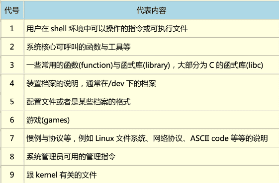

man page中每个部分的含义：

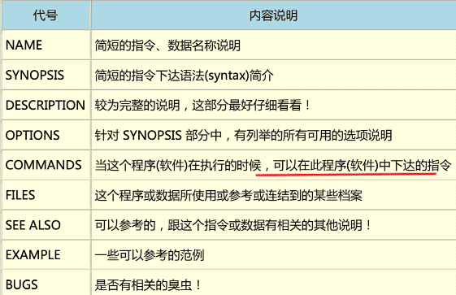


`man -f command` 查看某个命令的所有相关说明文件， 类似于 `whatis` （需要有whatis数据库） 

 `man -k`(比-f更全,相关的) 类似于 `apropos` 


#### info page

类似man page，不过info page将文件数据拆成一个一个的段落。


#### 其它有用的文件

`/etc/man.config`中定义了man到哪寻找参考文件  
MANPATH /usr/man 
MANPATH /usr/share/man  
MANPATH /usr/local/man  
MANPATH /usr/local/share/man  
MANPATH /usr/X11R6/man

`info` /usr/share/info/

`/usr/share/doc/` 下有很多重要的文档 `/usr/share/doc/centos-release-notes-5.5/`  
`/usr/share/doc/bash-3.2/`


### 4.4 文本编辑器

`nano` 


### 4.5 正确关机方法

正常关机关注点：

1. 观察系统的使用状态:  `who`    `netstat -a`

2. 通知在线使用者关机的时刻:

3. 正确的关机指令使用:   `shutdown`   `reboot`


`sync` 将数据同步写入磁盘

`shutdown`  关机

```shell
[root@www ~]# shutdown -h now
立刻关机，其中 now 相当于时间为 0 的状态
[root@www ~]# shutdown -h 20:25
系统在今天的 20:25 分会关机，若在 21:25 才下达此指令，则隔天才关机 
[root@www ~]# shutdown -h +10
系统再过十分钟后自动关机
[root@www ~]# shutdown -r now
系统立刻重新启动
[root@www ~]# shutdown -r +30 'The system will reboot' 
再过三十分钟系统会重新启动，并显示后面的讯息给所有在在线的使用者 
[root@www ~]# shutdown -k now 'This system will reboot' 
仅发出警告信件的参数!系统并不会关机啦!吓唬人!
```


`reboot`,`halt`,`poweroff`   重新启动、关闭


systemctl 关机

```shell
[root@study ~]# systemctl [指令]
指令项目包括如下：
halt       进入系统停止的模式，屏幕可能会保留一些讯息，这与你的电源管理模式有关
poweroff   进入系统关机模式，直接关机没有提供电力喔！
reboot     直接重新开机
suspend    进入休眠模式

[root@study ~]# systemctl reboot    # 系统重新开机
[root@study ~]# systemctl poweroff  # 系统关机
```


#### 切换执行等级: init

`init 0` 关机，`init 5` 类似 `startx`


#### 文件系统错误的问题

`/etc/issue`中是开机显示信息，通过`man issue`(配置文件的档案内容格式，man page的代号为5) > `man mingetty`查看/etc/issue中变量的意义


#### 忘记root密码

# 二、Linux文件、目录与磁盘格式

 ## 5 linux文件权限与目录配置

### 5.1 使用者与群组

**owner/group/others** 简写 **u/g/o**

账号相关信息：`/etc/passwd`

账号密码：`/etc/shadow`

群组名称：`/etc/group`


### 5.2 Linux文件权限

#### Linux文件属性

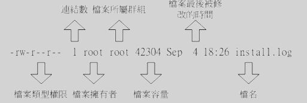

- 第一栏代表这个文件的类型与权限（permission）

文件类型：d，-， l，b，c

文件权限**rwx**分别表示read、write、execute。三组分别代表**u/g/o**。

- 第二栏表示有多少文件名链接到此节点（i-node）

- 第三栏表示这个文件（或目录）的“拥有者帐号”

- 第四栏表示这个文件的所属群组

- 第五栏为这个文件的容量大小，默认单位为Bytes

- 第六栏为这个文件的创建日期或者是最近的修改日期

- 第七栏为这个文件的文件名

```shell
drwxr-xr-- 1 test1 testgroup 5238 Jun 19 10:24 groups/
```

testgroup群组的[r-x]表示同组其它如test2可以进入本目录，但不能再目录下进行写入操作；other的[r--]，没有x权限，不能进入此目录。


#### 如何改变文件属性与权限

##### chgrp ：改变文件所属群组

```shell
chgrp [-R] group dirname/filename
```

群组group必须已经在/etc/group中已经存在。

##### chown ：改变文件拥有者

```shell
chown [-R] user[:group] dirname/filename
```

-R表示同时修改目录下所有目录和文件。

##### chmod ：改变文件的权限, SUID, SGID, SBIT等等的特性

1. 数字类型

```shell
chmod [-R] xyz dirname/filename
```

2. 符号类型

```shell
chmod u=rwx,go=rx .bashrc
```


a表示所有身份


#### 目录与文件的权限意义

- 权限对文件的重要性

文件的rwx， 主要针对**文件的内容**而言的。

- 权限对目录的重要性

目录的r表示可以查询该目录下的文件名数据，即可以用`ls` 查看目录的内容；

目录的w很重要，表示可以改变目录下的结构：

1. 建立新的文件与目录； 
2. 删除已经存在的文件与目录(不论该文件的权限为何！) ；
3. 将已存在的文件或目录进行更名；
4.  搬移该目录内的文件、目录位置；

目录的x表示<u>能否进入目录使之成为工作目录</u>，即是否可以`cd`（change directory）。

<font color=#FF8C00>要开放目录给任何人浏览时，应该至少也要给予r及x的权限，但w权限不可随便给！</font>

🔖


sudo -s

last /var/log/wtmp btmp


#### Linux文件种类与扩展名

##### 文件种类

1. 普通文件【-】。就是平常说的文件，分三类：

   纯文本（ASCII）

   二进制文件

   数据格式文件：一些特定文件，例如存储用户登录情况的文件`/var/log/wtmp`，命令`last`就是读取这个文件。

   ```shell
   # file /var/log/wtmp
   /var/log/wtmp: data
   # last
   root     pts/0        192.168.165.1    Sun Jun  7 17:41   still logged in
   root     tty1                          Sun Jun  7 17:40   still logged in
   reboot   system boot  3.10.0-1127.el7. Sun Jun  7 17:39 - 17:42  (00:02)
   root     pts/1        192.168.165.1    Tue Jun  2 17:04 - 20:59  (03:55)
   root     pts/0        192.168.165.1    Tue Jun  2 10:16 - 17:22  (07:05)
   root     tty1                          Tue Jun  2 10:16 - 23:24  (13:08)
   reboot   system boot  3.10.0-1127.el7. Tue Jun  2 10:15 - 23:24  (13:08)
   root     pts/0        192.168.165.1    Mon May 25 18:57 - down   (02:58)
   root     pts/0        192.168.165.1    Mon May 25 11:23 - 18:11  (06:47)
   root     pts/1        192.168.165.1    Sun May 24 17:01 - 19:53  (02:52)
   root     pts/0        192.168.165.1    Sun May 24 07:29 - 17:21  (09:52)
   root     pts/0        192.168.165.1    Sun May 24 07:14 - 07:28  (00:14)
   root     tty1                          Sun May 24 07:11 - 21:56 (1+14:45)
   reboot   system boot  3.10.0-1127.el7. Sun May 24 07:10 - 21:56 (1+14:45)
   root     pts/0        192.168.165.1    Sat May 23 17:22 - down   (01:41)
   root     tty1                          Sat May 23 12:15 - 19:03  (06:48)
   reboot   system boot  3.10.0-1127.el7. Sat May 23 12:08 - 19:03  (06:55)
   
   wtmp begins Sat May 23 12:08:07 2020
   ```

   

2. 目录 【d】


3. （软）链接【l】


4. 设备与装置文件

   通常在`/dev`下，分两类区块（block）设备文件【b】和字符设备文件【c】。

5. 资料接口文件【s】

   与客服端进行socket链接，通常在`/var/run`

6. 数据传送文件（FIFO，pipe）【p】


##### Linux文件扩展名

linux文件是没有所谓的“扩展名”，文件名只是为了让用户了解文件的用途。


##### Linux文件名长度限制

255

4096

##### Linux文件名命名限制

最好可以避免一些特殊字符


### 5.3 Linux目录配置

#### Linux目录配置的依据（FHS）

 [FHS](http://www.pathname.com/fhs/)(Filesystem Hierarchy Standard）是官方对不同Linux发行版目录的限制。

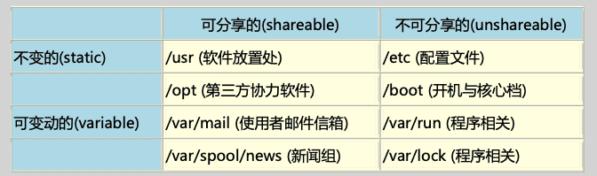

- 可分享的:可以分享给其他系统挂载使用的目录，所以包括执行文件与用户的邮件等数据， 是能够分享给网络上其他主机挂载用的目录;
- 不可分享的:自己机器上面运作的装置档案或者是与程序有关的 socket 档案等， 由于仅与自身机器有关，所以当然就不适合分享给其他主机了。
- 不变的:有些数据是不会经常变动的，跟随着 distribution 而不变动。 例如函式库、文件说明 文件、系统管理员所管理的主机服务配置文件等等;
- 可变动的:经常改变的数据，例如登录文件、一般用户可自行收受的新闻组等。

FHS仅定义的三个目录：

- **/** ( 根目录):与开机系统有关;
-  **/usr** (unix software resource):与软件安装/执行有关;
-  **/var** (variable):与系统运作过程有关。


##### 根目录的意义和内容

根目录是整个系统最重要的一个目录，因为不但所有的目录都是由根目录衍生出来的， 同时根目录也与**开机/还原/系统修复**等动作有关。 由于系统开机时需要特定的**开机软件、核心文件、开机所需程序、 函式库**等等文件数据，若系统出现错误时，根目录也必须要包含有能够修复文件系统的程序才行。

 因为根目录是这么的重要，所以FHS标准建议: **根目录(/)所在分割槽应该越小越好，且应用程序所安装的软件最好不要与根目录放在同一个分割槽内，保持根目录越小越好。**这样减少发生错误的机会。

根目录一般有如下次目录：

因此 FHS 标准建议: 根目录(/)所在分割槽应该越小越好， 且应用程序所安装的软件最好不要与根目录 放在同一个分割槽内，保持根目录越小越好。

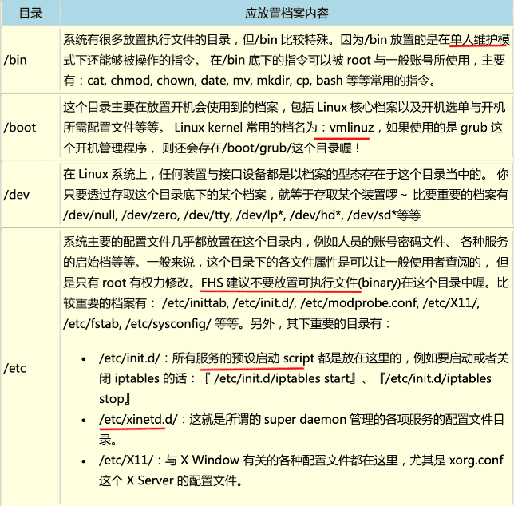


FHS标准外需要了解的一些目录：

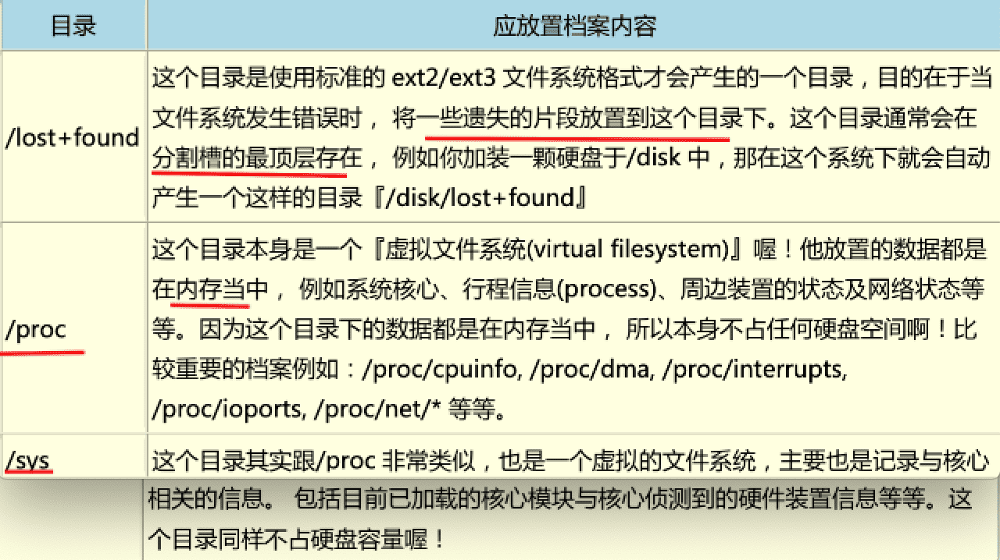


不可以与根目录分开的五个目录：

- **/etc**:配置文件
- **/bin**:重要执行档
- **/dev**:所需要的装置档案􏰮
-  **/lib**:执行档所需的函式库与核心所需的模块 􏰮 
- **/sbin**:重要的系统执行文件


##### /usr 的意义与内容

依据 FHS 的基本定义，/usr 里面放置的数据属于可分享的与不可变动的(shareable, static)， 如果你知 道如何透过网络进行分割槽的挂载(例如在服务器篇会谈到的 **NFS服务器**)，那么/usr 确实可以分享给局 域网络内的其他主机来使用喔!

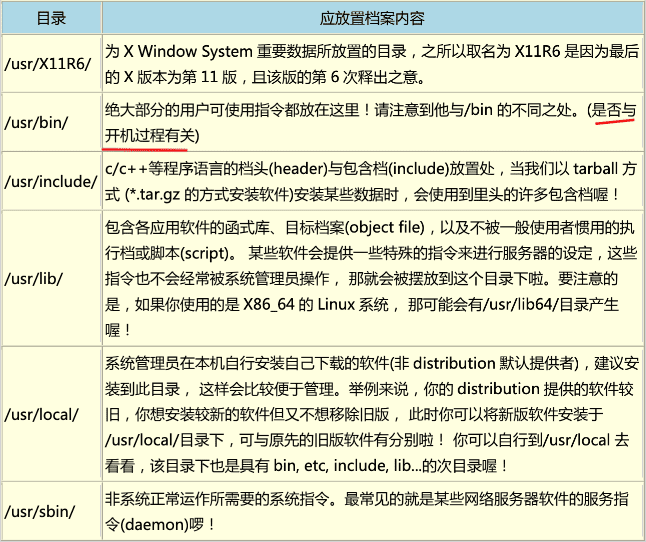

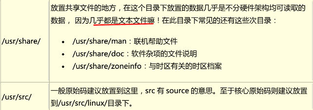

##### /var的意义与内容

如果/usr 是安装时会占用较大硬盘容量的目录，那么/var 就是在系统运作后才会渐渐占用硬盘容量的目 录。 因为/var 目录主要针对**常态性变动的文件**，包括快取(cache)、登录档(log file)以及某些软件运作所产生的档案， 包括程序档案(lock file, run file)，或者例如 MySQL 数据库的档案等等。

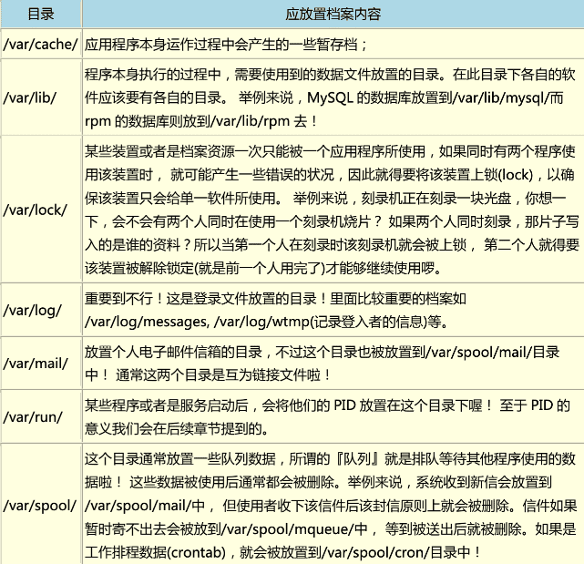

##### 在FHS标准基础上，各家的distributions有所不同


#### 目录树


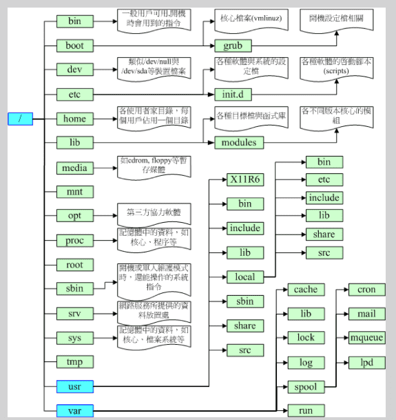


#### 绝对路径和相对路径


## 6 Linux文件与目录管理

### 6.1 目录与路径

#### 目录的相关操作

`cd`  `pwd`  `mkdir`  `rmdir`

#### 关于可执行文件路径的变量： $PATH

`$PATH`


### 6.2 文件与目录管理

#### 文件与目录的检视

`ls`

#### 复制、删除与移动

`cp`   `rm`   `mv`

#### 取得路径的文件名称与目录名称

`basename`

`dirname`

### 6.3 文件内容查阅

#### 直接检视文件内容

`cat ` 

`tac` 

 `nl`

#### 可翻页检视

`more` 

 `less`

#### 数据截取

`head` 

 `tail`

#### 非文本文件

`od`

```shell
[root@study ~]# od [-t TYPE] 文件
选项或参数：
-t  ：后面可以接各种“类型 （TYPE）”的输出，例如：
      a       ：利用默认的字符来输出；
      c       ：使用 ASCII 字符来输出
      d[size] ：利用十进制（decimal）来输出数据，每个整数占用 size Bytes ；
      f[size] ：利用浮点数值（floating）来输出数据，每个数占用 size Bytes ；
      o[size] ：利用八进位（octal）来输出数据，每个整数占用 size Bytes ；
      x[size] ：利用十六进制（hexadecimal）来输出数据，每个整数占用 size Bytes ；

范例一：请将/usr/bin/passwd的内容使用ASCII方式来展现！
[root@study ~]# od -t c /usr/bin/passwd
0000000 177   E   L   F 002 001 001  \0  \0  \0  \0  \0  \0  \0  \0  \0
0000020 003  \0   >  \0 001  \0  \0  \0 364   3  \0  \0  \0  \0  \0  \0
0000040   @  \0  \0  \0  \0  \0  \0  \0   x   e  \0  \0  \0  \0  \0  \0
0000060  \0  \0  \0  \0   @  \0   8  \0  \t  \0   @  \0 035  \0 034  \0
0000100 006  \0  \0  \0 005  \0  \0  \0   @  \0  \0  \0  \0  \0  \0  \0
.....（后面省略）....
# 最左边第一栏是以 8 进位来表示Bytes数。以上面范例来说，第二栏0000020代表开头是
# 第 16 个 byes （2x8） 的内容之意。

范例二：请将/etc/issue这个文件的内容以8进位列出储存值与ASCII的对照表
[root@study ~]# od -t oCc /etc/issue
0000000 134 123 012 113 145 162 156 145 154 040 134 162 040 157 156 040
          \   S  \n   K   e   r   n   e   l       \   r       o   n
0000020 141 156 040 134 155 012 012
          a   n       \   m  \n  \n
0000027
# 如上所示，可以发现每个字符可以对应到的数值为何！要注意的是，该数值是 8 进位喔！
# 例如 S 对应的记录数值为 123 ，转成十进制：1x8^2+2x8+3=83。
```

#### 修改文件时间或创建新文件

`touch`

### 6.4 文件和目录的默认权限、隐藏权限

#### `umask`  文件预设权限

```shell
[root@www ~]# umask
0022 <==与一般权限有关的是后面三个数字! 
[root@www ~]# umask -S
u=rwx,g=rx,o=rx
```

#### 文件隐藏属性

`chattr`    配置文件案隐藏属性

```shell
[root@www tmp]# touch attrtest <==建立一个空档案
[root@www tmp]# chattr +i attrtest <==给予 i 的属性
[root@www tmp]# rm attrtest <==尝试删除看看
rm: remove write-protected regular empty file `attrtest'? y

rm: cannot remove `attrtest': Operation not permitted <==操作不许可 # 看到了吗?呼呼!连 root 也没有办法将这个档案删除呢!赶紧解除设定!

范例:请将该档案的 i 属性取消! 
[root@www tmp]# chattr -i attrtest
```


`lsattr`  显示档案隐藏属性

```shell
[root@www ~]# lsattr [-adR] 档案或目录
选项与参数:
-a :将隐藏文件的属性也秀出来;
-d :如果接的是目录，仅列出目录本身的属性而非目录内的文件名; -R :连同子目录的数据也一并列出来!

[root@www tmp]# chattr +aij attrtest 
[root@www tmp]# lsattr attrtest 
----ia---j--- attrtest
```


#### 文件的特殊权限： SUID，SGID，SBIT

```shell
[root@www ~]# ls -ld /tmp ; ls -l /usr/bin/passwd 
drwxrwxrwt 7 root root 4096 Sep 27 18:23 /tmp 
-rwsr-xr-x 1 root root 22984 Jan 7 2007 /usr/bin/passwd
```


#### 观察文件类型：`file` 


### 6.5 命令和文件的搜索

#### 命令的搜索

`which` / `type`

```bash
# which [-a] command

[root@VM-16-12-centos ~]# which history 
/usr/bin/which: no history in (/usr/local/sbin:/usr/local/bin:/usr/sbin:/usr/bin:/root/bin)
[root@VM-16-12-centos ~]# type history 
history is a shell builtin
```

which 是根据用户所设定的 PATH 变量内的目录去搜寻可执行文件的！history是内置的命令。

#### 文件文件名的搜索

##### `whereis`  

只查找某些特定目录下面的文件。`whereis -l`可显示其查找的目录。

```shell
[root@www ~]# whereis [-bmsu] 档案或目录名 
选项与参数:
-b	:只找二进制格式的文件
-m	：只找说明文件manual路径下的文件
-s	：只找Source来源文件
-u : 搜寻不在上述三个项目当中的其他特殊档案
```


##### `locate`

在已创建的数据库 `/var/lib/mlocate/` 中查找。

这数据库文件CentOS 7.x默认只更新一次。通过命令`updatedb`可手动更新，这个命令根据配置文件`/etc/updatedb.conf`的设置搜索系统里的文件名，并更新到前面的数据库文件。

```shell
# locate [-ir] keyword
-i：忽略大小写
-l：仅输出几行
-r：正则
-S：输出locate所使用的数据库文件的相关信息，包括数据库记录的文件/目录数量等

[root@VM-16-12-centos ~]# locate -l 5 passwd
/etc/passwd
/etc/passwd-
/etc/pam.d/passwd
/etc/security/opasswd
/usr/bin/gpasswd
[root@VM-16-12-centos ~]# locate -S
Database /var/lib/mlocate/mlocate.db:
      21,505 directories
      164,759 files
      15,880,186 bytes in file names
      4,774,040 bytes used to store database
```

#####   `find`

```shell
# find [PATH] [option] [action]
```


### 6.6 权限和命令间的关系


## 7 Linux磁盘与文件系统管理

### **7.1** 认识 **Linux** 文件系统

#### 7.1.1 磁盘组成与分区的复习

磁盘的物理组成：

- 圆形的==盘片==（主要记录数据的部分）；
- 机械手臂，与在机械手臂上的==磁头==（可读写盘片上的数据）；
- 主轴马达，可以转动盘片，让机械手臂的磁头在盘片上读写数据。

盘片的物理组成：


- 扇区(Sector)为最小的物理储存单位，且依据磁盘设计的不同，目前主要有 512Bytes 与 4K 两种格式;
- 将扇区组成一个圆，那就是**柱面(Cylinder)**; 
- 早期的分区主要以柱面为最小分区单位，现在的分区通常使用扇区为最小分区单位(每 个扇区都有其号码喔，就好像座位一样); 
- 磁盘分区表主要有两种格式，一种是限制较多的 MBR 分区表，一种是较新且限制较少的 GPT 分区表。

- MBR 分区表中，第一个扇区最重要，里面有:(1)主要开机区(Master boot record, MBR)及分区表(partition table)， 其中 MBR 占有 446 Bytes，而 partition table 则占 有 64 Bytes。
- GPT 分区表除了分区数量扩充较多之外，支持的磁盘容量也可以超过 2TB。

磁盘的文件名：
`/dev/sd[a-p][1-128]`：为实体磁盘的磁盘文件名；

`/dev/vd[a-d][1-128]`：为虚拟磁盘的磁盘文件名。


#### 7.1.2 文件系统特性


#### 7.1.3 Linux 的 EXT2 文件系统（inode）


#### 7.1.4 与目录树的关系


#### 7.1.5 EXT2/EXT3/EXT4 文件的存取与日志式文件系统的功能


#### 7.1.6 Linux 文件系统的运行


#### 7.1.7 挂载点的意义 （mount point）


#### 7.1.8 其他 Linux 支持的文件系统与 VFS


#### 7.1.9 XFS 文件系统简介


### 7.2 文件系统的简单操作


#### 磁盘与目录的容量


#### 实体链接与符号链接： ln


### 7.3 磁盘的分区、格式化、检验与挂载


#### 1 观察磁盘分区状态


#### 2 磁盘分区： gdisk/fdisk


#### 3 磁盘格式化（创建文件系统）


#### 4 文件系统检验


#### 5 文件系统挂载与卸载


#### 6 磁盘/文件系统参数修订


### 7.4 设置开机挂载


### 7.5 内存交换空间（swap）之创建


### 7.6 文件系统的特殊观察与操作


#### 1、EXT2文件系统

🔖

#### 2、文件系统的简单操作

`df`  `du`

`ln`


#### 3、磁盘的分割、格式化、检验与挂载

`fdisk`  `partprobe`

`mkfs`  `mke2fs`

`fsck`  `badblocks`

`mount`  `umount`

`mknod`  `e2label`  `tune2fs`  `hdparm`


#### 4、设定开机挂载

`/etc/fstab`   `/etc/mtab`


#### 5、内存置换空间(swap)之建置


#### 6、文件系统的特殊观察与操作


## 8 文件的压缩与打包

#### 8.1 压缩文件的用途和技术


#### 8.2 常用压缩命令

`compress`

`gzip`  `zcat`

`bzip2`  `bzcat`


#### 8.3 打包命令

`tar`


#### 8.4 完整备份工具

`dump`

`restore`


#### 8.5 光盘写入工具

`mkisofs`

`cdrecord`

#### 8.6 其它压缩和备份工具


# 三、学习Shell和Shell脚本

## 9 Vim

#### 9.1 vi与vim

在 Linux 世界中，绝大部分的配置文件是以 ASCII 纯文本形态存在，因此利用简单的文字编辑软件就能够修改设定了! 

太多 Linux 上指令使用 vi 作为数据接口。


#### 9.2 vi的使用

##### 三种模式：

- 一般模式
- 编辑模式。 i/I、o/O、a/A（插入），r/R（取代）。
- 命令模式。【:  /  ?  】 搜索、读取、存储、大量取代字符、离开、显示行号等动作。

##### 按键说明

###### 一般模式下

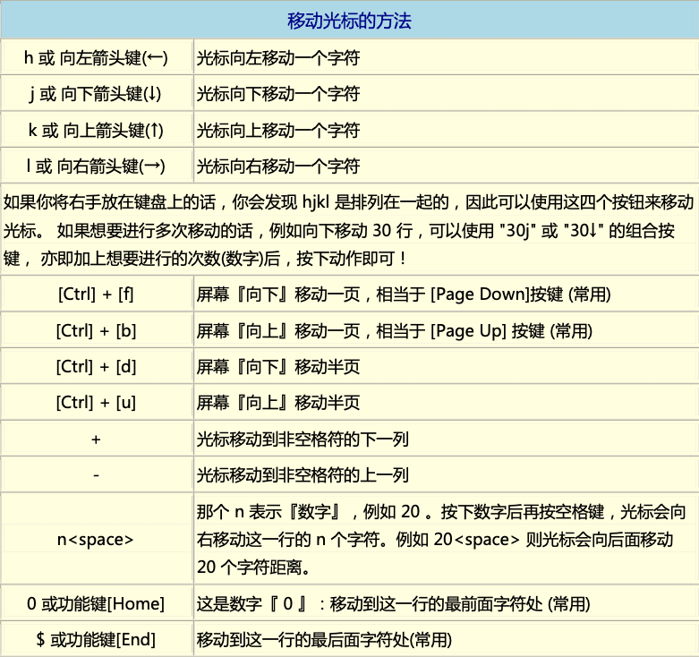

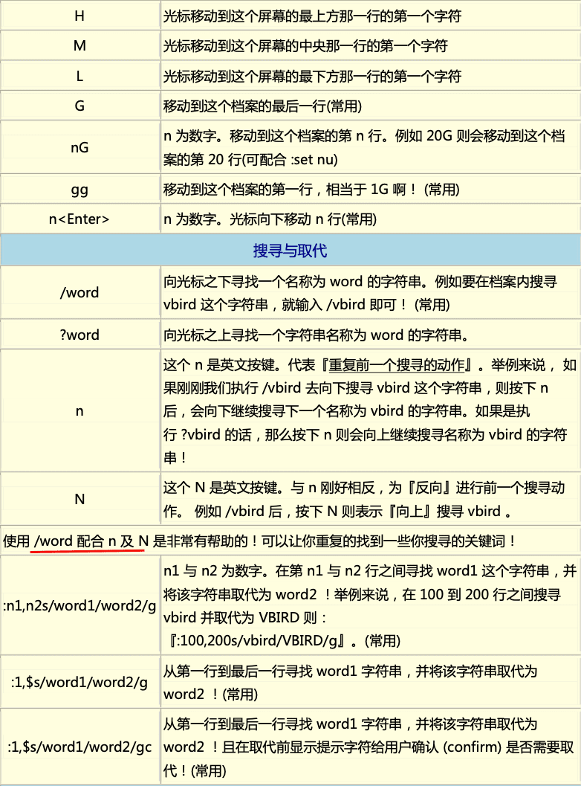

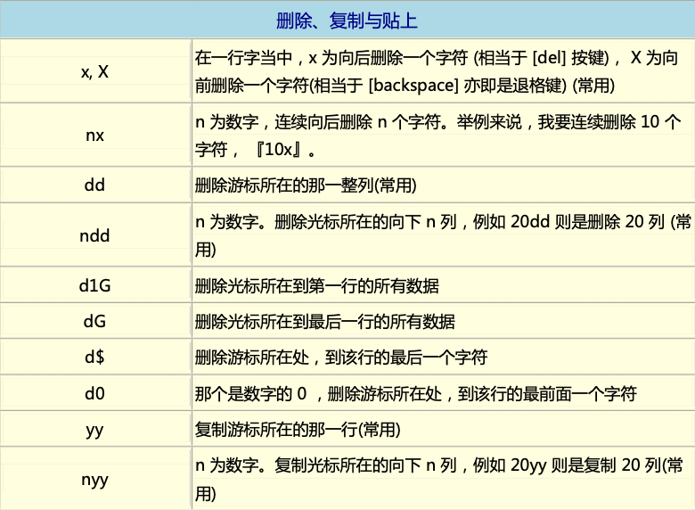

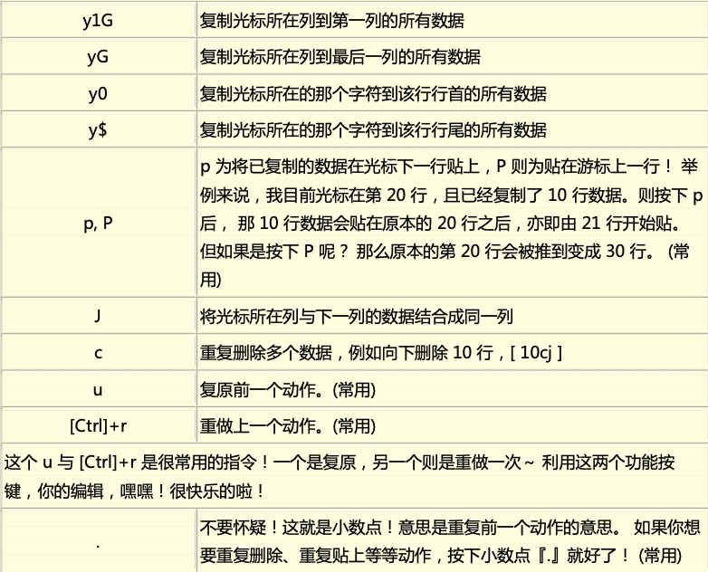

###### 一般模式切换到编辑模式

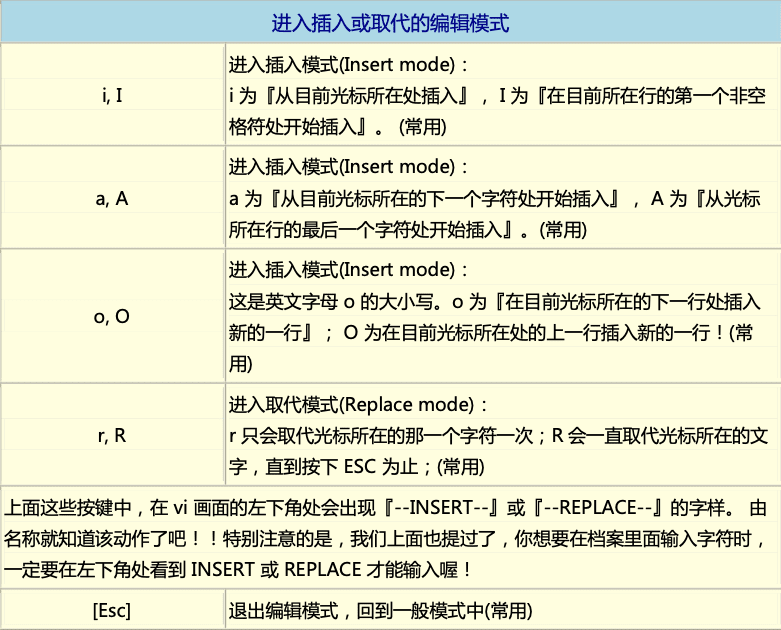

###### 一般模式切换到命令模式

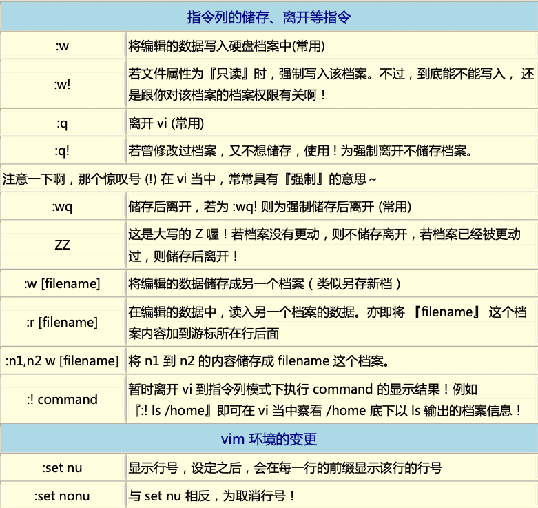


##### 练习

!!

🔖

#### 9.3 vim的额外功能


#### 9.4 其他vim使用注意事项


## 10 Bash


## 11 正则表达式与文件格式化处理


#### 文件的格式化与相关处理

`printf`

`awk`

`diff`  `cmp`  `patch`

`pr`


## 12 Shell脚本


# 四、Linux使用者管理


## 13 Linux账号管理与ACL权限控制


## 14 磁盘配额（Quota）与进阶文件系统管理


## 15 例行性工作调度 (**crontab**)


## 16 程序管理与SELinux初探

### 16.1 什么是程序（process）

在 Linux中，<u>**触发任何一个事件**时，系统都会将他定义成一个程序，并且给予这个程序一个ID ，成为**PID**，同时依据这个程序的用户与相关属性关系，给予这个PID一组有效的权限设定</u>。从此以后，这个PID能够在系统上进行的动作，就与这个PID的权限有关了。

##### process  与 program

两者都可以翻译为程序，program通常就是指二进制文件；而process就是加载到内存中运行的program，操作系统给process分配了PID，process有时也翻译成进程。

同样的program`/bin/bash`在不同用户登录时，执行为不同的process，分配了不同的PID：

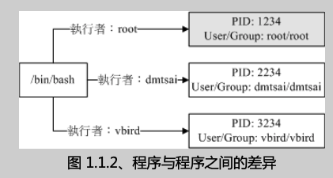


###### 子程序与父程序

Parent PID(PPID)

执行`bash`，进入子程序环境中，`ps -l`：

```shell
# ps -l
F S   UID    PID   PPID  C PRI  NI ADDR SZ WCHAN  TTY          TIME CMD
4 S     0   3732   3721  0  80   0 - 28886 do_wai pts/0    00:00:00 bash
4 S     0   3812   3732  0  80   0 - 28886 do_wai pts/0    00:00:00 bash
0 R     0   3823   3812  0  80   0 - 38337 -      pts/0    00:00:00 ps
```

> 平常一个程序被关闭后，会再运行，大概率（也有可能是crontab）是被一个父程序调用运行。

###### fork 和 exec：程序调用的流程

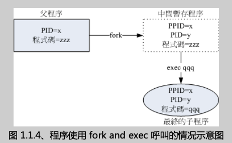


###### 系统或网络服务：常驻在内存的程序

一般`touch`，`ls`，`rm`等程序执行完就结束了。

也有一只在内存中运行的程序，叫服务（daemon）或守护进程。如**crond**（每分钟都会扫描/etc/crontab等文件）、syslog等，还有负责网络方面httpd、postfix、vsftpd等等。


##### Linux的多人多任务环境

🔖

### 16.2 工作管理（job control）


### 16.3 程序管理


### 16.4 特殊文件与程序


### 16.5 SELinux


# 五、Linux系统管理员


## 17 系统服务（daemon）

`/etc/services`    服务与端口号（和协议）的对应

执行文件、配置文件、执行环境等等。

服务启动后会把PID保存在`/var/run/`目录下，类似`/var/run/yum.pid`这样。

`/etc/init.d/`（or`/etc/rc.d/init.d/`）存放系统几乎所有的服务启动脚本。

`/etc/sysconfig/*` :各服务的初始化环境配置文件

`/var/lib/*` :各服务产生的数据


##### 观察服务

`netstat -tulp`      目前系统开放的『网络服务』有哪些  (-n  显示端口)

`netstat -lnp`		所有的有监听网络的服务 (包吨 socket 状态)

`service --status-all`

##### 设置开机启动服务

一般开启服务的两种方法： `service   *** start`  和 `/etc/init.d/* start `

Linux一般开机流程

1. 打开计算机电源，开始读取BIOS并迚行主机的自我测试;
2. 透过BIOS取得第一个可开机装置，读取主要开机区(MBR)取得开机管理程序;
3. 透过开机管理程序的设定，取得kernel并加载内存且侦测系统硬件;
4. 核心主动呼叫init程序;
5. init程序开始执行系统初始化(/etc/rc.d/rc.sysinit)
6. 依据 init 的设定进行 daemon start (/etc/rc.d/rc[0-6].d/*)
7. 加载本机设定(/etc/rc.d/rc.local)

可以在第6步以不动的执行等级（run level）启动服务。

CentOS 7之后 渐渐用systemctl 替代service 和chkconfig


services --status-all

netstat -anl 

pstree


## 18 认识、分析登录文件

登录文件可以记录系统在什么时间、哪个主机、哪个服务、出现了什么讯息等信息， 这些信息也包括用户识别数据、系统故障排除须知等信息。

### 18.1 什么事登录文件

登录文件：**记录系统在什么时候由哪个程序做了什么样的行为时，发生了何种的事件等一系列文件**。通俗的讲就是<u>何时、何地 （来源 IP）、何人 （什么服务名称）、做了什么动作</u> 。

“**详细而确实的分析以及备份系统的登录文件**”是一个系统管理员应该要进行的任务之一。

#### 登录文件的重要性

- 解决系统方面的错误
- 解决网络服务的问题
- 过往事件记录簿

> 通过 ①察看屏幕上面的错误信息与②登录文件的错误信息，几乎可以解决大部分的 Linux 问题！

#### Linux常见的登录文件

登录文件通常仅有root能够读取。`/var/log/`

1. /var/log/boot.log ：开启时系统核心检测硬件的信息
2. /var/log/cron：
3. /var/log/dmesg:   记录系统在开机的时核心检测硬件过程所产生的各项信息

4. /var/log/lastlog：记录系统上面所有的帐号最近一次登陆系统时的相关信息。`lastlog`就是读取这个文件。
5. /var/log/maillog 或 /var/log/mail/*：记录邮件的往来信息，其实主要是记录 postfix （SMTP 协定提供者） 与 dovecot （POP3 协定提供者） 所产生的信息。
6. **/var/log/messages**:  	相当的重要，几乎系统发生的错误信息 (或重要信息) 都会记录在这个文件中。
7. /var/log/secure:	基本上，只要牵涉到"需要输入账号密码"的软件，那么当登入时 (不管登入正确或错误) 都会被记录在此。 
8. /var/log/wtmp, /var/log/faillog：`last`
9. `/var/log/httpd/*`, `/var/log/news/*`, `/var/log/samba/*`：不同的网路服务都会有自己的登录文件记录其产生的各种信息。

#### 登录文件所需相关服务 （daemon） 与程序

登录文件产生的两种方式：

- 软件开发商自己定义
-  🔖

systemd-journald.service：最主要的讯息收受者，由 systemd 提供的；

rsyslog.service：主要登录系统与网络等服务的讯息；

logrotate：主要在进行登录文件的轮替功能。


#### journalctl


#### 登录文件的一般格式

事件发生的日期与时间；

发生此事件的主机名称；

启动此事件的服务名称 （如 systemd, CROND 等） 或指令与函数名称 （如 su, login..）；

该讯息的实际数据内容。


CentOS 提供 syslogd 这个服务来统一管理登录档喔!

syslogd:主要登录系统不网绚等朋务的讯息;
klogd:主要登录核心产生的各项信息;
logrotate:主要在迚行登录文件的轮替功能。


### 18.2 rsyslog.service ：记录登录文件的服务


#### rsyslog.service 的配置文件：/etc/rsyslog.conf

##### 服务名称

##### 信息等级

##### 信息记录的文件名或设备或主机

##### 服务、daemon 与函数名称


#### 登录文件的安全性设置


#### 登录文件服务器的设置


### 18.3 登录文件的轮替（logrotate）


`syslog`

`/etc/syslog.conf`


`logrotate`

`/etc/logrotate.conf`

`/etc/logrotate.d/`


### 18.4 systemd-journald.service 简介

#### 使用 journalctl 观察登录信息


#### logger 指令的应用


### 18.5 分析登录档

#### `logwatch`


## 19 开机流程、模块管理与Loader


## 20 网络设置与备份策略

#### 1、CentOS 系统设定工具: setup


#### 2、利用CUPS设定Linux打印机


####  3、硬件数据收集不驱劢，及 lm_sensors

kernel 在开机时就能够侦测主机硬件并加载适当的模块来驱动硬件了。 而核心所侦测到的各项硬件装置，后来就会被记录在 /proc 与 /sys 当中了。 包括 /proc/cpuinfo, /proc/partitions, /proc/interrupts 等等。

- fdisk:  第八章曾经谈过，可以使用 fdisk -l 将分割表列出;
- hdparm:  第八章，可观察硬盘的信息与测试读写速度;
- dmesg:  第十七章谈过， 观察核心运作过程当中所显示的各项讯息记录;
- vmstat:  第十七章谈过，可分析系统 (CPU/RAM/IO) 目前的状态;
- lspci:  列出整个 PC 系统的 PCI 接口装置!很有用的指令;
- lsusb:  列出目前系统上面各个 USB 端口口的状态，与连接的 USB 装置;
- iostat: 与vmstat 类似，可实时列出整个 CPU 不接口设备的 Input/Output 状态。


lm_sensors，是一款基于linux系统的[硬件监控](https://baike.baidu.com/item/硬件监控/6458294)的软件。可以监控主板，CPU的工作电压，温度等数据。


## 21 软件安装：源代码与Tarball

了解如何将开放源码的程序设计、加入函数库的原理、通过编译而成为可以执行的 binary program，最后该可执行文件可被我们所使用的一连串过程!

### 21.1 源码安装

#### 什么是开放源码、编译器和可执行文件

Linux系统中的真正可执行文件都是二进制文件，例如/usr/bin/passwd，/bin/touch等。shell scripts是利用shell（如bash）程序来执行的。

```shell
# file /bin/bash
/bin/bash: ELF 64-bit LSB executable, x86-64, version 1 (SYSV), dynamically linked (uses shared libs), for GNU/Linux 2.6.32, BuildID[sha1]=85e3da5a087950e7aaeb7893c056218a8874d2e5, stripped

# file /etc/init.d/network
/etc/init.d/network: Bourne-Again shell script, ASCII text executable
```

如果二进制文件是可以执行的时候，就会显示执行文件类别 (**ELF 64-bit LSB executable**)， 同时会说明是否使用动态函数库 (**dynamically linked**)。

一般的shell脚本，就会显示**ASCII text executables**。如果第一行是`#! /bin/bash`，还会显示**Bourne-Again shell script**。

#### 函数库

动态与静态函数库

/usr/include, /usr/lib, /usr/lib64

#### make 与 configure

 gcc是编译器。make是依赖于Makefile来编译多个源文件的工具，在Makefile里同样是用gcc(或者别的编译器)来编译源代码。

执行 make 时，make 会在当前目录下搜寻Makefile/makefile文件，而 Makefile 里面则记录了源代码如何编译的详细信息！make 会自动的判别源码是否经过变动了，然后自动更新可执行文件。

源代码安装程序的过程：

1. 下载源码
2. 解压缩
3. 执行 ./configure   -> 生成 makefile 文件
4. make    ->  对makefile 文件 操作
5. make install 

configure会监测运行环境：

- 是否有合适的编译器
- 是否有对应的函数库或软件
- 操作系统是否适合本软件
- 核心的头文件是否存在

#### 什么是 Tarball 的软件

Tarball文件，就是将软件的所有源代码文件先以 tar 打包，然后再以压缩技术来压缩成一个文件。

Tarball文件解压后通常包括：

- 源代码
- 监测程序（configure或config）
- 软件说明和安装说明（INSTALL或README）

#### 如何安装与升级软件

直接使用linux发行厂商预先编译好的程序来安装与升级，省略了监测、编译等过程。

 Red Hat 系统（含 Fedora/CentOS 系列） 发展的 ==RPM== 软件管理机制与 ==yum== 线上更新模式；

Debian 使用的 ==dpkg== 软件管理机制与 ==APT== 线上更新模式。

### 21.2 源码安装示例

##### Hello World

```shell
# vim hello.c 
#include <stdio.h>
int main(void) {
	printf("Hello World\n"); 
}
# gcc hello.c
# ll hello.c a.out
-rwxr-xr-x. 1 root root 8360 6月   2 11:21 a.out
-rw-r--r--. 1 root root   64 6月   2 11:20 hello.c
# ./a.out
Hello World
```

gcc 是编译程序，上面gcc的过程可以分两步：

```shell
# gcc -c hello.c
# gcc -o hello hello.o
# ll hello*
-rwxr-xr-x. 1 root root 8360 6月   2 11:32 hello 	 <==编译得到的可执行文件!
-rw-r--r--. 1 root root   64 6月   2 11:20 hello.c
-rw-r--r--. 1 root root 1496 6月   2 11:32 hello.o  <==产生的目标文件
# ./hello
Hello World
```

##### 主、副程序链接：副程序的编译

```shell
# vim thanks.c
#include <stdio.h>
int main(void) {
  printf("Hello World\n");
  thanks_2();
}

# vim thanks_2.c
#include <stdio.h>
void thanks_2(void) {
  printf("Thank you!\n"); 
}

# gcc -c thanks.c thanks_2.c
# ll thanks*
-rw-r--r--. 1 root root   70 6月   2 11:37 thanks_2.c
-rw-r--r--. 1 root root 1504 6月   2 11:38 thanks_2.o
-rw-r--r--. 1 root root   79 6月   2 11:36 thanks.c
-rw-r--r--. 1 root root 1560 6月   2 11:38 thanks.o
# gcc -o thanks thanks.o thanks_2.o
# ./thanks
Hello World
Thank you!
```

> 为什么要制作出目标文件了吗？

1. 由于源码文件有时有很多个，所以无法直接编译， 这时就需要先产生目标文件，然后再以链接制作成为二进制可执行文件。

2. 如果单个源码文件更新了，只需要重新生成单个目标文件，然后重新链接，可节省时间。


#####  调用外部函数库：加入链接的函数库

```shell
# vim sin.c
#include <stdio.h>
int main(void) {
  float value;
  value = sin ( 3.14 / 2 );
  printf("%f\n",value);
}

# gcc sin.c
sin.c: In function 'main':
sin.c:5: warning: incompatible implicit declaration of built-in function 'sin' /tmp/ccsfvijY.o: In function `main':
sin.c:(.text+0x1b): undefined reference to `sin'
collect2: ld returned 1 exit status
# 注意看到上面最后一行，会有个错误信息，代表没有成功!


```

C语言里面的sin函数是写在 libm.so 这个数学函数库中。

```bash
# gcc sin.c -lm -L/lib -L/lib64
# ./a.out
1.000000
```

`-lm`中的l表示“加入某个函数库”，m就是指libm.so函数库。`-L`表示在指定路径下搜索。

`#include <stdio.h>`就是指`/usr/include/stdio.h`，C语言标准库文件默认就在`/usr/include`，可通过`-I`指定搜索库文件的位置。

> 尖括号就表示标准库文件，就到默认的`/usr/include`下寻找，如果是双引号就是当前目录。

🔖

### 21.3 用make进行宏编译


### 21.4 Tarball的管理


#### 21.5 函数库管理


#### 21.6 检验软件的正确性


## 22 软件安装：RPM、SRPM、YUM


### 22.2 RPM 软件管理程序： rpm


### 22.3 YUM 线上升级机制


### 22.4 SRPM 的使用 ： rpmbuild


## 23 X Window介绍


## 24 Linux核心编译


