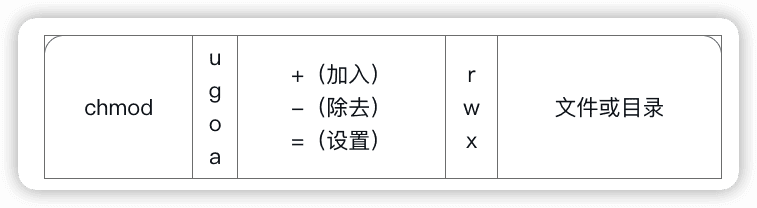
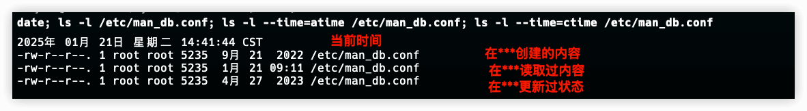
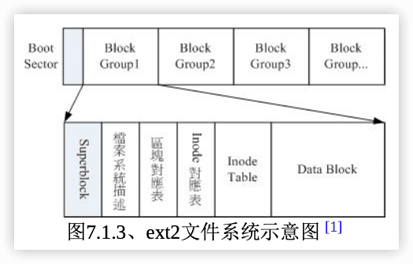
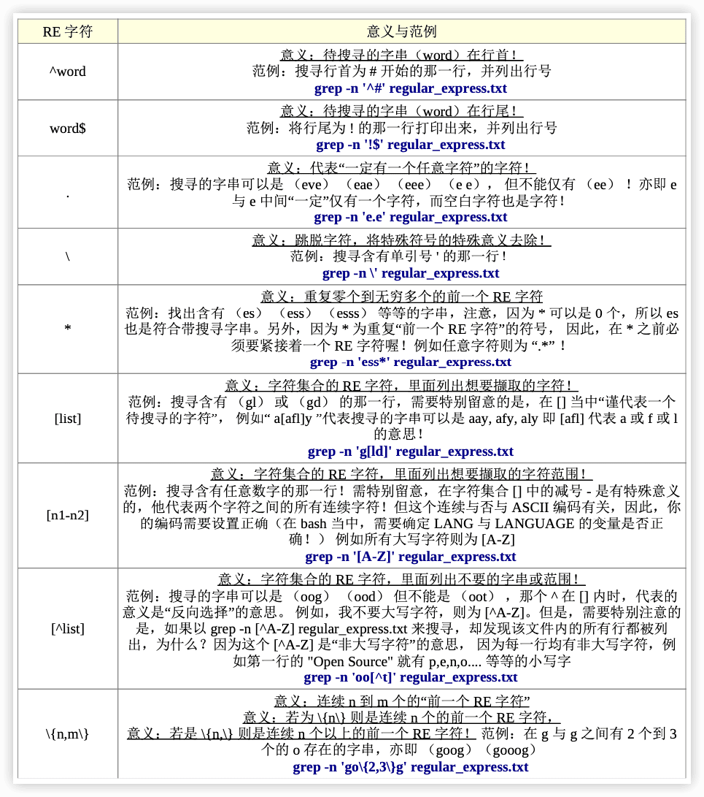

 《鸟哥的Linux私房菜》笔记

更新为第四版

[鸟哥的首页](https://linux.vbird.org/)

[The Linux Kernel documentation](https://www.kernel.org/doc/html/v4.20/index.html)

[TLDP](http://www.tldp.org/)（The Linux Documentation Project）

### 准备

学习环境：Mac的VMware Fusion虚拟机，CentOS 7 64位；腾讯云 CentOS 7

查看IP地址的方法：

```shell
cat /etc/sysconfig/network-scripts/ifcfg-eth0
ifconfig
ip add
```


# Linux的学习曲线和建议


# 一、Linux 的规划与安装

## 0 计算机概论

### 0.1 电脑：辅助人脑的好工具

#### 计算机硬件的五大单元


==输入单元==、==输出单元==、CPU内部的==控制单元==、==算数逻辑单元==、==内存==

#### 一切设计的起点： CPU的架构

- 精简指令集（==RISC==，Reduced Instruction Set Computer）。指令集较为精简，每个指令的执行时间都很短，完成的动作也很单纯，指令的执行性能较佳; 但是若要做复杂的事情，就要由多个指令来完成。   
  - ==ARM架构==。手机、PDA、导航系统、网络设备(交换器、路由器等)等【目前世界上使用范围最广的CPU架构】
  - 甲骨文(Oracle)公司的 SPARC 系列。常用于学术领域的大型工作站中，包括银行金融体系的主 要服务器
  - IBM公司的 Power Architecture(包括 PowerPC) 系列。索尼(Sony)公司出产的Play Station 3(PS3)

- 复杂指令集（==CISC==，Complex Instruction Set Computer）。与RISC不同的，CISC在微指令集的每个小指令可以执行一些较低阶的硬件操作，指令数目多而且复杂， 每条指令的长度并不相同。因为指令执行较为复杂所以每条指令花费的时间较长，但每条个别指令可以处理的工作较为丰富。   
  - 常见的CISC微指令集CPU主要有AMD、Intel、VIA等的==x86架构==的CPU。【主要用于个人电脑(Personal computer)】
  - 因为最早的那颗Intel发展出来的CPU代号称为8086，后来依此架构又开发出80286, 80386...， 因此这种架构的CPU就被称为x86架构了。
  - 64位的被统称为==x86_64==


> 所谓的位指的是**CPU一次数据读取的最大量**，也就是**==最大寻址空间==**。一个内存地址对应一个字节（Byte）。
>
> 64位CPU代表CPU一次可以读写64bits这么多的数据，32位CPU则是CPU一次只能读取32位的意思。也就是32位最大支持4G内存，64位理论上最大支持`2^64`字节内存，但受其他因素达不到。

> 例题:最新的Intel/AMD的x86架构中，请查询出多媒体、虚拟化、省电功能各有哪些重要的 微指令集?(仅供参考)答:
>
> - 多媒体微指令集:MMX, SSE, SSE2, SSE3, SSE4, AMD-3DNow!
> - 虚拟化微指令集:Intel-VT, AMD-SVM
> - 省电功能:Intel-SpeedStep, AMD-PowerNow
> - 64/32位相容技术:AMD-AMD64, Intel-EM64T


#### 电脑上常用的计算单位

- 容量单位

> 1 Byte = 8 bits
>
> K M G T P E Z


<font color=#FF8C00>一般，文件大小使用二进制的方式，所以 1GBytes 的文件大小实际上为：1024x1024x1024Bytes 这么大！ 速度单位则常使用十进制，例如 1GHz 就是1000x1000x1000Hz的。</font>

- 速度单位

CPU运算速度常用MHz、GHz等，Hz表示秒分之一。

网速常用的是bit为单位，Mbps（Mbits per second），常说100M网速，要除以8，大约12.5MBps。

### 0.2 个人电脑架构与相关设备元件

一般消费者常说的电脑通常指的就是x86的个人电脑架构。

Intel官网提供的Z390芯片组结构图：


#### 1 CPU

##### CPU的工作频率：外频与倍频

外频：CPU与外部元件进行数据传输时的速度；

倍频：CPU内部用来加速工作性能的一个倍数。

**CPU的工作频率（内频） = 外频 * 倍频**

> 例如 Intel Core 2 E8400 的内频为 3.0GHz，而外频是333MHz，因此倍频就是9倍啰！（3.0G=333Mx9, 其中1G=1000M）

“超频”： 将CPU的倍频或者是外频通过主板的设置功能更改成较高频率的一种方式。（但一般倍频出厂时被锁定无法修改）

##### 32位与64位的CPU与总线“宽度”


##### CPU等级

2023年桌面端CPU综合性能天梯图：

[2023年桌面端CPU综合性能天梯图](https://pic4.zhimg.com/v2-a8df62d3250791690bef6e3830d61fab_r.jpg)

##### 超线程 （Hyper-Threading, HT）


#### 2 内存（main memory）

不论是软件程序还是数据，都必须要读入内存后CPU才能利用。

##### DRAM

动态随机存取内存（Dynamic Random Access Memory, ==DRAM==）

**同步动态随机存取内存**（synchronous dynamic random-access memory，简称==SDRAM==）是有一个同步接口的动态随机存取内存（DRAM）。通常DRAM是有一个异步接口的，这样它可以随时响应控制输入的变化。而SDRAM有一个同步接口，在响应控制输入前会等待一个时钟信号，这样就能和计算机的系统总线同步。

==DDR SDRAM==，DDR是所谓的双倍数据传送 速度(Double Data Rate)。

DDR SDRAM又依据技术的发展，有DDR, DDR2, DDR3, DDR4等等。


> 多通道设计

##### SRAM

除了内存条之外，电脑当中还有许许多多的内存存在。例如CPU内的第二层高速缓存（L2 cache）。

因为L2整合到CPU内部，它的速度必须要CPU频率相同，DRAM是无法达到这个频率速度的，此时就需要**静态随机存取内存**（Static Random Access Memory, ==SRAM==）。

SRAM在设计上使用的电晶体数量较多，价格较高，且不易做成大容量，不过速度快。

##### ROM

BIOS（Basic Input Output System）是一套程序，这套程序是写死到主板上面的一个内存芯片中， 这个内存芯片在没有通电时也能够将数据记录下来，那就是**只读存储器（Read Only Memory, ROM）**。

#### 3 显卡

显卡又称为==VGA==（Video Graphics Array）。

一般对于图形影像的显示重点在于**分辨率与色彩深度**，因为每个图像显示的颜色会占用掉内存，因此显卡上面会有一个内存的容量（**==显存==**）。也就是说显存会影响图像的分辨率与色彩深度。

由于3D游戏和动画的流行，除了显存，显卡的“运算能力”也越来越重要。。

一些3D的运算早期是交给CPU去运行的，但是CPU并非完全针对这些3D 来进行设计的，而且CPU平时已经非常忙碌了呢! 所以后来显卡厂商直接在显卡上面嵌入一 个3D加速的芯片，这就是所谓的**图形处理器（graphics processing unit，==GPU==）**称谓的由来。

显卡主要也是通过CPU的控制芯片来与CPU、内存等沟通。

由于数据传输越来越快，显卡的规格由早期的PCI导向AGP，近期AGP又被PCI-Express（PCIe）规格所取代。


> 例题:假设你的桌面使用1024x768分辨率，且使用全彩(每个像素占用3Bytes的容量)，请问你的显卡至少需要多少内存才能使用这样的彩度?
>
> 答:因为1024x768分辨率中会有786432个像素，每个像素占用3Bytes，所以总共需要2.25MBytes以上才行! 但如果考虑屏幕的更新率(每秒钟屏幕的更新次数)，显卡的内存还是越大越好!


#### 4 硬盘与存储设备

##### 硬盘的物理组成


磁头（head）

##### 盘片上的数据


扇区 （sector）

磁道（track）

柱面 （cylinder）：所有盘片上面的同一个磁道


##### 磁盘与主板<font color=#FF8C00>传输接口</font>

传输接口： SATA、SAS、 IDE 与 SCSI ，其它USB, eSATA 等等。

主要：SATA, USB 与 SAS。

##### 固态硬盘 （Solid State Disk, SSD）


#### 5 扩展卡与接口

PCI (peripheral component interconnect)

**PCIe**（PCI-Express）速度快，主流。

一般主板大多还是会保留一两个 PCI 插槽，其他的则是以 PCIe 来设计。


#### 6 主板

##### 发挥扩展卡性能须考虑的插槽位置


##### 设备I/O位址与IRQ中断信道


##### CMOS与BIOS

CMOS主要的功能为记录主板上面的重要参数， 包括系统时间、CPU电压与频率、各项设备的I/O位址与IRQ等，由于这些数据的记录要花费电力，因此主板上面才有电池。 BIOS为写入到主板上某一块 flash 或 EEPROM 的程序，他可以在开机的时候执行，以载入CMOS当中的参数， 并尝试调用储存设备中的开机程序，进一步进入操作系统当中。

BIOS程序也可以修改CMOS中的数据， 每种主板调用BIOS设置程序的按键都不同，一般台式机常见的是使用[del]按键进入BIOS设置画面。


##### 连接周边设备的接口


#### 7 电源供应器

==能源转换率==

### 0.3 数据表示方式

计算机只认识 0 和 1，那么文字是怎么记录的呢？这个就是编码系统的工作了。

#### 数字系统


#### 文字编码系统


### 0.4 软件程序运行

#### 1 机器程序与编译程序


#### 2 操作系统

##### 操作系统核心（Kernel）

操作系统（Operating System, OS）其实也是一组程序， 这组程序的重点在于**管理电脑的所有活动以及驱动系统中的所有硬件**。

操作系统的功能就是让CPU可以开始判断逻辑与运算数值、让内存可以开始载入/读出数据与程序码、让硬盘可以开始被存取、让网卡可以开始传输数据、让所有周边可以开始运行等等。


##### 系统调用（System Call）


##### 操作系统核心的功能：

- 系统调用接口（System call interface）
- 程序管理（Process control）  cpu有效分配，cpu排程机制
- 内存管理（Memory management）
- 文件系统管理（Filesystem management）
- 设备的驱动（Device drivers）   可加载模块


##### 操作系统与驱动程序


#### 3 应用程序


### 0.5 小结

`cat /proc/cpuinfo`

`lspci`   显示系统中所有PCI总线设备或连接到该总线上的所有设备的工具


## 1 Linux是什么与如何学习

### 1.1 Linux是什么

####  Linux之前，Unix的历史

GNU 是 GNU is Not Unix 

GNU C Compiler(gcc)

自由软件基金会(FSF, Free Software Foundation)

GNU的**通用公共许可证**(General Public License, GPL) ， copyleft(相对于专利软件的copyright！)

GNU所开发的几个重要软件，如：

```
Emacs
GNU C （GCC）
GNU C Library （glibc）
Bash shell
```


#### 关于GNU计划、自由软件与开放源代码

##### 自由软件的活动


##### 自由软件的版权GNU GPL：


##### 自由（Free）的真谛：

使用者可以自由的执行、复制、再发行、学习、修改与强化自由软件。

一个软件挂上了GPL版权宣告之后，他自然就成了自由软件！这个软件就具有下面的特色：

- 取得软件与源代码：你可以根据自己的需求来执行这个自由软件；
- 复制：你可以自由的复制该软件；
- 修改：你可以将取得的源代码进行程序修改工作，使之适合你的工作；
- 再发行：你可以将你修改过的程序，再度的自由发行，而不会与原先的撰写者冲突；
- 回馈：你应该将你修改过的程序码回馈于社群！


但请特别留意，你所修改的任何一个自由软件都不应该也不能这样：

- 修改授权：你不能将一个GPL授权的自由软件，在你修改后而将他取消GPL授权～
- 单纯贩卖：你不能单纯的贩卖自由软件。


##### 自由软件与商业行为：

Linux开发商大多都是贩售“售后服务！”


##### 开放源代码：

自由软件（free software）

常见的开放源代码授权有哪些呢？

Apache License 2.0

BSD 3-Clause "New" or "Revised" license

BSD 2-Clause "Simplified" or "FreeBSD" license

GNU General Public License （GPL）

GNU Library or "Lesser" General Public License （LGPL）

MIT license

Mozilla Public License 2.0

Common Development and Distribution License

##### 专属软件/专利软件 （close source）

相对于Open Source的软件会释出源代码，Close source的程序则仅推出可执行的二进制程序（binary program）而已。

优点是有专人维护，你不需要去更动他；缺点则是灵活度大打折扣，使用者无法变更该程序成为自己想要的样式！


### 1.2 Torvalds的Linux发展

#### 与Minix之间


#### 对386硬件的多任务测试


#### 初次释出Linux 0.02

**POSIX**是可携式操作系统接口(Portable Operating System Interface)，重点在规范核心与应用程序之间的接口。


#### Linux 的发展：虚拟团队的产生


#### Linux的核心版本

Linux的核心版本编号类似：`uname -r`

```
3.10.0-123.el7.x86_64 
主版本.次版本.释出版本-修改版本
```

##### 奇数、偶数版本分类

- 主、次版本为奇数：发展中版本（development）
- 主、次版本为偶数：稳定版本（stable）

##### 主线版本、长期维护版本（longterm version）

从 3.0 版开始，奇数、偶数的编号格式取消，核心主要依据主线版本（MainLine）来开发，开发完毕后会往下一个主线版本进行。 

##### Linux 核心版本与 Linux 发布商版本


#### Linux distributions

Kernel + Softwares + Tools + 可完整安装程序，称之为Linux distribution。


各大Linux Distributions的主要异同：支持标准！

为了让所有的Linux distributions开发不致于差异太大，且让这些开发商在开发的时候有所依据，还有[Linux Standard Base （LSB）]( http://www.linuxbase.org/)等标准来规范开发者，以及目录架构的[File system Hierarchy Standard （FHS）](https://www.pathname.com/fhs/)标准规范！


Linux distributions可以以软件安装方式分为两大主流 ：

1. 使用==RPM==（Red Hat，Fedora，SuSE）
2. 使用==dpkg==(Debian、Ubuntu、B2D等)


### 1.3 Linux当前用在哪里

#### 企业

- ==网络服务器==【最热门】

- 关键任务的应用（金融数据库、大型企业网管环境）

- 学术机构的高性能运算任务

#### 个人

1. 桌面电脑

2. 手持系统（PDA、手机）

3. 嵌入式系统。

   家电产品、数码相机、路由器、防火墙、IP分享器、交换器、机器人控制芯片、NAS等

#### 云端运用

1. 云程序
2. 端设备


### 1.4 Linux该如何学习

#### 从头学习Linux基础

1. 计算机概论与硬件相关知识
2. 先从Linux的安装与指令学起
3. Linux操作系统的基础技能
4. 务必学会vi文书编辑器
5. Shell与ShellScript的学习
6. 一定要会软件管理员
7. 网络基础的创建
8. ...

#### 选择一本易读的工具书


#### 实操再实操


#### 发生问题怎么处理啊?建议流程是这样

1. 在自己的主机**/**网络数据库上查询**How-To**或**FAQ**

- Linux自己的文件数据: /usr/share/doc
- [TLDP](http://www.tldp.org/)（The Linux Documentation Project），这个网站几乎列出了所有Linux上面可以看到的文献数据，各种How-To的作法等等。

2. 注意Linux各种输出信息，自行解决疑难杂症

`/var/log`查看各种日志

`lastlog`

`last`

`lastb`   查看记录用户登录失败信息的二进制文件`/var/log/btmp`的内容分

3. 搜索引擎


### 1.5 习题


linux上的图形界面： KDE ， GNOME

**平行运算**是将原本的工作分成多样，然后交给多部主机去运算，最终再将结果收集起来。

要让linux解决问题

Linux最强的地方在于**网络**，而Windows是赢在用户接口较为亲善。

> 作为一个使用者，人要迁就机器；做为一个开发者，要机器迁就人。

**TLDP**是 The Linux Documentation Project 。

异步的磁盘/内存数据传输模式。

`/usr/share/doc/`   Linux自己的文档存储位置

`/var/log/`   Linux系统日志

不同环境下，解决问题的方法有很多种，只要行的通，就是好方法。


## 2 主机规划与磁盘分区

### 2.1 Linux与硬件的搭配

#### 认识计算机的硬件配备


#### 选择与Linux搭配的主机配备


#### 各硬件设备在Linux中的文件名

> **在Linux系统中，每个设备都被当成一个文件来对待。**


Linux支持的更多设备：[devices](https://www.kernel.org/doc/html/v4.20/admin-guide/devices.html)

#### 使用虚拟机学习


### 2.2 磁盘分区

#### 1 磁盘连接的方式与设备文件名的关系


#### 2 MSDOS（MBR）与GPT磁盘分区表（partition table）🔖

##### 磁盘的组成

> sector 扇区，磁区(512字节)。  
> track 磁道。由于磁盘是旋转的，则连续写入的数据是排列在一个圆周上的。所以这个圆周上的所有sector组成一个track。  
> side/head 磁面/磁头。每个磁面都有一个用于读取存储数据的磁头，所以side数与head数相同  
> cylinder 磁柱，柱面(这个翻译貌似不好理解)。

*   磁盘的第一个sector： 1，主要启动记录区(Master Boot Record, MBR)：可以安装开机管理程序的地方，有446 bytes 2，分割表(partition table)：记录整颗硬盘分割的状态，有64 bytes 3，结束标志：2bytes
*   partition table 
    *   最多纪录四条分割信息（开始和结束的磁柱号码，主和延伸分割槽；其中延伸最多一个，可以进行逻辑分割）
    *   分隔槽最小单位是cylinder
    *   延伸分割槽使用额外的扇区来纪录分割信息（在延伸分隔槽中）

##### MSDOS （MBR） 分区表格式与限制


##### 开机流程与MBR 

由于**开机管理程序**是操作系统在安装的时候所提供的，所以他会认识硬盘内的文件系统格式。 
1.  BIOS：开机主动执行的韧体（写在硬件上的一个软件程序），会认识第一个可开机的装置；
2.  MBR：第一个可开机装置的第一个扇区内的主要启动记录区块，内含开机管理程序；
3.  开机管理程序(boot loader)：一支可读取 核心档案 来执行的软件；
4.  核心档案：开始操作系统的功能... 

##### 多重引导 

开机管理程序也可以安装在每个分隔槽的**启动扇区**(boot sector)

每个分割槽都拥有自己的启动扇区

实际可开机的核心档案是放置到各分隔槽中

windows安装程序会主动的覆盖掉MBR以及自己所在分割槽的启动扇区 ，所以先安装windows

##### 磁盘分区的选择 

**挂载** 就是利用一个目录当成进入点，将磁盘分隔槽的数据放置在该目录下

SAMBA （与windows文件共享） /home

邮件服务器 /var


#### 3 开机流程中的BIOS与UEFI开机检测程序 🔖

##### BIOS搭配MBR/GPT的开机流程


##### UEFI BIOS搭配GPT开机的流程

UEFI（统一可扩展固件接口，Unified Extensible Firmware Interface） 是一种用于计算机启动过程的新型固件接口标准。


#### 4 Linux安装模式下，磁盘分区的选择（极重要）❤️

##### 目录树结构（directory tree）

> “如何结合目录树的架构与磁盘内的数据”？
>
> 挂载（mount）

##### 文件系统与目录树的关系（挂载）

<font color=#FF8C00>“挂载”</font>就是利用一个目录当成进入点，将磁盘分区的数据放置在该目录下； 也就是说，进入该目录就可以读取该分区。

由于整个Linux系统最重要的是根目录，因此根目录一定需要挂载到某个分区的。 至于其他的目录则可依使用者自己的需求来给予挂载到不同的分区。


##### distributions安装时，挂载点与磁盘分区的规划


### 2.3 安装Linux前的规划

#### 选择适当的distribution


#### 主机的服务规划与硬件的关系


打造Windows与Linux共存的环境


NAT（达成IP分享器的功能）


SAMBA（加入Windows网络上的芳邻）


Mail（邮件服务器）


Web（WWW服务器）


DHCP（提供用户端自动取得IP的功能）


FTP


#### 主机硬盘的主要规划


#### 鸟哥的两个实际案例🔖


### 习题


## 3 安装CentOS7.x


## 4 首次登录与man page

### 4.1 首次登陆系统


### 4.2 文字模式下命令的下达

#### 开始下达的命令

格式一般是：


第一个被输入的数据绝对是指令或者是可执行的文件。

##### 语系的支持

 

#### 基础命令

`locale`

`date` 

`cal`

`bc`

在命令行下达命令后，会有两种情况：

- 一种是该指令会直接显示结果然后回到命令提示字符等待下一个指令的输入；
- 一种是进入到该指令的环境，直到结束该指令才回到命令提示字符的环境。（需要结束命令，如bc的就是quit）

#### 重要的几个热键

- `[Tab]`

- `ctrl-c` 中断目前程序 

- `ctrl-z` 把程序掉到背景中

- `ctrl-d` 键盘输入结束 (End Of File, EOF 或 End Of Input) 类似于 exit

- `[shift]+{[PageUP]|[Page Down]}`    翻页

#### 错误信息的查看

```shell
DATE: command not found
```

两个原因：

1. 没安装
2. 命令所在目录不在命令搜寻路径中（PATH）


### 4.3 Linux系统的线上求助man page与info page

#### 命令的--help求助说明

```shell
[dmtsai@study ~]# date --help
Usage: date [OPTION]... [+FORMAT]                           # 这里有基本语法
  or:  date [-u|--utc|--universal] [MMDDhhmm[[CC]YY][.ss]]  # 这是设置时间的语法
Display the current time in the given FORMAT, or set the system date.
# 下面是主要的选项说明
Mandatory arguments to long options are mandatory for short options too.
  -d, --date=STRING         display time described by STRING, not 'now'
  -f, --file=DATEFILE       like --date once for each line of DATEFILE
....（中间省略）....
  -u, --utc, --universal    print or set Coordinated Universal Time （UTC）
      --help     显示此求助说明并离开
      --version  显示版本信息并离开
# 下面则是重要的格式 （FORMAT） 的主要项目
FORMAT controls the output.  Interpreted sequences are:

  %%   a literal %
  %a   locale's abbreviated weekday name （e.g., Sun）
  %A   locale's full weekday name （e.g., Sunday）
....（中间省略）....
# 下面是几个重要的范例 （Example）
Examples:
Convert seconds since the epoch （1970-01-01 UTC） to a date
  $ date --date='@2147483647'
....（下面省略）....
```


#### man page❤️

```shell
[dmtsai@study ~]$ man date
DATE（1）                          User Commands                         DATE（1）
# 请注意上面这个括号内的数字
NAME  <==这个指令的完整全名，如下所示为date且说明简单用途为设置与显示日期/时间
       date - print or set the system date and time

SYNOPSIS  <==这个指令的基本语法如下所示
       date [OPTION]... [+FORMAT]                            <==第一种单纯显示的用法
       date [-u|--utc|--universal] [MMDDhhmm[[CC]YY][.ss]]   <==这种可以设置系统时间的用法

DESCRIPTION  <==详细说明刚刚语法谈到的选项与参数的用法
       Display the current time in the given FORMAT, or set the system date.

       Mandatory arguments to long options are mandatory for short options too.

       -d, --date=STRING  <==左边-d为短选项名称，右边--date为完整选项名称
              display time described by STRING, not 'now'

       -f, --file=DATEFILE
              like --date once for each line of DATEFILE

       -I[TIMESPEC], --iso-8601[=TIMESPEC]
              output  date/time  in  ISO  8601  format.   TIMESPEC='date' for date only （the
              default）, 'hours', 'minutes', 'seconds', or 'ns' for  date  and  time  to  the
              indicated precision.
....（中间省略）....
       # 找到了！下面就是格式化输出的详细数据！
       FORMAT controls the output.  Interpreted sequences are:

       %%     a literal %

       %a     locale's abbreviated weekday name （e.g., Sun）

       %A     locale's full weekday name （e.g., Sunday）
....（中间省略）....
ENVIRONMENT  <==与这个指令相关的环境参数有如下的说明
       TZ     Specifies the timezone, unless overridden by command line parameters.  
              If neither is specified, the setting from /etc/localtime is used.

EXAMPLES     <==一堆可用的范本
       Convert seconds since the epoch （1970-01-01 UTC） to a date

              $ date --date='@2147483647'
....（中间省略）....

DATE STRING  <==上面曾提到的 --date 的格式说明！
       The --date=STRING is a mostly free format human readable date string such as "Sun, 29
       Feb 2004 16:21:42 -0800" or "2004-02-29 16:21:42" or even "next  Thursday".   A  date
       string  may  contain  items  indicating calendar date, time of day, time zone, day of

AUTHOR  <==这个指令的作者啦！
       Written by David MacKenzie.

COPYRIGHT  <==受到著作权法的保护！用的就是 GPL 了！
       Copyright © 2013 Free Software Foundation, Inc.  License GPLv3+: GNU GPL version 3 or
       later <http://gnu.org/licenses/gpl.html>.
       This  is free software: you are free to change and redistribute it.  There is NO WAR‐
       RANTY, to the extent permitted by law.

SEE ALSO  <==这个重要，你还可以从哪里查到与date相关的说明文档之意
       The full documentation for date is maintained as a Texinfo manual.  If the  info  and
       date programs are properly installed at your site, the command

              info coreutils 'date invocation'

       should give you access to the complete manual.

GNU coreutils 8.22                        June 2014                                  DATE（1）
```


man page 中第一行代号的意义（`man 7 man` 查看）：


man page中每个部分的含义：


有时还有Authors与Copyright等，不过也有很多时候仅有NAME与DESCRIPTION等部分。

查阅一般步骤：

1. 先察看NAME的项目，约略看一下这个数据的意思;

2. 再详看一下DESCRIPTION，这个部分会提到很多相关的数据与使用时机，从这个地方可以学到很多小细节呢;

3. 而如果这个指令其实很熟悉了(例如上面的date)，那么主要就是查询关于OPTIONS的部分了!

   可以知道每个选项的意义，这样就可以下达比较细部的指令内容呢!

4. 最后，鸟哥会再看一下，跟这个数据有关的还有哪些东西可以使用的?举例来说，上面的SEEALSO就告知我们还可以利用“`info coreutils date`”来进一步查阅数据;

5. 某些说明内容还会列举有关的文件(FILES部分)来提供我们参考!这些都是很有帮助的!


man page中的常用按键操作：


`man -f command` 查看某个命令的所有相关说明文件， 类似于 `whatis` （需要有whatis数据库） 

 `man -k`(比-f更全,相关的) 类似于 `apropos` 


#### info page

类似man page，不过info page将文件数据拆成一个一个的段落。

`/usr/share/info/`

#### 其它有用的文件

软件开发者大多会把说明制作成“线上说明文档”，但不是每个都有。其他额外的、How-To(如何做的意思)、安装须知、预计工作事项、未来工作规划等等都会放在`/usr/share/doc`.


### 4.4 文本编辑器

`nano` 


### 4.5 正确关机方法

正常关机关注点：

1. 观察系统的使用状态:  `who`    `netstat -a`

2. 通知在线使用者关机的时刻:

3. 正确的关机指令使用:   `shutdown`   `reboot`


- `sync` 将数据同步写入磁盘

- `shutdown`  关机

```shell
[root@www ~]# shutdown -h now
立刻关机，其中 now 相当于时间为 0 的状态
[root@www ~]# shutdown -h 20:25
系统在今天的 20:25 分会关机，若在 21:25 才下达此指令，则隔天才关机 
[root@www ~]# shutdown -h +10
系统再过十分钟后自动关机
[root@www ~]# shutdown -r now
系统立刻重新启动
[root@www ~]# shutdown -r +30 'The system will reboot' 
再过三十分钟系统会重新启动，并显示后面的讯息给所有在在线的使用者 
[root@www ~]# shutdown -k now 'This system will reboot' 
仅发出警告信件的参数!系统并不会关机啦!吓唬人!
```


- `reboot`,`halt`,`poweroff`   重新启动、关闭


systemctl 关机

```shell
[root@study ~]# systemctl [指令]
指令项目包括如下：
halt       进入系统停止的模式，屏幕可能会保留一些讯息，这与你的电源管理模式有关
poweroff   进入系统关机模式，直接关机没有提供电力喔！
reboot     直接重新开机
suspend    进入休眠模式

[root@study ~]# systemctl reboot    # 系统重新开机
[root@study ~]# systemctl poweroff  # 系统关机
```


#### 切换执行等级: init

`init 0` 关机，`init 5` 类似 `startx`


#### 文件系统错误的问题

`/etc/issue`中是开机显示信息，通过`man issue`(配置文件的档案内容格式，man page的代号为5) > `man mingetty`查看/etc/issue中变量的意义


#### 忘记root密码


### 习题


# 二、Linux文件、目录与磁盘格式

 ## 5 linux文件权限与目录配置

### 5.1 使用者与群组

**owner/group/others** 简写 **u/g/o** 【文件拥有者、群、其他人】

账号相关信息：`/etc/passwd`

账号密码：`/etc/shadow`

群组名称：`/etc/group`


### 5.2 Linux文件权限

#### 5.2.1 Linux文件属性


- 第一栏代表这个文件的类型与权限（permission）

文件类型：d，-， l，b，c

文件权限**rwx**分别表示read、write、execute。三组分别代表**u/g/o**。

- 第二栏表示有多少文件名链接到此节点（i-node）。

  每个文件都会将他的**权限与属性记录**到文件系统的i-node中，不过，我们使用的**目录树**却是使用**文件名**来记录， 因此每个文件名就会链接到一个i-node！【第七章】

- 第三栏表示这个文件（或目录）的“拥有者帐号”

- 第四栏表示这个文件的所属群组

- 第五栏为这个文件的容量大小，默认单位为Bytes

- 第六栏为这个文件的创建日期或者是最近的修改日期

- 第七栏为这个文件的文件名

```shell
drwxr-xr-- 1 test1 testgroup 5238 Jun 19 10:24 groups/
```

testgroup群组的[r-x]表示同组其它如test2可以进入本目录，但不能再目录下进行写入操作；other的[r--]，没有x权限，不能进入此目录。

> Linux文件权限的重要性：
>
> - 系统保护的功能
> - 团队开发软件或数据共享的功能
> - 未将权限设置妥当的危害


#### 5.2.2 如何改变文件属性与权限

##### `chgrp` ：改变文件所属群组

```shell
chgrp [-R] group dirname/filename
```

群组group必须已经在/etc/group中已经存在。`R`是递归。

##### `chown` ：改变文件拥有者

```shell
chown [-R] user[:group] dirname/filename
```

-R表示同时修改目录下所有目录和文件。

> `cp`会复制属性与权限

##### `chmod` ：改变文件的权限, SUID, SGID, SBIT等等的特性

1. 数字类型

```shell
chmod [-R] xyz dirname/filename

chmod 777 .bashrc
```

2. 符号类型

```shell
chmod u=rwx,go=rx .bashrc
```



a表示所有身份


#### 5.2.3 目录与文件的权限意义

##### 权限对文件的重要性

文件的rwx， 主要针对**文件的==内容==**而言的。

- r（read）：可读取此一文件的实际内容，如读取文本文件的文字内容等；

- w（write）：可以编辑、新增或者是修改该文件的内容（但不含删除该文件）；

- x（eXecute）：该文件具有可以被系统执行的权限。

##### 权限对目录的重要性

目录的r表示可以查询该目录下的**文件名数据**，即可以用`ls` 查看目录的内容；【read contents in directory】

目录的w很重要，表示可以改变目录下的**结构**： 【modify contents of directory】

1. 建立新的文件与目录； 
2. 删除已经存在的文件与目录(不论该文件的权限为何！) ；
3. 将已存在的文件或目录进行更名；
4.  搬移该目录内的文件、目录位置；

目录的x表示<u>能否进入目录使之成为工作目录</u>，即是否可以`cd`（change directory）。 【access directory】

<font color=#FF8C00>要开放目录给任何人浏览时，应该至少也要给予r及x的权限，但w权限不可随便给！</font>


```sh
ll
总用量 0
drwxr--r-- 2 root root 22  1月 21 08:51 testdir
ll testdir/
ls: 无法访问 'testdir/test.txt': 权限不够
总用量 0
-????????? ? ? ? ?             ? test.txt
cd testdir/
bash: cd: testdir/: 权限不够
```

虽然有告知权限不足，但因为具有 r 的权限可以查询文件名。由于权限不足（没有x），所以会有一堆问号。

因为不具有 x ，所以当然没有进入的权限啦！


> 分别需要“哪些最小的权限”才能达成各项任务？
>
> ```
> /dir1/file1
> /dir2
> ```
>
> 
>
> 很多时候 /dir1 都不必有r，只要具有 x 即可；只是，没有 r 的话，使用 [tab]时，就无法自动帮你补齐文件名了！

#### 5.2.4 Linux文件种类与扩展名

##### 文件种类❤️

1. 普通文件【`-`】。就是平常说的文件，分三类：

   纯文本（ASCII）

   二进制文件

   数据格式文件：一些特定文件，例如存储用户登录情况的文件`/var/log/wtmp`，命令`last`就是读取这个文件。

   ```shell
   # file /var/log/wtmp
   /var/log/wtmp: data
   # last
   root     pts/0        192.168.165.1    Sun Jun  7 17:41   still logged in
   root     tty1                          Sun Jun  7 17:40   still logged in
   reboot   system boot  3.10.0-1127.el7. Sun Jun  7 17:39 - 17:42  (00:02)
   root     pts/1        192.168.165.1    Tue Jun  2 17:04 - 20:59  (03:55)
   root     pts/0        192.168.165.1    Tue Jun  2 10:16 - 17:22  (07:05)
   root     tty1                          Tue Jun  2 10:16 - 23:24  (13:08)
   reboot   system boot  3.10.0-1127.el7. Tue Jun  2 10:15 - 23:24  (13:08)
   root     pts/0        192.168.165.1    Mon May 25 18:57 - down   (02:58)
   root     pts/0        192.168.165.1    Mon May 25 11:23 - 18:11  (06:47)
   root     pts/1        192.168.165.1    Sun May 24 17:01 - 19:53  (02:52)
   root     pts/0        192.168.165.1    Sun May 24 07:29 - 17:21  (09:52)
   root     pts/0        192.168.165.1    Sun May 24 07:14 - 07:28  (00:14)
   root     tty1                          Sun May 24 07:11 - 21:56 (1+14:45)
   reboot   system boot  3.10.0-1127.el7. Sun May 24 07:10 - 21:56 (1+14:45)
   root     pts/0        192.168.165.1    Sat May 23 17:22 - down   (01:41)
   root     tty1                          Sat May 23 12:15 - 19:03  (06:48)
   reboot   system boot  3.10.0-1127.el7. Sat May 23 12:08 - 19:03  (06:55)
   
   wtmp begins Sat May 23 12:08:07 2020
   ```

   

2. 目录 【`d`】


3. （软）链接【`l`】


4. 设备与设备文件

   通常在`/dev`下，分两类区块（block）设备文件【`b`】和字符设备文件【`c`】。

5. 数据接口文件（sockets）【`s`】

   与客服端进行socket链接，通常在`/var/run`

6. 数据传送文件（FIFO，pipe）【`p`】

```sh
man fifo
man socket
```


##### Linux文件扩展名

linux文件是没有所谓的“扩展名”，文件名只是为了让用户了解文件的用途。


##### Linux文件名长度限制

> 查看文件系统：
>
> ```sh
> df -T
> fdisk -l
> ```
>
> 

传统的Ext2/Ext3/Ext4文件系统以及近来被 CentOS 7 当作默认文件系统的 `xfs`：

单一文件或目录的最大容许文件名为 255Bytes，英文255个字符，中文大约128。

##### Linux文件名命名限制

最好可以避免一些特殊字符，例如：

```
* ? > < ; & ! [ ] | \ ' " ` （ ） { }
```


### 5.3 Linux目录配置

#### 5.3.1 Linux目录配置的依据（FHS）❤️

[FHS](http://www.pathname.com/fhs/)(Filesystem Hierarchy Standard）是官方对不同Linux发行版目录的限制。

[FHS3.0官方文件](https://refspecs.linuxfoundation.org/FHS_3.0/fhs-3.0.pdf)

FHS依据文件系统**使用的频繁**与否与是否允许使用者随意**更动**， 而将目录定义成为四种交互作用的形态：


- 可分享的:可以分享给其他系统挂载使用的目录，所以包括执行文件与用户的邮件等数据， 是能够分享给网络上其他主机挂载用的目录;
- 不可分享的:自己机器上面运作的装置档案或者是与程序有关的 socket 档案等， 由于仅与自身机器有关，所以当然就不适合分享给其他主机了。
- 不变的:有些数据是不会经常变动的，跟随着 distribution 而不变动。 例如函式库、文件说明 文件、系统管理员所管理的主机服务配置文件等等;
- 可变动的:经常改变的数据，例如登录文件、一般用户可自行收受的新闻组等。

FHS仅定义的三个目录：

- **`/`** ( 根目录):与开机系统有关;
-  **`/usr`** (unix software resource):与软件安装/执行有关;
-  **`/var`** (variable):与系统运作过程有关。


##### 根目录的意义和内容

根目录是整个系统最重要的一个目录，因为不但所有的目录都是由根目录衍生出来的， 同时根目录也与**开机/还原/系统修复**等动作有关。 由于系统开机时需要特定的**开机软件、核心文件、开机所需程序、 函式库**等等文件数据，若系统出现错误时，根目录也必须要包含有能够修复文件系统的程序才行。

因为根目录是这么的重要，所以FHS标准建议: **根目录(/)所在分区应该越小越好，且应用程序所安装的软件最好不要与根目录放在同一个分区内，保持根目录越小越好。**这样减少发生错误的机会。

根目录一般有如下目录：


FHS标准外需要了解的一些目录：


- **/etc**:配置文件
- **/bin**:重要执行档
- **/dev**:所需要的装置档案􏰮
-  **/lib**:执行档所需的函式库与核心所需的模块 􏰮 
- **/sbin**:重要的系统执行文件

早期Linux 在设计的时候，若发生问题时，救援模式通常仅挂载根目录而已，因此有五个重要的目录被要求一定要与根目录放置在一起， 那就是 /etc, /bin, /dev, /lib, /sbin 这五个重要目录。现在许多的 Linux distributions 由于已经将许多非必要的文件移出 /usr 之外了， 所以 /usr 也是越来越精简，同时因为 /usr 被建议为“即使挂载成为只读，系统还是可以正常运行”的模样，所以救援模式也能同时挂载 /usr 喔！

##### /usr的意义与内容

依据 FHS 的基本定义，/usr 里面放置的数据属于可分享的与不可变动的(shareable, static)， 如果你知道如何透过网络进行分区的挂载(例如在服务器篇会谈到的 **NFS服务器**)，那么/usr 确实可以分享给局域网络内的其他主机来使用喔!

usr是**Unix Software Resource**的缩写， 也就是“Unix操作系统软件资源”。

因为是所有系统默认的软件（distribution发布者提供的软件）都会放置到/usr下面，因此这个目录有点类似Windows 系统的“`C:\Windows\`（当中的一部份） + `C:\Program files\`”这两个目录的综合体，系统刚安装完毕时，这个目录会占用最多的硬盘容量。


##### /var的意义与内容

如果/usr 是安装时会占用较大硬盘容量的目录，那么/var就是在**系统运作后才会渐渐占用硬盘容量的目录**。 因为/var目录主要针对**常态性变动的文件**，包括快取(cache)、登录文件(log file)以及某些软件运作所产生的档案， 包括程序文件(lock file, run file)，或者例如 MySQL 数据库的档案等等。


##### 在FHS标准基础上，各家的distributions有所不同

由于FHS仅是定义出最上层（/）及次层（/usr, /var）的目录内容应该要放置的文件或目录数据， 因此，在其他次目录层级内，就可以随开发者自行来配置了。比如，CentOS的网络设置数据放在`/etc/sysconfig/network-scripts/` 目录下，但是SuSE则是将网络放置在 `/etc/sysconfig/network/` 目录下。

entOS 7 在目录的编排上有变化，比较大的差异在于将许多原本应该要在根目录 （/） 里面的目录，将他内部数据全部挪到 /usr 里面

去，然后进行链接设置！

```
/bin --> /usr/bin
/sbin --> /usr/sbin
/lib --> /usr/lib
/lib64 --> /usr/lib64
/var/lock --> /run/lock
/var/run --> /run
```

#### 5.3.2 目录树

目录树的启始点为根目录 (/, root)。

每一个目录不止能使用本地端的 partition 的文件系统，也可以使用网络上的filesystem 。举例来说，可以利用 Network File System (NFS) 服务器挂载某特定目录等。 

每一个文件在此目录树中的文件名(包含完整路径)都是独一无二的。


#### 5.3.3 绝对路径和相对路径


#### 5.3.4 CentOS的观察

除了FHS之外，还有个**Linux Standard Base（LSB）**的标准是可以依循的！

通过 uname 检查 Linux 核心与操作系统的位版本:

```sh
$ uname -r
5.14.0-252.el9.aarch64  # 查看核心版本
$ uname -m
aarch64   							# 查看操作系统的位版本
```

 `lsb_release`命令需要安装🔖

```
lsb_release -a
```


## 6 Linux文件与目录管理

### 6.1 目录与路径

#### 目录的相关操作

```sh
.
..
-
~
~account
```

`cd`  

`pwd`    Print Working Directory

`mkdir`  

`rmdir`

#### 关于可执行文件路径的变量： $PATH

`$PATH`

不同身份使用者默认的PATH不同，默认能够随意执行的指令也不同。

本目录（.）最好不要放到PATH当中。

### 6.2 文件与目录管理

#### 文件与目录的检视

`ls`

```
[root@study ~]# ls [-aAdfFhilnrRSt] 文件名或目录名称..
[root@study ~]# ls [--color={never,auto,always}] 文件名或目录名称..
[root@study ~]# ls [--full-time] 文件名或目录名称..
选项与参数：
-a ：全部的文件，连同隐藏文件（ 开头为 . 的文件） 一起列出来（常用）
-A ：全部的文件，连同隐藏文件，但不包括 . 与 .. 这两个目录
-d ：仅列出目录本身，而不是列出目录内的文件数据（常用）
-f ：直接列出结果，而不进行排序 （ls 默认会以文件名排序！）
-F ：根据文件、目录等信息，给予附加数据结构，例如：
		*:代表可可执行文件； /:代表目录； =:代表 socket 文件； |:代表 FIFO 文件；
-h ：将文件大小以人类较易读的方式（例如 GB, KB 等等）列出来；
-i ：列出 inode 号码，inode 的意义下一章将会介绍；
-l ：长数据串行出，包含文件的属性与权限等等数据；（常用）
-n ：列出 UID 与 GID 而非使用者与群组的名称 （UID与GID会在帐号管理提到！）
-r ：将排序结果反向输出，例如：原本文件名由小到大，反向则为由大到小；
-R ：连同子目录内容一起列出来，等于该目录下的所有文件都会显示出来；
-S ：以文件大小大小排序，而不是用文件名排序；
-t ：依时间排序，而不是用文件名。
--color=never ：不要依据文件特性给予颜色显示；
--color=always ：显示颜色
--color=auto ：让系统自行依据设置来判断是否给予颜色
--full-time ：以完整时间模式 （包含年、月、日、时、分） 输出
--time={atime,ctime} ：输出 access 时间或改变权限属性时间 （ctime）
											而非内容变更时间 （modification time）
```


#### 复制、删除与移动🔖

`cp`   `rm`   `mv`

#### 取得路径的文件名称与目录名称

`basename`

`dirname`

### 6.3 文件内容查阅

#### 直接检视文件内容

`cat `  con**cat**enate

`tac` 

`nl`

#### 可翻页检视

- `more`  一页一页的显示文件内容


- `less`  比 more 更好的是可以往前翻页！

空白键 ：向下翻动一页；
[pagedown]：向下翻动一页；
[pageup] ：向上翻动一页；
/字串 ：向下搜寻“字串”的功能；
?字串 ：向上搜寻“字串”的功能；
n ：重复前一个搜寻 （与 / 或 ? 有关！）
N ：反向的重复前一个搜寻 （与 / 或 ? 有关！）
g ：前进到这个数据的第一行去；
G ：前进到这个数据的最后一行去 （注意大小写）；
q ：离开 less 这个程序；

#### 数据截取

`head`  

`tail`

```sh
head [-n number] 文件
tail [-n number] 文件
```

列出/etc/mandb.conf 的第11到第20行:

```sh
cat -n /etc/mandb.conf | head -n 20 | tail -n 10
```


#### 非文本文件

`od` 以二进制的方式读取文件内容

```shell
[root@study ~]# od [-t TYPE] 文件
选项或参数：
-t  ：后面可以接各种“类型 （TYPE）”的输出，例如：
      a       ：利用默认的字符来输出；
      c       ：使用 ASCII 字符来输出
      d[size] ：利用十进制（decimal）来输出数据，每个整数占用 size Bytes ；
      f[size] ：利用浮点数值（floating）来输出数据，每个数占用 size Bytes ；
      o[size] ：利用八进位（octal）来输出数据，每个整数占用 size Bytes ；
      x[size] ：利用十六进制（hexadecimal）来输出数据，每个整数占用 size Bytes ；

范例一：请将/usr/bin/passwd的内容使用ASCII方式来展现！
[root@study ~]# od -t c /usr/bin/passwd
0000000 177   E   L   F 002 001 001  \0  \0  \0  \0  \0  \0  \0  \0  \0
0000020 003  \0   >  \0 001  \0  \0  \0 364   3  \0  \0  \0  \0  \0  \0
0000040   @  \0  \0  \0  \0  \0  \0  \0   x   e  \0  \0  \0  \0  \0  \0
0000060  \0  \0  \0  \0   @  \0   8  \0  \t  \0   @  \0 035  \0 034  \0
0000100 006  \0  \0  \0 005  \0  \0  \0   @  \0  \0  \0  \0  \0  \0  \0
.....（后面省略）....
# 最左边第一栏是以 8 进位来表示Bytes数。以上面范例来说，第二栏0000020代表开头是
# 第 16 个 byes （2x8） 的内容之意。

范例二：请将/etc/issue这个文件的内容以8进位列出储存值与ASCII的对照表
[root@study ~]# od -t oCc /etc/issue
0000000 134 123 012 113 145 162 156 145 154 040 134 162 040 157 156 040
          \   S  \n   K   e   r   n   e   l       \   r       o   n
0000020 141 156 040 134 155 012 012
          a   n       \   m  \n  \n
0000027
# 如上所示，可以发现每个字符可以对应到的数值为何！要注意的是，该数值是 8 进位喔！
# 例如 S 对应的记录数值为 123 ，转成十进制：1x8^2+2x8+3=83。
```

 password 这几个字符 ASCII 对照：

```sh
echo password | od -t oCc
0000000 160 141 163 163 167 157 162 144 012
          p   a   s   s   w   o   r   d  \n
0000011
```


#### 修改文件时间或创建新文件`touch` 

三个时间:

- modification time (==mtime==)【`ls`默认】: 当该文件的“内容数据”变更时，就会更新这个时间!内容数据指的是文件的内容，而不是文件的属性 或权限喔!
- access time (==atime==):当“该文件的内容被取用”时，就会更新这个读取时间 (access)。举例来说，我们使用 cat去读取 /etc/man_db.conf ， 就会更新该文件的 atime 了。
- status time (==ctime==):当该文件的“状态 (status)”改变时，就会更新这个时间，举例来说，像是权限与属性被更改了，都会 更新这个时间啊。

```shell
date; ls -l /etc/man_db.conf; ls -l --time=atime /etc/man_db.conf; ls -l --time=ctime /etc/man_db.conf
```





```sh
touch [-acdmt] 文件
选项与参数：
-a ：仅修订 access time；
-c ：仅修改文件的时间，若该文件不存在则不创建新文件；
-d ：后面可以接欲修订的日期而不用目前的日期，也可以使用 --date=
"日期或时间"
-m ：仅修改 mtime ；
-t ：后面可以接欲修订的时间而不用目前的时间，格式为[YYYYMMDDhhmm]
```


```sh
$ date; ll ~/.bashrc; ll --time=atime ~/.bashrc; ll --time=ctime ~/.bashrc
2025年 01月 23日 星期四 09:10:07 CST
-rw-r--r--. 1 andyron andyron 492 11月 24  2022 /home/andyron/.bashrc
-rw-r--r--. 1 andyron andyron 492  1月 22 11:48 /home/andyron/.bashrc
-rw-r--r--. 1 andyron andyron 492  4月 27  2023 /home/andyron/.bashrc
```


```sh
$ cp -a ~/.bashrc bashrc

$ date; ll bashrc; ll --time=atime bashrc; ll --time=ctime bashrc
2025年 01月 23日 星期四 09:12:51 CST
-rw-r--r--. 1 andyron andyron 492 11月 24  2022 bashrc
-rw-r--r--. 1 andyron andyron 492  1月 22 11:48 bashrc
-rw-r--r--. 1 andyron andyron 492  1月 23 09:12 bashrc
```

`cp`把数据的内容与属性是被复制过来的，因此文件内容时间（mtime）与原本文件相同。 但是由于这个文件是刚刚被创建的，因此状态（ctime）就变成现在的时间。

通过touch加参数变更时间：

```sh
$ touch -d "2 days ago" bashrc   
$ date; ll bashrc; ll --time=atime bashrc; ll --time=ctime bashrc
2025年 01月 23日 星期四 09:15:13 CST
-rw-r--r--. 1 andyron andyron 492  1月 21 09:15 bashrc
-rw-r--r--. 1 andyron andyron 492  1月 21 09:15 bashrc
-rw-r--r--. 1 andyron andyron 492  1月 23 09:15 bashrc
# atime和mtime都变成两天前， ctime 并没有跟着改变！

$ touch -t 202406150202 bashrc
$ date; ll bashrc; ll --time=atime bashrc; ll --time=ctime bashrc
2025年 01月 23日 星期四 09:18:07 CST
-rw-r--r--. 1 andyron andyron 492  6月 15  2024 bashrc
-rw-r--r--. 1 andyron andyron 492  6月 15  2024 bashrc
-rw-r--r--. 1 andyron andyron 492  1月 23 09:18 bashrc
# 日期在 atime 与 mtime 都改变了，但是 ctime 则是记录目前的时间！
```

注意：

- 即使我们复制一个文件时，复制所有的属性，但也没有办法复制 ctime 这个属性的。ctime 可以记录这个文件最近的状态 （status） 被改变的时间。
- 比较重要的还是 mtime（内容修改）。

### 6.4 文件和目录的默认权限、隐藏权限🔖

传统的Ext2/Ext3/Ext4文件系统下，还可以设置其他的系统隐藏属性，可使用 `chattr` 来设置，而以 `lsattr` 来查看，最重要的属性就是可以设置其不可修改的特性！让连文件的拥有者都不能进行修改！ 

而xfs文件系统仅支持部分`chattr`参数。

#### 文件默认权限：`umask`  

umask 就是指定 “目前使用者在创建文件或目录时候的权限默认值”。是“==该默认值需要减掉的权限==！”

```shell
[root@www ~]# umask
0022 <==与一般权限有关的是后面三个数字，第一组是特殊权限用的。
[root@www ~]# umask -S
u=rwx,g=rx,o=rx
```

在默认权限的属性上，目录与文件是不一样的。 x 权限对于目录是非常重要的，但是一般文件的创建则不应该有执行的权限，因为一般文件通常是用在于数据的记录嘛！当然不需要执行的权限了。


#### 文件隐藏属性

- `chattr`    配置文件案隐藏属性


```shell
[root@www tmp]# touch attrtest <==建立一个空档案
[root@www tmp]# chattr +i attrtest <==给予 i 的属性
[root@www tmp]# rm attrtest <==尝试删除看看
rm: remove write-protected regular empty file `attrtest'? y

rm: cannot remove `attrtest': Operation not permitted <==操作不许可 # 看到了吗?呼呼!连 root 也没有办法将这个档案删除呢!赶紧解除设定!

范例:请将该档案的 i 属性取消! 
[root@www tmp]# chattr -i attrtest
```


- `lsattr`  显示档案隐藏属性

```shell
[root@www ~]# lsattr [-adR] 档案或目录
选项与参数:
-a :将隐藏文件的属性也秀出来;
-d :如果接的是目录，仅列出目录本身的属性而非目录内的文件名; -R :连同子目录的数据也一并列出来!

[root@www tmp]# chattr +aij attrtest 
[root@www tmp]# lsattr attrtest 
----ia---j--- attrtest
```


#### 文件的特殊权限： SUID，SGID，SBIT

```shell
[root@www ~]# ls -ld /tmp ; ls -l /usr/bin/passwd 
drwxrwxrwt 7 root root 4096 Sep 27 18:23 /tmp 
-rwsr-xr-x 1 root root 22984 Jan 7 2007 /usr/bin/passwd
```


#### 观察文件类型：`file` 


### 6.5 命令和文件的搜索

#### 命令文件名的搜索

`which` / `type`

```bash
# which [-a] command
选项或参数：
-a ：将所有由 PATH 目录中可以找到的指令均列出，而不止第一个被找到的指令名称


[root@VM-16-12-centos ~]# which history 
/usr/bin/which: no history in (/usr/local/sbin:/usr/local/bin:/usr/sbin:/usr/bin:/root/bin)
[root@VM-16-12-centos ~]# type history 
history is a shell builtin
```

which 是根据用户所设定的 PATH 变量内的目录去搜寻可执行文件的！history是内置的命令。

```sh
which passwd
/usr/bin/passwd
```


#### 文件文件名的搜索

##### `whereis`  

只查找某些特定目录下面的文件。`whereis -l`可显示其查找的目录。

```shell
[root@www ~]# whereis [-bmsu] 档案或目录名 
选项与参数:
-l :可以列出 whereis 会去查询的几个主要目录而已
-b	:只找二进制格式的文件
-m	：只找说明文件manual路径下的文件
-s	：只找Source来源文件
-u : 搜寻不在上述三个项目当中的其他特殊档案
```

```sh
whereis passwd
passwd: /usr/bin/passwd /etc/passwd /usr/share/man/man5/passwd.5.gz /usr/share/man/man1/passwd.1ossl.gz /usr/share/man/man1/passwd.1.gz
```


##### `locate` 

在已创建的数据库 `/var/lib/mlocate/` 中查找。

```shell
# locate [-ir] keyword
-i：忽略大小写
-l：仅输出几行
-r：正则
-S：输出locate所使用的数据库文件的相关信息，包括数据库记录的文件/目录数量等

[root@VM-16-12-centos ~]# locate -l 5 passwd
/etc/passwd
/etc/passwd-
/etc/pam.d/passwd
/etc/security/opasswd
/usr/bin/gpasswd
[root@VM-16-12-centos ~]# locate -S
Database /var/lib/mlocate/mlocate.db:
      21,505 directories
      164,759 files
      15,880,186 bytes in file names
      4,774,040 bytes used to store database
```

locate的局限性是数据库是定时更新（centos7是每天）。

通过命令`updatedb`可手动更新，这个命令根据配置文件`/etc/updatedb.conf`的设置搜索系统里的文件名，并更新到前面的数据库文件。


#####   `find`

相对而言速度慢一点，它会搜索整个磁盘。

```shell
# find [PATH] [option] [action]
选项与参数：
1. 与时间有关的选项：共有 -atime,-ctime 与 -mtime ，以 -mtime 说明
  -mtime n ：n 为数字，意义为在 n 天之前的“一天之内”被更动过内容的文件；
  -mtime +n ：列出在 n 天之前（不含 n 天本身）被更动过内容的文件文件名；
  -mtime -n ：列出在 n 天之内（含 n 天本身）被更动过内容的文件文件名。
  -newer file ：file 为一个存在的文件，列出比 file 还要新的文件文件名
  
2. 与使用者或群组名称有关的参数：
  -uid n ：n 为数字，这个数字是使用者的帐号 ID，亦即 UID ，这个 UID 是记录在/etc/passwd 里面与帐号名称对应的数字。这方面我们会在第四篇介绍。
  -gid n ：n 为数字，这个数字是群组名称的 ID，亦即 GID，这个 GID 记录在/etc/group，相关的介绍我们会第四篇说明～
  -user name ：name 为使用者帐号名称喔！例如 dmtsai
  -group name：name 为群组名称喔，例如 users ；
  -nouser ：寻找文件的拥有者不存在 /etc/passwd 的人！
  -nogroup ：寻找文件的拥有群组不存在于 /etc/group 的文件！
        当你自行安装软件时，很可能该软件的属性当中并没有文件拥有者，
        这是可能的！在这个时候，就可以使用 -nouser 与 -nogroup 搜寻。
        
3. 与文件权限及名称有关的参数：
  -name filename：搜寻文件名称为 filename 的文件；
  -size [+-]SIZE：搜寻比 SIZE 还要大（+）或小（-）的文件。这个 SIZE 的规格有：
  	c: 代表 Byte， k: 代表 1024Bytes。所以，要找比 50KB
还要大的文件，就是“-size +50k ”
  -type TYPE ：搜寻文件的类型为 TYPE 的，类型主要有：一般正规文件 （f）, 设备文件 （b, c）,目录 （d）, 链接文件 （l）, socket （s）, 及 FIFO （p） 等属性。
  -perm mode ：搜寻文件权限“刚好等于” mode 的文件，这个 mode 为类似 chmod的属性值，举例来说，-rwsr-xr-x 的属性为 4755 ！
  -perm -mode ：搜寻文件权限“必须要全部囊括 mode 的权限”的文件，举例来说，我们要搜寻 -rwxr--r--，亦即 0744 的文件，使用 -perm -0744，当一个文件的权限为 -rwsr-xr-x ，亦即 4755 时，也会被列出来，因为 -rwsr-xr-x 的属性已经囊括了 -rwxr--r-- 的属性了。
  -perm /mode ：搜寻文件权限“包含任一 mode 的权限”的文件，举例来说，我们搜寻-rwxr-xr-x ，亦即 -perm /755 时，但一个文件属性
  
4. 额外可进行的动作：
	-exec command ：command 为其他指令，-exec 后面可再接额外的指令来处理搜寻到的结果。
	-print ：将结果打印到屏幕上，这个动作是默认动作！
```

###### 1️⃣与时间有关的选项

```sh
# 将从现在开始到 24 小时前的文件列出
find / -mtime 0
# 三天前的 24 小时内
find / -mtime 0
# 4天内被更动过的文件文件名
find /var -mtime -4
# 4天前的那一天
find /var -mtime 4
```


图中最右边为目前的时间，越往左边则代表越早之前的时间轴啦。

🔖


```sh
# 寻找 /etc 下面的文件，如果文件日期比 /etc/passwd 新就列出
find /etc -newer /etc/passwd
```


###### 2️⃣与使用者或群组名称有关的参数

```sh
# 将属于某个使用者的所有文件都找出来
find /home -user andyron
# 搜寻系统中不属于任何人的文件。找出那些不太正常的文件
find / -nouser
```

`-nogroup`类似


###### 3️⃣与文件权限及名称有关的参数

```sh
find / -name passwd
# 含了 passwd 这个关键字的文件
find / -name "*passwd*"
# 找出 /run 目录下，文件类型为 Socket 的文件名有哪些？
find /run -type s

# 搜寻文件当中含有 SGID 或 SUID 或 SBIT 的属性
find / -perm /7000
```

所谓的 7000 就是 ---s--s--t ，那么只要含有 s 或 t 的就列出，所以当然要使用 /7000。使用 -7000 表示要同时含有 ---s--s--t 的所有三个权限。


###### 4️⃣额外可进行的动作

```sh
# 将上个范例找到的文件使用 ls -l 列出来
find /usr/bin /usr/sbin -perm /7000 -exec ls -l {} \;

# 找出系统中，大于 1MB 的文件
find / -size +1M
```


- `{}` 代表的是“由 find 找到的内容”。

- `-exec` 一直到 `\;` 是关键字，代表 find 额外动作的开始 （-exec） 到结束 （`\;`） ，在这中间的就是 find 指

  令内的额外动作。

- 因为“ `;` ”在 bash 环境下是有特殊意义的，因此利用反斜线来跳脱。


### 6.6 权限和命令间的关系🔖

一、让使用者能进入某目录成为“可工作目录”的基本权限为何：

- 可使用的指令：例如 cd 等变换工作目录的指令；

- 目录所需权限：使用者对这个目录至少需要具有 x 的权限

- 额外需求：如果使用者想要在这个目录内利用 ls 查阅文件名，则使用者对此目录还需要 r 的权限。

二、使用者在某个目录内读取一个文件的基本权限为何？

- 可使用的指令：例如本章谈到的 cat, more, less等等

- 目录所需权限：使用者对这个目录至少需要具有 x 权限；

- 文件所需权限：使用者对文件至少需要具有 r 的权限才行！

三、让使用者可以修改一个文件的基本权限为何？

- 可使用的指令：例如 nano 或未来要介绍的 vi 编辑器等；

- 目录所需权限：使用者在该文件所在的目录至少要有 x 权限；

- 文件所需权限：使用者对该文件至少要有 r, w 权限

四、让一个使用者可以创建一个文件的基本权限为何？

- 目录所需权限：使用者在该目录要具有 w,x 的权限，重点在 w 啦！

五、让使用者进入某目录并执行该目录下的某个指令之基本权限为何？

- 目录所需权限：使用者在该目录至少要有 x 的权限；

- 文件所需权限：使用者在该文件至少需要有 x 的权限


### 习题🔖


## 7 Linux磁盘与文件系统管理❤️

### **7.1** 认识Linux文件系统

Linux 最传统的磁盘文件系统 （filesystem） 使用的是 EXT2 这个啦！所以要了解 Linux 的文件系统就得要由认识 EXT2 开始！

#### 7.1.1 磁盘组成与分区的复习

磁盘的物理组成：

- 圆形的==盘片==（主要记录数据的部分）；
- 机械手臂，与在机械手臂上的==磁头==（可读写盘片上的数据）；
- 主轴马达，可以转动盘片，让机械手臂的磁头在盘片上读写数据。

盘片的物理组成：


- ==扇区(Sector)==为最小的物理储存单位，且依据磁盘设计的不同，目前主要有 512Bytes 与 4K 两种格式;
- 将扇区组成一个圆，那就是**==柱面(Cylinder)==**; 
- 早期的分区主要以柱面为最小分区单位，现在的分区通常使用扇区为最小分区单位(每个扇区都有其号码，就好像座位一样); 
- 磁盘分区表主要有两种格式，一种是限制较多的==MBR分区表==，一种是较新且限制较少的==GPT分区表==。

- MBR分区表中，第一个扇区最重要，里面有:主要开机区(Master boot record, ==MBR==)及==分区表==(partition table)， 其中 MBR 占有 446 Bytes，而 partition table 则占 有 64 Bytes。
- GPT分区表除了分区数量扩充较多之外，支持的磁盘容量也可以超过 2TB。

所有实体磁盘的文件名都已经被仿真成 `/dev/sd[a-p]` 的格式，第一颗磁盘文件名为 /dev/sda。而分区的文件名若以第一颗磁盘为例，则为`/dev/sda[1-128]` 。

除了实体磁盘之外，虚拟机的磁盘通常为 `/dev/vd[a-p]` 的格式。 

若有使用到软件磁盘阵列的话，那还有 `/dev/md[0-128]` 的磁盘文件名。

使用的是 LVM 时，文件名则为 `/dev/VGNAME/LVNAME` 等格式。

主要介绍：
`/dev/sd[a-p][1-128]`：为实体磁盘的磁盘文件名；

`/dev/vd[a-d][1-128]`：为虚拟磁盘的磁盘文件名。


#### 7.1.2 文件系统特性

磁盘分区完毕后还需要进行格式化（format），之后操作系统才能够使用这个文件系统。 

每种操作系统所设置的文件属性/权限并不相同， 为了存放这些文件所需的数据，因此就需要将分区进行格式化，以成为操作系统能够利用的“文件系统格式（filesystem）”。

传统的磁盘与文件系统之应用中，一个分区就是只能够被格式化成为一个文件系统，所以我们可以说一个 ==filesystem== 就是一个 ==partition==。

但是由于新技术的利用，例如我们常听到的==LVM==与软件==磁盘阵列==（software raid）， 这些技术可以将一个分区格式化为多个文件系统（例如LVM），也能够将多个分区合成一个文件系统（LVM, RAID）！ 所以说，目前我们在格式化时已经不再说成针对 partition 来格式化了， 通常我们可以称呼一个可被挂载的数据为一个文件系统而不是一个分区喔！

操作系统文件数据包括（每个inode与block都有编号）：

- ==superblock==：记录此 filesystem 的整体信息，包括inode/block的总量、使用量、剩余量， 以及文件系统的格式与相关信息等；

- ==inode==：记录文件的属性，一个文件占用一个inode，同时记录此文件的数据所在的 block 号码；

- ==block==：实际记录文件的内容，若文件太大时，会占用多个 block 。


==索引式文件系统==（indexed allocation）

其他文件系统，U盘（闪存）使用FAT格式，这种格式的文件系统并没有 inode 存在，每个 block 号码都记录在前一个 block 当中。


> “==磁盘重组==”  需要磁盘重组的原因就是**文件写入的 block 太过于离散了，此时文件读取的性能将会变的很差所致**。 这个时候可以通过磁盘重组将同一个文件所属的 blocks 汇整在一起，这样数据的读取会比较容易啊！ 


#### 7.1.3 Linux的EXT2文件系统（inode）

 Ext2 是索引式文件系统



##### data block(数据区块)

Ext2 所支持的 block 大小有 1K, 2K 及 4K三种而已。

| Block 大小         | 1KB  | 2KB   | 4KB  |
| ------------------ | ---- | ----- | ---- |
| 最大单一文件限制   | 16GB | 256GB | 2TB  |
| 最大文件系统总容量 | 2TB  | 8TB   | 16TB |

>  Ext2 已经能够支持大于 2GB 以上的单一文件大小，不过某些应用程序依然使用旧的限制。

 Ext2的 block：

- 原则上，block 的大小与数量在格式化完就不能够再改变了（除非重新格式化）；
- 每个 block 内最多只能够放置一个文件的数据；
- 承上，如果文件大于 block 的大小，则一个文件会占用多个 block 数量；
- 承上，若文件小于 block ，则该 block 的剩余容量就不能够再被使用了（磁盘空间会浪费）。

block选用4K时，在有很多小文件情况下，会浪费空间；如果 block 较小的话，那么大型文件将会占用数量更多的 block ，而 inode 也要记录更多的 block 号码，此时将可能导致文件系统不良的读写性能。

##### inode table 

inode记录的文件数据至少有：

- 该文件的存取模式（read/write/excute）；

- 该文件的拥有者与群组（owner/group）；

- 该文件的容量；
- 该文件创建或状态改变的时间（ctime）；
- 最近一次的读取时间（atime）；
- 最近修改的时间（mtime）；
- 定义文件特性的旗标（flag），如 SetUID...；
- 该文件真正内容的指向 （pointer）；

inode 的数量与大小也是在格式化时就已经固定了，除此之外 inode 还有些什么特色呢？

- 每个 inode 大小均固定为 128 Bytes （新的 ext4 与 xfs 可设置到 256 Bytes）；

- 每个文件都仅会占用一个 inode 而已；

- 承上，因此文件系统能够创建的文件数量与 inode 的数量有关；

- 系统读取文件时需要先找到 inode，并分析 inode 所记录的权限与使用者是否符合，若符合才能够开始实际读取 block 的内容。

🔖


##### Superblock(超级区块)

一般大小为==1024Bytes==。

Superblock记录整个 filesystem 相关信息。

- block 与 inode 的总量；
- 使用与已使用的 inode/block 数量；
- block与inode的大小 （block 为 1, 2, 4K，inode 为128Bytes或256Bytes）；
- filesystem 的挂载时间、最近一次写入数据的时间、最近一次检验磁盘（fsck）的时间等文件系统的相关信息；

- 一个 valid bit 数值，若此文件系统已被挂载，则 valid bit 为 0 ，若未被挂载，则 valid bit 为 1 。

除了第一个 block group 内会含有 superblock 之外，后续的 block group 也可能含有 superblock，主要是为了备份。

`dumpe2fs`

##### Filesystem Description(文件系统描述说明)

描述每个 block group 的开始与结束的 block 号码，以及说明每个区段 （superblock, bitmap, inodemap, data block） 分别介于哪一个 block 号码之间。

##### block bitmap(区块对照表)

从block bitmap 当中可以知道哪些 block 是空的。

##### inode bitmap(inode 对照表)

与 block bitmap 是类似的功能，只是 block bitmap 记录的是使用与未使用的 block 号码，inode bitmap 则是记录使用与未使用的 inode 号码。

##### dumpe2fs: 查询 Ext家族 superblock 信息的指令

```sh
$ dumpe2fs [-bh] 设备文件名
选项与参数：
-b ：列出保留为坏轨的部分（一般用不到吧！？）
-h ：仅列出 superblock 的数据，不会列出其他的区段内容！
```


#### 7.1.4 与目录树的关系  🔖


#### 7.1.5 EXT2/EXT3/EXT4 文件的存取与日志式文件系统的功能


#### 7.1.6 Linux 文件系统的运行


#### 7.1.7 挂载点的意义 （mount point）


#### 7.1.8 其他Linux支持的文件系统与 VFS


- 传统文件系统:ext2 / minix / MS-DOS / FAT (用 vfat 模块) / iso9660 (光盘)等等; 
- 日志式文件系统: ext3 /ext4 / ReiserFS / Windows' NTFS / IBM's JFS / SGI's XFS / ZFS 
- 网络文件系统: NFS / SMBFS

查看当前系统支持的文件系统：

```shell
ll /lib/modules/$(uname -r)/kernel/fs
```

查看目前系统已载入内存中支持的文件系统：

```shell
cat /proc/filesystems 
```


#### 7.1.9 XFS文件系统简介🔖

CentOS 7开始，默认的文件系统已经由原本的 EXT4 变成了 XFS 文件系统了!

**EXT**家族当前较伤脑筋的地方:支持度最广，但==格式化超慢==!


### 7.2 文件系统的简单操作

#### 磁盘与目录的容量

- `df`:列出文件系统的整体磁盘使用量;

- `du`:评估文件系统的磁盘使用量(常用在推估目录所占容量)

##### df

```shell
[root@study ~]# df [-ahikHTm] [目录或文件名]
选项与参数:
-a :列出所有的文件系统，包括系统特有的 /proc 等文件系统;
-k :以 KBytes 的容量显示各文件系统;
-m :以 MBytes 的容量显示各文件系统;
-h :以人们较易阅读的 GBytes, MBytes, KBytes 等格式自行显示; 
-H :以 M=1000K 取代 M=1024K 的进位方式;
-T :连同该 partition 的 filesystem 名称 (例如 xfs) 也列出; 
-i :不用磁盘容量，而以 inode 的数量来显示

范例一:将系统内所有的 filesystem 列出来! 
[root@study ~]# df
Filesystem 1K-blocks Used Available Use% Mounted on
/dev/mapper/centos-root 10475520 3409408 7066112 33% /
devtmpfs 627700 0 627700 0% /dev
tmpfs 637568 80 637488 1% /dev/shm
tmpfs 637568 24684 612884 4% /run
tmpfs 637568 0 637568 0% /sys/fs/cgroup
/dev/mapper/centos-home 5232640 67720 5164920 2% /home
/dev/vda2 1038336 133704 904632 13% /boot
# 在 Linux 下面如果 df 没有加任何选项，那么默认会将系统内所有的
```

- Filesystem:代表该文件系统是在哪个 partition ，所以列出设备名称; 
- 1k-blocks:说明下面的数字单位是 1KB 呦!可利用 -h 或 -m 来改变容量; Used:顾名思义，就是使用掉的磁盘空间啦!
- Available:也就是剩下的磁盘空间大小;
- Use%:就是磁盘的使用率啦!如果使用率高达 90% 以上时， 最好需要注意一下了，免得容量不足造 成系统问题喔!(例如最容易被灌爆的 /var/spool/mail 这个放置邮件的磁盘)
- Mounted on:就是磁盘挂载的目录所在啦!(挂载点啦!)

```shell
范例二:将容量结果以易读的容量格式显示出来
[root@study ~]# df -h

范例三:将系统内的所有特殊文件格式及名称都列出来
[root@study ~]# df -aT

范例四:将 /etc 下面的可用的磁盘容量以易读的容量格式显示 
[root@study ~]# df -h /etc

范例五:将目前各个 partition 当中可用的 inode 数量列出 
[root@study ~]# df -ih
文件系统                       Inodes 已用(I) 可用(I) 已用(I)% 挂载点
devtmpfs                         442K     406    441K       1% /dev
tmpfs                            449K       3    449K       1% /dev/shm
tmpfs                            800K     893    800K       1% /run
/dev/mapper/cs_centos9--2-root    21M    211K     21M       2% /
/dev/mapper/cs_centos9--2-home    10M     246     10M       1% /home
/dev/sda2                        512K     225    512K       1% /boot
/dev/sda1                           0       0       0        - /boot/efi
tmpfs                             90K      55     90K       1% /run/user/42
tmpfs                             90K      37     90K       1% /run/user/1000
```

df主要读取的数据几乎都是针对一整个文件系统，因此读取的范围主要是在 Superblock 内的信息， 所以这个指令显示结果的速度非常的快速！

> 要留意根目录的剩余容量！ 因为所有的数据都是由根目录衍生出来的，因此当根目录的剩余容量剩下 0 时，那你的 Linux可能就问题很大了。

##### du

```shell
[root@study ~]# du [-ahskm] 文件或目录名称
选项与参数:
-a :列出所有的文件与目录容量，因为默认仅统计目录下面的文件量而已。 
-h :以人们较易读的容量格式 (G/M) 显示;
-s :列出总量而已，而不列出每个各别的目录占用容量;
-S :不包括子目录下的总计，与 -s 有点差别。
-k :以 KBytes 列出容量显示;
-m :以 MBytes 列出容量显示;

范例一：列出目前目录下的所有文件大小
[root@study ~]# du

范例二：同范例一，但是将文件的容量也列出来
[root@study ~]# du -a

范例三：检查根目录下面每个目录所占用的容量
[root@study ~]# du -sm /*
```


#### 实体链接与符号链接： ln 🔖

##### Hard Link（硬链接）

前文：

- 每个文件都会占用一个 inode ，文件内容由 inode 的记录来指向；

- 想要读取该文件，必须要经过目录记录的文件名来指向到正确的 inode 号码才能读取。

也就是说，其实**文件名只与目录有关，但是文件内容则与 inode 有关**。

> 有没有可能有多个文件名对应到同一个 inode 号码呢？

**hard link只是在某个目录下新增一笔文件名链接到某inode号码的关连记录而已**。

```sh
ln /etc/crontab . 

ll -i
```


hard link的限制：

- 不能跨 Filesystem；
- 不能 link 目录。

##### Symbolic Link（符号链接）

```sh
ln -s /etc/crontab crontab2
```


##### 关于目录的 link 数量


### 7.3 磁盘的分区、格式化、检验与挂载

新增一颗磁盘时，需要做：

1. 对磁盘进行分区，以创建可用的 partition ；

2. 对该 partition 进行格式化 （format），以创建系统可用的 filesystem；

3. 若想要仔细一点，则可对刚刚创建好的 filesystem 进行检验；

4. 在 Linux 系统上，需要创建挂载点 （亦即是目录），并将他挂载上来；

#### 7.3.1 观察磁盘分区状态

磁盘分区主要有 MBR 以及 GPT 两种格式。

##### lsblk列出系统上的所有磁盘列表

“ list block device ”

```sh
[root@study ~]# lsblk [-dfimpt] [device]
选项与参数：
-d ：仅列出磁盘本身，并不会列出该磁盘的分区数据
-f ：同时列出该磁盘内的文件系统名称
-i ：使用 ASCII 的线段输出，不要使用复杂的编码 （再某些环境下很有用）
-m ：同时输出该设备在 /dev 下面的权限数据 （rwx 的数据）
-p ：列出该设备的完整文件名！而不是仅列出最后的名字而已。
-t ：列出该磁盘设备的详细数据，包括磁盘伫列机制、预读写的数据量大小等

范例一
：列出本系统下的所有磁盘与磁盘内的分区信息
[root@study ~]# lsblk
NAME MAJ:MIN RM SIZE RO TYPE MOUNTPOINT
sr0 11:0 1 1024M 0 rom
vda 252:0 0 40G 0 disk 							# 一整颗磁盘
|-vda1 252:1 0 2M 0 part
|-vda2 252:2 0 1G 0 part /boot
`-vda3 252:3 0 30G 0 part
  |-centos-root 253:0 0 10G 0 lvm / 			# 在 vda3 内的其他文件系统
  |-centos-swap 253:1 0 1G 0 lvm [SWAP]
  `-centos-home 253:2 0 5G 0 lvm /home
```

- MAJ:MIN：其实核心认识的设备都是通过这两个代码来熟悉的！分别是主要：次要设备代码！

- RM：是否为可卸载设备 （removable device），如光盘、USB 磁盘等等
- RO：是否为只读设备的意思
- TYPE：是磁盘 （disk）、分区 （partition） 还是只读存储器 （rom） 等输出
- MOUTPOINT：挂载点

```sh
范例二：仅列出 /dev/vda 设备内的所有数据的完整文件名
[root@study ~]# lsblk -ip /dev/vda
NAME MAJ:MIN RM SIZE RO TYPE MOUNTPOINT
/dev/vda 252:0 0 40G 0 disk
|-/dev/vda1 252:1 0 2M 0 part
|-/dev/vda2 252:2 0 1G 0 part /boot
`-/dev/vda3 252:3 0 30G 0 part
  |-/dev/mapper/centos-root 253:0 0 10G 0 lvm /
  |-/dev/mapper/centos-swap 253:1 0 1G 0 lvm [SWAP]
  `-/dev/mapper/centos-home 253:2 0 5G 0 lvm /home 			# 完整的文件名，由 / 开始写
```

```sh
lsblk -ip /dev/sda3
NAME                             MAJ:MIN RM  SIZE RO TYPE MOUNTPOINTS
/dev/sda3                          8:3    0 62.4G  0 part 
|-/dev/mapper/cs_centos9--2-root 253:0    0 40.6G  0 lvm  /
|-/dev/mapper/cs_centos9--2-swap 253:1    0    2G  0 lvm  [SWAP]
`-/dev/mapper/cs_centos9--2-home 253:2    0 19.8G  0 lvm  /home
```

##### blkid列出设备的UUID等参数


##### parted列出磁盘的分区表类型与分区信息

```sh
$ parted device_name print
```

```sh
$ sudo parted /dev/sda print
型号：ATA CentOS9-2-0 SSD (scsi)
磁盘 /dev/sda：68.7GB
扇区大小 (逻辑/物理)：512B/4096B
分区表：gpt
磁盘标志：

编号  起始点  结束点  大小    文件系统  名称                  标志
 1    1049kB  630MB   629MB   fat32     EFI System Partition  启动, esp
 2    630MB   1704MB  1074MB  xfs
 3    1704MB  68.7GB  67.0GB                                  lvm
```


#### 7.3.2 磁盘分区： gdisk/fdisk 🔖

**MBR 分区表请使用 fdisk 分区， GPT 分区表请使用 gdisk 分区！**

##### gdisk


##### `partprobe` 更新 Linux 核心的分区表信息


##### 用 gdisk 删除一个分区


##### fdisk


#### 7.3.3 磁盘格式化（创建文件系统）🔖

##### XFS文件系统`mkfs.xfs`


##### XFS文件系统for RAID性能优化（Optional）


##### EXT4文件系统mkfs.ext4


##### 其他文件系统mkfs


#### 7.3.4 文件系统检验

##### `xfs_repair`处理 XFS 文件系统


##### `fsck.ext4`处理 EXT4 文件系统


#### 7.3.5 文件系统挂载与卸载 🔖


- 单一文件系统不应该被重复挂载在不同的挂载点（目录）中；
- 单一目录不应该重复挂载多个文件系统；
- 要作为挂载点的目录，理论上应该都是空目录才是。


#### 7.3.6 磁盘/文件系统参数修订

mknod


### 7.4 设置开机挂载

#### 开机挂载/etc/fstab及/etc/mtab


#### 特殊设备loop挂载（镜像文件不烧录就挂载使用）


### 7.5 内存交换空间（swap）之创建

#### 使用实体分区创建swap


#### 使用文件创建swap


### 7.6 文件系统的特殊观察与操作

#### 7.6.1 磁盘空间之浪费问题


#### 7.6.2 利用 GNU 的 parted 进行分区行为（Optional）


### 小结

磁盘的分割、格式化、检验与挂载

`fdisk`  `partprobe`

`mkfs`  `mke2fs`

`fsck`  `badblocks`

`mount`  `umount`

`mknod`  `e2label`  `tune2fs`  `hdparm`


### 练习🔖


## 8 文件的压缩与打包

### 8.1 压缩文件的用途和技术


### 8.2 常用压缩命令

```
*.Z 					compress 程序压缩的文件；
*.zip 				zip 程序压缩的文件；
*.gz 					gzip 程序压缩的文件；
*.bz2 				bzip2 程序压缩的文件；
*.xz 					xz 程序压缩的文件；
*.tar 				tar 程序打包的数据，并没有压缩过；
*.tar.gz 			tar 程序打包的文件，其中并且经过 gzip 的压缩
*.tar.bz2 		tar 程序打包的文件，其中并且经过 bzip2 的压缩
*.tar.xz 			tar 程序打包的文件，其中并且经过 xz 的压缩
```


`compress`

`gzip`  `zcat`

`bzip2`  `bzcat`


#### gzip


#### bzip2


#### xz


### 8.3 打包命令tar 🔖

`tar`


- 压 缩：`tar -jcv -f filename.tar.bz2 要被压缩的文件或目录名称`

- 查 询：`tar -jtv -f filename.tar.bz2`

- 解压缩：`tar -jxv -f filename.tar.bz2 -C 欲解压缩的目录`


### 8.4 XFS文件系统的备份与还原

#### 8.4.1 XFS文件系统备份`xfsdump`

##### 用 xfsdump 备份完整的文件系统


##### 用 xfsdump 进行累积备份 （Incremental backups）


#### 8.4.2 XFS 文件系统还原 `xfsrestore` 


##### 用 xfsrestore 观察 xfsdump 后的备份数据内容


##### 简单复原 level 0 的文件系统


##### 复原累积备份数据


### 8.5 光盘写入工具

#### 8.5.1 `mkisofs`：创建镜像文件


#### 8.5.2 cdrecord：光盘烧录工具


### 8.6 其它压缩和备份工具

#### dd


#### cpio


# 三、学习Shell和Shell脚本

## 9 Vim

### 9.1 vi与vim

在 Linux 世界中，绝大部分的配置文件是以 ASCII 纯文本形态存在，因此利用简单的文字编辑软件就能够修改设定了! 

太多 Linux 上指令使用 vi 作为数据接口。


### 9.2 vi的使用

三种模式：

- 一般模式
- 编辑模式。 i/I、o/O、a/A（插入），r/R（取代）。
- 命令模式。【`:/?`】 搜索、读取、存储、大量取代字符、离开、显示行号等动作。


#### 按键说明

一般模式下


###### 一般模式切换到编辑模式


###### 一般模式切换到命令模式


#### 案例 🔖


#### vim 的暂存盘、救援回复与打开时的警告讯息


### 9.3 vim的额外功能

#### 9.3.1 区块选择（Visual Block）


#### 9.3.2 多文件编辑


#### 9.3.3 多窗口功能


#### 9.3.4 vim的挑字补全功能


#### 9.3.5 vim 环境设置与记录： ~/.vimrc, ~/.viminfo


#### 9.3.6 vim 常用指令示意图


### 9.4 其他vim使用注意事项


## 10 Bash

### 10.1 认识BASH

#### 硬件、核心与Shell


#### 系统的合法 shell 与 /etc/shells 功能


#### Bash shell 的功能


#### 查询命令是否为Bash shell的内置命令:type


#### 指令的下达与快速编辑按钮


### 10.2 Shell的变量功能

#### 什么是变量?


#### 变量的取用与设置

`echo`


#### 环境变量的功能

`env`

`set`


`export`


#### 影响显示结果的语系变量（`locale`）


#### 变量的有效范围


#### 与文件系统及程序的限制关系:`ulimit`


#### 变量内容的删除、取代与替换🔖


### 10.3 命令别名与历史命令

`alias`, `unalias`


`history`


### 10.4 Bash Shell的操作环境

#### 路径与指令搜寻顺序


#### bash的进站与欢迎信息:/etc/issue, /etc/motd

```
issue 内的各代码意义
\d 本地端时间的日期；
\l 显示第几个终端机接口；
\m 显示硬件的等级 （i386/i486/i586/i686...）；
\n 显示主机的网络名称；
\O 显示 domain name；
\r 操作系统的版本 （相当于 uname -r）
\t 显示本地端时间的时间；
\S 操作系统的名称；
\v 操作系统的版本。
```


#### bash的环境配置文件

`/etc/profile`

`source`

`~/.bashrc`


`/etc/mandb.conf`

`~/.bash_history`

`~/.bash_logout`


#### 终端的环境设置：stty、set


#### 通配符与特殊符号

通配符：

| \*    | 代表“ 0 个到无穷多个”任意字符                                |
| ----- | ------------------------------------------------------------ |
| ?     | 代表“一定有一个”任意字符                                     |
| []    | 同样代表“一定有一个在括号内”的字符（非任意字符）。例如 [abcd] 代表“一定有一个字符， 可能是 a, b, c, d 这四个任何一个” |
| [-]   | 若有减号在中括号内时，代表“在编码顺序内的所有字符”。例如 [0-9] 代表 0 到 9 之间的所有数字，因为数字的语系编码是连续的！ |
| `[^]` | 若中括号内的第一个字符为指数符号 （^） ，那表示“反向选择”例如 `[^abc]` 代表 一定有一个字符，只要是非 a, b, c 的其他字符就接受的意思。 |

特殊符号：


### 10.5 数据流重定向

#### 10.5.1 什么是数据流重定向


##### standard output 与 standard error output


1. 标准输入 （stdin） ：代码为 0 ，使用 < 或 << ；
2. 标准输出 （stdout）：代码为 1 ，使用 > 或 >> ；
3. 标准错误输出（stderr）：代码为 2 ，使用 2> 或 2>> ；


##### /dev/null 垃圾桶黑洞设备与特殊写法


##### standard input ： < 与 <<


#### 10.5.2 命令执行的判断根据：;、&&、||


### 10.6 管道命令（pipe）

#### 选取命令：cut、grep


#### 排序命令：sort、wc、uniq


#### 双向重定向：tee


#### 字符转换命令：tr、col、join、paste、expand


#### 划分命令：split


#### 参数代换：xargs


#### 关于减号【-】的用途


### 练习


## 11 正则表达式与文件格式化处理

### 11.1 开始之前：什么是正则表达式

vi, grep, awk ,sed 等等都支持正则表达式。

```sh
grep 'mail' /lib/systemd/system/*
```


### 11.2 基础正则表达式

#### 语系对正则表达式的影响🔖


#### grep 的一些高级选项

```sh
$ grep [-A] [-B] [--color=auto] '搜寻字串' filename
选项与参数：
-A ：后面可加数字，为 after 的意思，除了列出该行外，后续的 n 行也列出来；
-B ：后面可加数字，为 befer 的意思，除了列出该行外，前面的 n 行也列出来；
--color=auto 可将正确的那个撷取数据列出颜色
```

```sh
范例一：用 dmesg 列出核心讯息，再以 grep 找出内含 qxl 那行
[dmtsai@study ~]$ dmesg | grep 'qxl'
# dmesg 可列出核心产生的讯息！包括硬件侦测的流程也会显示出来。
# 鸟哥使用的显卡是 QXL 这个虚拟卡，通过 grep 来 qxl 的相关信息，可发现如上信息。

范例二：承上题，要将捉到的关键字显色，且加上行号来表示：
[dmtsai@study ~]$ dmesg | grep -n --color=auto 'qxl'

# 除了 qxl 会有特殊颜色来表示之外，最前面还有行号喔！其实颜色显示已经是默认在 alias 当中了！

范例三：承上题，在关键字所在行的前两行与后三行也一起捉出来显示
[dmtsai@study ~]$ dmesg | grep -n -A3 -B2 --color=auto 'qxl'
```


#### 基础正则表达式练习🔖

```sh
grep -n 'the' regular_express.txt
grep -nv 'the' regular_express.txt
grep -ni 'the' regular_express.txt

# 利用中括号 [] 来搜寻集合字符
grep -n 't[ae]st' regular_express.txt

grep -n 'oo' regular_express.txt
grep -n '[^g]oo' regular_express.txt
grep -n '[^a-z]oo' regular_express.txt

grep -n '[0-9]' regular_express.txt

grep -n '[^[:lower:]]oo' regular_express.txt
grep -n '[[:digit:]]' regular_express.txt


# 行首与行尾字符 ^$
grep -n '^the' regular_express.txt
grep -n '^[a-z]' regular_express.txt
grep -n '^[[:lower:]]' regular_express.txt
grep -n '^[^a-zA-Z]' regular_express.txt

grep -n '\.$' regular_express.txt
```

> `^`符号在 [] 内代表“反向选择”，在 [] 之外则代表定位在行首的意义！

```sh
cat -An regular_express.txt | head -n 10 | tail -n 6

# 空白行
grep -n '^$' regular_express.txt

#
cat -n /etc/rsyslog.conf
# 第一个grep表示不要空白行；第二个表示不要开头#行
grep -v '^$' /etc/rsyslog.conf | grep -v '^#'
```


```sh
# 任意一个字符.与 重复字符*(0 到无穷多次)
grep -n 'g..d' regular_express.txt
grep -n 'ooo*' regular_express.txt
grep -n 'goo*g' regular_express.txt

grep -n 'g*g' regular_express.txt
grep -n 'g.*g' regular_express.txt
grep -n '[0-9][0-9]*' regular_express.txt
```

```sh
# 限定连续 RE 字符范围 {}
grep -n 'o\{2\}' regular_express.txt
grep -n 'go\{2,5\}g' regular_express.txt
grep -n 'go\{2,\}g' regular_express.txt
```


#### 基础正则表达式字符集合（characters）



🔖

#### sed工具🔖


### 11.3 扩展正则表达式


### 11.4 文件的格式化与相关处理🔖

#### 格式化打印：printf


#### awk：好用的数据处理工具


#### 文件比对工具

`diff`


`cmp`


`patch`


#### 文件打印准备：pr


#### 文件的格式化与相关处理

`printf`

`awk`

`diff`  `cmp`  `patch`

`pr`


## 12 Shell脚本 🔖

### 12.1 什么是shell脚本


#### 为什么要学习shell脚本


#### 第 一个脚本的编写与执行


#### 建立shell脚本的良好编写习惯


### 12.2 简单的shell脚本练习🔖


#### 简单范例


#### 脚本的执行方式差异（source、sh script、./script）


### 12.3 善用判断式


#### 利用test命令的测试功能


#### 利用判断符号[ ]


#### shell脚本的默认变量（$0、$1...）


### 12.4 条件判断式


#### 利用if…then


#### 利用case…esac判断


#### 利用function功能


### 12.5 循环（loop）


#### while do done、until do done（不定循环）


#### for...do...done（固定循环）


#### for...do...done的数值处理


#### 搭配随机数与数组的实验

### 12.6 shell脚本的跟踪与调试


# 四、Linux使用者管理


## 13 Linux账号管理与ACL权限控制 🔖

### 13.1 Linux的账号与用户组

#### 用户标识符：UID与GID

Linux不认识『账号名字』，只认识ID。

`/etc/passwd`

`/etc/group`	

```sh
$ id andyron
用户id=1000(andyron) 组id=1000(andyron) 组=1000(andyron),10(wheel),977(docker)
```


#### 使用者账号

密码表 `/etc/shadow`

##### /etc/passwd文件结构

```sh
$ sudo head -n 4 /etc/passwd
root:x:0:0:root:/root:/bin/bash
bin:x:1:1:bin:/bin:/sbin/nologin
daemon:x:2:2:daemon:/sbin:/sbin/nologin
adm:x:3:4:adm:/var/adm:/sbin/nologin
```

1. 帐号名称
2. 密码。放到了`/etc/shadow`里
3. UID


4. GID

5. 使用者信息说明

6. 主文件夹

7. Shell

   当使用者登陆系统后就会取得一个 Shell 来与系统的核心沟通以进行使用者的操作任务。

   这里就是指定默认shell的，root默认是bash。

   有一个 shell （`/sbin/nologin`）可以用来替代成让帐号无法取得 shell 环境的登陆动作！

##### /etc/shadow文件结构

```sh
$ sudo head -n 4 /etc/shadow 
root:$6$JYo1VoRdBOs7Pzzz$C6cbsiPXxu1dNyZEFJzzrRf72a07IBm3fWjni3yktzc55o9ZFbAhOXs7nExDXtrw.Q7Nt7XG4c9RIcxXq9M8r1:20112:0:99999:7:::
bin:*:19347:0:99999:7:::
daemon:*:19347:0:99999:7:::
adm:*:19347:0:99999:7:::
```

1. 账号名称

2. 密码

   加密过的密码

3. 最近更动密码的日期

   这日期是以 1970 年 1 月 1 日作为 1 而累加的日期。

   > ```sh
   > echo $(($(date --date="2025/01/24" +%s)/86400 + 1))
   > ```
   >
   > 2025/01/24为你想要计算的日期，86400 为每一天的秒数， %s 为1970/01/01以来的累积总秒数。由于 bash 仅支持整数，因此最终需要加上 1 补齐 1970/01/01 当天。

4. 密码不可被更动的天数：（与第 3 字段相比）

   这个帐号的密码在最近一次被更改后需要经过几天才可以再被变更！**如果是0的话，表示密码随时可以更动的意思**。这的限制是为了怕密码被某些人一改再改而设计的！如果设置为20天的话，那么当你设置了密码之后，20天之内都无法改变这个密码！

5. 密码需要重新变更的天数：（与第 3 字段相比）

   经常变更密码是个好习惯！为了强制要求使用者变更密码，这个字段可以指定在最近一次更改密码后， 在多少天数内需要再次的变更密码才行。**你必须要在这个天数内重新设置你的密码，否则这个帐号的密码将会“变为过期特性”**。 而如果像上面的 99999 （计算为 273 年） 的话，那就表示密码的变更没有强制性之意。

6. 密码需要变更期限前的警告天数：（与第 5 字段相比）

7. 密码过期后的帐号宽限时间（密码失效日）：（与第 5 字段相比）

8. 帐号失效日期

9. 保留


#### 关于群组：有效与初始群组, groups, newgr

##### /etc/group文件结构

```sh
$ sudo head -n 4 /etc/group
root:x:0:
bin:x:1:
daemon:x:2:
sys:x:3:
```

1. 群组名称

2. 群组密码

3. GID

4. 此群组支持的帐号名称

   多个账号以逗号分隔


##### 有效群组（effective group）与初始群组（initial group）


##### `groups`: 有效与支持群组的观察

```sh
$ groups
andyron wheel docker
```


##### `newgrp`: 有效群组的切换


##### `/etc/gshadow`


### 13.2 账号管理

#### 1️⃣新增与删除用户：`useradd`、相关配置文件、`passwd`、`usermod`、`userdel`

##### `useradd`

```sh
[root@study ~]# useradd [-u UID] [-g 初始群组] [-G 次要群组] [-mM]\
> [-c 说明栏] [-d 主文件夹绝对路径] [-s shell] 使用者帐号名
选项与参数：
-u ：后面接的是 UID ，是一组数字。直接指定一个特定的 UID 给这个帐号；
-g ：后面接的那个群组名称就是我们上面提到的 initial group。该群组的 GID 会被放置到/etc/passwd的第四个字段内。
-G ：后面接的群组名称则是这个帐号还可以加入的群组。这个选项与参数会修改 /etc/group 内的相关数据喔！
-M ：强制！不要创建使用者主文件夹！（系统帐号默认值）
-m ：强制！要创建使用者主文件夹！（一般帐号默认值）
-c ：这个就是 /etc/passwd 的第五栏的说明内容啦～可以随便我们设置的啦～
-d ：指定某个目录成为主文件夹，而不要使用默认值。务必使用绝对路径！
-r ：创建一个系统的帐号，这个帐号的 UID 会有限制 （参考 /etc/login.defs）
-s ：后面接一个 shell ，若没有指定则默认是 /bin/bash 的啦～
-e ：后面接一个日期，格式为“YYYY-MM-DD”此项目可写入 shadow 第八字段，亦即帐号失效日的设置项目啰；
-f ：后面接 shadow 的第七字段项目，指定密码是否会失效。0为立刻失效，-1为永远不失效（密码只会过期而强制于登陆时重新设置而已。）
```


##### useradd默认值


`/etc/default/useradd`

GID 为 100 者即是 users 这个群组


`/etc/login.defs `内容：


##### `passwd`


##### `chage`

```sh
[root@study ~]# chage [-ldEImMW] 帐号名
选项与参数：
-l ：列出该帐号的详细密码参数；
-d ：后面接日期，修改 shadow 第三字段（最近一次更改密码的日期），格式 YYYY-MM-DD
-E ：后面接日期，修改 shadow 第八字段（帐号失效日），格式 YYYY-MM-DD
-I ：后面接天数，修改 shadow 第七字段（密码失效日期）
-m ：后面接天数，修改 shadow 第四字段（密码最短保留天数）
-M ：后面接天数，修改 shadow 第五字段（密码多久需要进行变更）
-W ：后面接天数，修改 shadow 第六字段（密码过期前警告日期）
```


##### `usermod`

```sh
[root@study ~]# usermod [-cdegGlsuLU] username
选项与参数：
-c ：后面接帐号的说明，即 /etc/passwd 第五栏的说明栏，可以加入一些帐号的说明。
-d ：后面接帐号的主文件夹，即修改 /etc/passwd 的第六栏；
-e ：后面接日期，格式是 YYYY-MM-DD 也就是在 /etc/shadow 内的第八个字段数据啦！
-f ：后面接天数，为 shadow 的第七字段。
-g ：后面接初始群组，修改 /etc/passwd 的第四个字段，亦即是 GID 的字段！
-G ：后面接次要群组，修改这个使用者能够支持的群组，修改的是 /etc/group 啰～
-a ：与 -G 合用，可“增加次要群组的支持”而非“设置”喔！
-l ：后面接帐号名称。亦即是修改帐号名称， /etc/passwd 的第一栏！
-s ：后面接 Shell 的实际文件，例如 /bin/bash 或 /bin/csh 等等。
-u ：后面接 UID 数字啦！即 /etc/passwd 第三栏的数据；
-L ：暂时将使用者的密码冻结，让他无法登陆。其实仅改 /etc/shadow 的密码栏。
-U ：将 /etc/shadow 密码栏的 ! 拿掉，解冻啦！
```


##### `userdel`

目的在删除使用者的相关数据，而使用者的数据有：

- 使用者帐号/密码相关参数：/etc/passwd, /etc/shadow

- 使用者群组相关参数：/etc/group, /etc/gshadow

- 使用者个人文件数据： /home/username, /var/spool/mail/username..

```sh
[root@study ~]# userdel [-r] username
选项与参数：
-r ：连同使用者的主文件夹也一起删除
```


#### 2️⃣用户功能

useradd/usermod/userdel 都是系统管理员所能够使用的指令。

普通用户可以用来查看和变更数据的指令：

##### `id`


##### `finger`

finger指令有点危险，所以新的版本中已经默认不安装这个软件。


##### `chfn`

change finger


##### `chsh`

change shell 


#### 3️⃣新增与删除用户组

群组的内容其实很简单，都是`/etc/group`, `/etc/gshadow`这两个文件的新增、修改与移除而已。

`groupadd`

`groupmod`

`groupdel`

`gpasswd`


#### 4️⃣账号管理实例


#### 5️⃣使用外部身份认证系统


### 13.3 主机的详细权限规划：ACL的使用 🔖

传统的权限仅有三种身份（owner, group, others） 搭配三种权限 （r,w,x） 而已，并没有办法单纯的**针对某一个使用者或某一个群组来设置特定的权限**需求，此时就需要ACL机制了。

#### 13.3.1 什么是ACL与如何支持启动ACL

ACL 是 Access Control List 的缩写，主要的目的是在提供传统的 owner,group,others 的read,write,execute 权限之外的==细部权限设置==。


#### 13.3.2 ACL的设置技巧：`getfacl`、`setfacl`

getfacl：取得某个文件/目录的 ACL 设置项目；

setfacl：设置某个目录/文件的 ACL 规范。


```sh
[root@study ~]# setfacl [-bkRd] [{-m|-x} acl参数] 目标文件名
选项与参数：
-m ：设置后续的 acl 参数给文件使用，不可与 -x 合用；
-x ：删除后续的 acl 参数，不可与 -m 合用；
-b ：移除“所有的” ACL 设置参数；
-k ：移除“默认的” ACL 参数，关于所谓的“默认”参数于后续范例中介绍；
-R ：递回设置 acl ，亦即包括次目录都会被设置起来；
-d ：设置“默认 acl 参数”的意思！只对目录有效，在该目录新建的数据会引用此默认值
```


```sh
getfacl filename
```

getfacl 的选项几乎与 setfacl 相同


### 13.4 用户身份切换 🔖

#### su


#### sudo


### 13.5 用户的特殊shell与PAM模块 🔖

> 如果我今天想要创建的， 是一个“仅能使用 mail server 相关邮件服务的帐号，而该帐号并不能登陆 Linux 主机”呢？
>
> 如果不能给予该帐号一个密码，那么该帐号就无法使用系统的各项资源，当然也包括 mail 的资源， 而如果给予一个密码，那么该帐号就可能可以登陆 Linux主机啊！

#### 1️⃣特殊的shell，/sbin/nologin

系统帐号是不需要登陆的!

我们所谓的“无法登陆”指的仅是：“这个使用者**无法使用bash或其他shell来登陆系统**”而已， 并不是说这个帐号就无法使用其他的系统资源！ 

举例来说，各个系统帐号，打印工作由 lp 这个帐号在管理，WWW 服务由 apache 这个帐号在管理， 他们都可以进行系统程序的工作，但是“就是无法登陆主机取得互动的 shell”而已啦！


#### 2️⃣PAM模块简介

PAM （Pluggable Authentication Modules, 嵌入式模块）

PAM 可以说是一套应用程序接口 （Application Programming Interface, API），他提供了一连串的验证机制，只要使用者将验证阶段的需求告知 PAM 后， PAM 就能够回报使用者验证的结果 （成功或失败）。


#### 3️⃣PAM模块设置语法

PAM借由一个与程序相同文件名的配置文件来进行一连串的认证分析需求。

以 passwd 这个指令的调用 PAM 来说明好了。 当你执行 passwd 后，这支程序调用 PAM 的流程是：

1. 使用者开始执行 /usr/bin/passwd 这支程序，并输入密码；

2. passwd 调用 PAM 模块进行验证；

3. PAM 模块会到 /etc/pam.d/ 找寻与程序 （passwd） 同名的配置文件；

4. 依据 /etc/pam.d/passwd 内的设置，引用相关的 PAM 模块逐步进行验证分析；

5. 将验证结果 （成功、失败以及其他讯息） 回传给 passwd 这支程序；

6. passwd 这支程序会根据 PAM 回传的结果决定下一个动作 （重新输入新密码或者通过验证！）


```sh
[root@study ~]# cat /etc/pam.d/passwd
#%PAM-1.0 <==PAM版本的说明而已！
auth 			include 		system-auth <==每一行都是一个验证的过程
account 	include 		system-auth
password 	substack 		system-auth
-password optional 		pam_gnome_keyring.so use_authtok
password 	substack 		postlogin
验证类别 	  控制标准 		 PAM 模块与该模块的参数
```

第一个字段：验证类别 （Type）


第二个字段：验证的控制旗标 （control flag）


#### 4️⃣常用模块简介


看看登陆所需要的PAM流程:


详细的模块情报:

- `/etc/pam.d/*`：每个程序个别的 PAM 配置文件；

- `/lib64/security/*`：PAM 模块文件的实际放置目录；

- `/etc/security/*`：其他 PAM 环境的配置文件；

- `/usr/share/doc/pam-*/`：详细的 PAM 说明文档。


#### 5️⃣其他相关文件

`/etc/security/`

##### limits.conf


##### /var/log/secure, /var/log/messages


### 13.6 Linux主机上的使用者信息传递

#### 查询使用者：w、who、last、lastlog


#### 使用对谈：write、mesg、wall


#### 使用者邮箱：mail


### 13.7 CentOS 7环境下大量创建账号的方法

#### 一些账号相关的检查工具

`pwck`

`pwconv`

`pwunconv`

`chpasswd`


#### 大量创建账号模板（适用passwd --stdin选项）


## 14 磁盘配额（Quota）与进阶文件系统管理

### 14.1 磁盘配额（Quota）的应用与实践


#### 什么是磁盘配额


#### 一个xfs文件系统的磁盘配额实践范例


#### 实践磁盘配额流程-1：文件系统的支持与查看


#### 实践磁盘配额流程-2：查看磁盘配额报告数据


#### 实践磁盘配额流程-3：限制值设置方式


#### 实践磁盘配额流程-4：project的限制（针对目录限制）（Optional）


#### xfs磁盘配额的管理与额外命令对照表


#### 不修改既有系统的磁盘配额实例


### 14.2 软件磁盘阵列（Software RAID）


#### 什么是RAID


#### 硬件RAID，软件RAID


#### 软件磁盘阵列的设置


#### 模拟RAID错误的恢复模式


#### 开机自动启动RAID并自动挂载


#### 关闭软件RAID（重要）


### 14.3 逻辑卷管理器（Logical Volume Manager）


#### 什么是LVM：PV、PE、VG、LV的意义


#### LVM实践流程


#### 放大LV容量


#### 使用LVM thin Volume让LVM动态自动调整磁盘使用率


#### LVM的LV磁盘快照


#### LVM相关命令集合与LVM的关闭


## 15 例行性工作调度 (**crontab**)

### 15.1 什么是计划任务


#### Linux计划任务的种类：at、cron


#### CentOS Linux系统上常见的例行性工作


### 15.2 仅执行一次的计划任务


#### atd的启动与at运行的方式


#### 实际运行单一计划任务


### 15.3 循环执行的计划任务


#### 用户的设置


#### 系统的配置文件：/etc/crontab、/etc/cron.d/*


#### 一些注意事项


### 15.4 可唤醒停机期间的工作任务


#### 什么是anacron


#### anacron与/etc/anacrontab


## 16 程序管理与SELinux初探

### 16.1 什么是程序（process）

#### 进程与程序（process & program）

#### Linux的多人多任务环境


在 Linux中，<u>**触发任何一个事件**时，系统都会将他定义成一个程序，并且给予这个程序一个ID ，成为**PID**，同时依据这个程序的用户与相关属性关系，给予这个PID一组有效的权限设定</u>。从此以后，这个PID能够在系统上进行的动作，就与这个PID的权限有关了。

##### process  与 program

两者都可以翻译为程序，program通常就是指二进制文件；而process就是加载到内存中运行的program，操作系统给process分配了PID，process有时也翻译成进程。

同样的program`/bin/bash`在不同用户登录时，执行为不同的process，分配了不同的PID：


###### 子程序与父程序

Parent PID(PPID)

执行`bash`，进入子程序环境中，`ps -l`：

```shell
# ps -l
F S   UID    PID   PPID  C PRI  NI ADDR SZ WCHAN  TTY          TIME CMD
4 S     0   3732   3721  0  80   0 - 28886 do_wai pts/0    00:00:00 bash
4 S     0   3812   3732  0  80   0 - 28886 do_wai pts/0    00:00:00 bash
0 R     0   3823   3812  0  80   0 - 38337 -      pts/0    00:00:00 ps
```

> 平常一个程序被关闭后，会再运行，大概率（也有可能是crontab）是被一个父程序调用运行。

###### fork 和 exec：程序调用的流程


###### 系统或网络服务：常驻在内存的程序

一般`touch`，`ls`，`rm`等程序执行完就结束了。

也有一只在内存中运行的程序，叫服务（daemon）或守护进程。如**crond**（每分钟都会扫描/etc/crontab等文件）、syslog等，还有负责网络方面httpd、postfix、vsftpd等等。


##### Linux的多人多任务环境

🔖

### 16.2 工作管理（job control）

#### 什么是任务管理


#### job control的管理


#### 脱机管理问题

### 16.3 进程管理

#### 查看进程


#### 进程的管理


#### 关于进程的执行顺序


#### 查看系统资源信息


### 16.4 特殊文件与进程

#### 具有SUID/SGID权限的命令执行状态


#### /proc/* 代表的意义


#### 查询已使用文件或已执行进程使用的文件


### 16.5 SELinux初探


#### 什么是SELinux


#### SELinux的运行模式


#### SELinux 3种模式的启动、关闭与查看


#### SELinux策略内的规则管理


#### SELinux安全上下文的修改


#### 一个网络服务案例及日志文件协助


# 五、Linux系统管理员


## 17 系统服务（daemon）

### 17.1 什么是daemon与服务（service）


#### 早期System V的init管理操作中daemon的主要分类


#### systemd使用的unit分类


### 17.2 通过systemctl管理服务


#### 通过systemctl管理单一服务（service unit）的启动/开机启动与查看状态


#### 通过systemctl查看系统上所有的服务


#### 通过systemctl管理不同的操作环境（target unit）


#### 通过systemctl分析各服务之间的依赖性


#### 与systemd的daemon运行过程相关的目录简介


#### 关闭网络服务


### 17.3 systemctl针对service类型的配置文件


#### systemctl配置文件相关目录简介


#### systemctl配置文件的设置项目简介


#### 两个vsftpd运行的实例


#### 多重的重复设置方式：以getty为例


#### 自己的服务自己做


### 17.4 systemctl针对timer的配置文件


### 17.5 CentOS 7.x默认启动的服务概要


`/etc/services`    服务与端口号（和协议）的对应

执行文件、配置文件、执行环境等等。

服务启动后会把PID保存在`/var/run/`目录下，类似`/var/run/yum.pid`这样。

`/etc/init.d/`（or`/etc/rc.d/init.d/`）存放系统几乎所有的服务启动脚本。

`/etc/sysconfig/*` :各服务的初始化环境配置文件

`/var/lib/*` :各服务产生的数据


##### 观察服务

`netstat -tulp`      目前系统开放的『网络服务』有哪些  (-n  显示端口)

`netstat -lnp`		所有的有监听网络的服务 (包吨 socket 状态)

`service --status-all`

##### 设置开机启动服务

一般开启服务的两种方法： `service   *** start`  和 `/etc/init.d/* start `

Linux一般开机流程

1. 打开计算机电源，开始读取BIOS并迚行主机的自我测试;
2. 透过BIOS取得第一个可开机装置，读取主要开机区(MBR)取得开机管理程序;
3. 透过开机管理程序的设定，取得kernel并加载内存且侦测系统硬件;
4. 核心主动呼叫init程序;
5. init程序开始执行系统初始化(/etc/rc.d/rc.sysinit)
6. 依据 init 的设定进行 daemon start (/etc/rc.d/rc[0-6].d/*)
7. 加载本机设定(/etc/rc.d/rc.local)

可以在第6步以不动的执行等级（run level）启动服务。

CentOS 7之后 渐渐用systemctl 替代service 和chkconfig


services --status-all

netstat -anl 

pstree


## 18 认识、分析登录文件

登录文件可以记录系统在什么时间、哪个主机、哪个服务、出现了什么讯息等信息， 这些信息也包括用户识别数据、系统故障排除须知等信息。

### 18.1 什么是登录文件

登录文件：**记录系统在什么时候由哪个程序做了什么样的行为时，发生了何种的事件等一系列文件**。通俗的讲就是<u>何时、何地 （来源 IP）、何人 （什么服务名称）、做了什么动作</u> 。

“**详细而确实的分析以及备份系统的登录文件**”是一个系统管理员应该要进行的任务之一。

#### 登录文件的重要性

- 解决系统方面的错误
- 解决网络服务的问题
- 过往事件记录簿

> 通过 ①察看屏幕上面的错误信息与②登录文件的错误信息，几乎可以解决大部分的 Linux 问题！

#### Linux常见的登录文件

登录文件通常仅有root能够读取。`/var/log/`

1. /var/log/boot.log ：开启时系统核心检测硬件的信息
2. /var/log/cron：
3. /var/log/dmesg:   记录系统在开机的时核心检测硬件过程所产生的各项信息

4. /var/log/lastlog：记录系统上面所有的帐号最近一次登陆系统时的相关信息。`lastlog`就是读取这个文件。
5. /var/log/maillog 或 /var/log/mail/*：记录邮件的往来信息，其实主要是记录 postfix （SMTP 协定提供者） 与 dovecot （POP3 协定提供者） 所产生的信息。
6. **/var/log/messages**:  	相当的重要，几乎系统发生的错误信息 (或重要信息) 都会记录在这个文件中。
7. /var/log/secure:	基本上，只要牵涉到"需要输入账号密码"的软件，那么当登入时 (不管登入正确或错误) 都会被记录在此。 
8. /var/log/wtmp, /var/log/faillog：`last`
9. `/var/log/httpd/*`, `/var/log/news/*`, `/var/log/samba/*`：不同的网路服务都会有自己的登录文件记录其产生的各种信息。

#### 登录文件所需相关服务 （daemon） 与程序

登录文件产生的两种方式：

- 软件开发商自己定义
-  🔖

systemd-journald.service：最主要的讯息收受者，由 systemd 提供的；

rsyslog.service：主要登录系统与网络等服务的讯息；

logrotate：主要在进行登录文件的轮替功能。


#### journalctl


#### 登录文件的一般格式

事件发生的日期与时间；

发生此事件的主机名称；

启动此事件的服务名称 （如 systemd, CROND 等） 或指令与函数名称 （如 su, login..）；

该讯息的实际数据内容。


CentOS 提供 syslogd 这个服务来统一管理登录档喔!

syslogd:主要登录系统不网绚等朋务的讯息;
klogd:主要登录核心产生的各项信息;
logrotate:主要在迚行登录文件的轮替功能。


### 18.2 rsyslog.service ：记录登录文件的服务


#### rsyslog.service 的配置文件：/etc/rsyslog.conf

##### 服务名称

##### 信息等级

##### 信息记录的文件名或设备或主机

##### 服务、daemon 与函数名称


#### 登录文件的安全性设置


#### 登录文件服务器的设置


### 18.3 登录文件的轮替（logrotate）


`syslog`

`/etc/syslog.conf`


`logrotate`

`/etc/logrotate.conf`

`/etc/logrotate.d/`


### 18.4 systemd-journald.service 简介

#### 使用 journalctl 观察登录信息


#### logger 指令的应用


### 18.5 分析登录档

#### `logwatch`


## 19 开机流程、模块管理与Loader

### 19.1 Linux的启动流程分析


#### 启动流程一览


#### BIOS、boot loader与kernel加载


#### 第 一个程序systemd及使用default.target进入启动程序分析


#### systemd执行sysinit.target初始化系统、basic.target准备系统


#### systemd启动multi-user.target下的服务


#### systemd启动graphical.target下面的服务


#### 启动过程会用到的主要配置文件


### 19.2 内核与内核模块


#### 内核模块与依赖性


#### 查看内核模块


#### 内核模块的加载与删除


#### 内核模块的额外参数设置：/etc/modprobe.d/*conf


### 19.3 Boot Loader:Grub2


#### boot loader的两个stage


#### grub2的配置文件/boot/grub2/grub.cfg初探


#### grub2配置文件维护/etc/default/grub与/etc/grub.d


#### initramfs的重要性与建立新initramfs文件


#### 测试与安装grub2


#### 启动前的额外功能修改


#### 关于启动画面与终端画面的图形显示方式


#### 为个别选项设置密码


### 19.4 启动过程的问题解决


#### 忘记root密码的解决之道


#### 直接启动就以root执行bash的方法

#### 因文件系统错误而无法启动


## 20 网络设置与备份策略

### 20.1 系统基本设置


#### 网络设置（手动设置与DHCP自动获取）


#### 日期与时间设置


#### 语系设置


#### 防火墙简易设置


### 20.2 服务器硬件数据的收集


#### 使用dmidecode查看硬件设备


#### 硬件资源的收集与分析


#### 了解磁盘的健康状态


### 20.3 备份要点


#### 备份数据的考虑


#### 哪些Linux数据具有备份的意义


#### 备份用存储媒介的选择


### 20.4 备份的种类、频率与工具的选择


#### 完整备份之累积备份（Incremental backup）


#### 完整备份之差异备份（Differential backup）


#### 关键数据备份


### 20.5 鸟哥的备份策略


#### 每周系统备份的脚本


#### 每日备份数据的脚本


#### 远程备份的脚本


### 20.6 灾难恢复的考虑


#### 1、CentOS 系统设定工具: setup


#### 2、利用CUPS设定Linux打印机


####  3、硬件数据收集不驱劢，及 lm_sensors

kernel 在开机时就能够侦测主机硬件并加载适当的模块来驱动硬件了。 而核心所侦测到的各项硬件装置，后来就会被记录在 /proc 与 /sys 当中了。 包括 /proc/cpuinfo, /proc/partitions, /proc/interrupts 等等。

- fdisk:  第八章曾经谈过，可以使用 fdisk -l 将分割表列出;
- hdparm:  第八章，可观察硬盘的信息与测试读写速度;
- dmesg:  第十七章谈过， 观察核心运作过程当中所显示的各项讯息记录;
- vmstat:  第十七章谈过，可分析系统 (CPU/RAM/IO) 目前的状态;
- lspci:  列出整个 PC 系统的 PCI 接口装置!很有用的指令;
- lsusb:  列出目前系统上面各个 USB 端口口的状态，与连接的 USB 装置;
- iostat: 与vmstat 类似，可实时列出整个 CPU 不接口设备的 Input/Output 状态。


lm_sensors，是一款基于linux系统的[硬件监控](https://baike.baidu.com/item/硬件监控/6458294)的软件。可以监控主板，CPU的工作电压，温度等数据。


## 21 软件安装：源代码与Tarball

了解如何将开放源码的程序设计、加入函数库的原理、通过编译而成为可以执行的 binary program，最后该可执行文件可被我们所使用的一连串过程!

### 21.1 源码安装

#### 什么是开放源码、编译器和可执行文件

Linux系统中的真正可执行文件都是二进制文件，例如`/usr/bin/passwd`，`/bin/touch`等。shell scripts是利用shell（如bash）程序来执行的。

```shell
# file /bin/bash
/bin/bash: ELF 64-bit LSB executable, x86-64, version 1 (SYSV), dynamically linked (uses shared libs), for GNU/Linux 2.6.32, BuildID[sha1]=85e3da5a087950e7aaeb7893c056218a8874d2e5, stripped

# file /etc/init.d/network
/etc/init.d/network: Bourne-Again shell script, ASCII text executable
```

如果二进制文件是可以执行的时候，就会显示执行文件类别 (**ELF 64-bit LSB executable**)， 同时会说明是否使用动态函数库 (**dynamically linked**)。

一般的shell脚本，就会显示**ASCII text executables**。如果第一行是`#! /bin/bash`，还会显示**Bourne-Again shell script**。

#### 函数库

动态与静态函数库

/usr/include, /usr/lib, /usr/lib64

#### make 与 configure

 gcc是编译器。make是依赖于Makefile来编译多个源文件的工具，在Makefile里同样是用gcc(或者别的编译器)来编译源代码。

执行 make 时，make 会在当前目录下搜寻Makefile/makefile文件，而 Makefile 里面则记录了源代码如何编译的详细信息！make 会自动的判别源码是否经过变动了，然后自动更新可执行文件。

源代码安装程序的过程：

1. 下载源码
2. 解压缩
3. 执行 ./configure   -> 生成 makefile 文件
4. make    ->  对makefile 文件 操作
5. make install 

configure会监测运行环境：

- 是否有合适的编译器
- 是否有对应的函数库或软件
- 操作系统是否适合本软件
- 核心的头文件是否存在

#### 什么是 Tarball 的软件

Tarball文件，就是将软件的所有源代码文件先以 tar 打包，然后再以压缩技术来压缩成一个文件。

Tarball文件解压后通常包括：

- 源代码
- 监测程序（configure或config）
- 软件说明和安装说明（INSTALL或README）

#### 如何安装与升级软件

直接使用linux发行厂商预先编译好的程序来安装与升级，省略了监测、编译等过程。

 Red Hat 系统（含 Fedora/CentOS 系列） 发展的 ==RPM== 软件管理机制与 ==yum== 线上更新模式；

Debian 使用的 ==dpkg== 软件管理机制与 ==APT== 线上更新模式。

### 21.2 源码安装示例

##### Hello World

```shell
# vim hello.c 
#include <stdio.h>
int main(void) {
	printf("Hello World\n"); 
}
# gcc hello.c
# ll hello.c a.out
-rwxr-xr-x. 1 root root 8360 6月   2 11:21 a.out
-rw-r--r--. 1 root root   64 6月   2 11:20 hello.c
# ./a.out
Hello World
```

gcc 是编译程序，上面gcc的过程可以分两步：

```shell
# gcc -c hello.c
# gcc -o hello hello.o
# ll hello*
-rwxr-xr-x. 1 root root 8360 6月   2 11:32 hello 	 <==编译得到的可执行文件!
-rw-r--r--. 1 root root   64 6月   2 11:20 hello.c
-rw-r--r--. 1 root root 1496 6月   2 11:32 hello.o  <==产生的目标文件
# ./hello
Hello World
```

##### 主、副程序链接：副程序的编译

```shell
# vim thanks.c
#include <stdio.h>
int main(void) {
  printf("Hello World\n");
  thanks_2();
}

# vim thanks_2.c
#include <stdio.h>
void thanks_2(void) {
  printf("Thank you!\n"); 
}

# gcc -c thanks.c thanks_2.c
# ll thanks*
-rw-r--r--. 1 root root   70 6月   2 11:37 thanks_2.c
-rw-r--r--. 1 root root 1504 6月   2 11:38 thanks_2.o
-rw-r--r--. 1 root root   79 6月   2 11:36 thanks.c
-rw-r--r--. 1 root root 1560 6月   2 11:38 thanks.o
# gcc -o thanks thanks.o thanks_2.o
# ./thanks
Hello World
Thank you!
```

> 为什么要制作出目标文件了吗？

1. 由于源码文件有时有很多个，所以无法直接编译， 这时就需要先产生目标文件，然后再以链接制作成为二进制可执行文件。

2. 如果单个源码文件更新了，只需要重新生成单个目标文件，然后重新链接，可节省时间。


#####  调用外部函数库：加入链接的函数库

```shell
# vim sin.c
#include <stdio.h>
int main(void) {
  float value;
  value = sin ( 3.14 / 2 );
  printf("%f\n",value);
}

# gcc sin.c
sin.c: In function 'main':
sin.c:5: warning: incompatible implicit declaration of built-in function 'sin' /tmp/ccsfvijY.o: In function `main':
sin.c:(.text+0x1b): undefined reference to `sin'
collect2: ld returned 1 exit status
# 注意看到上面最后一行，会有个错误信息，代表没有成功!


```

C语言里面的sin函数是写在 libm.so 这个数学函数库中。

```bash
# gcc sin.c -lm -L/lib -L/lib64
# ./a.out
1.000000
```

`-lm`中的l表示“加入某个函数库”，m就是指libm.so函数库。`-L`表示在指定路径下搜索。

`#include <stdio.h>`就是指`/usr/include/stdio.h`，C语言标准库文件默认就在`/usr/include`，可通过`-I`指定搜索库文件的位置。

> 尖括号就表示标准库文件，就到默认的`/usr/include`下寻找，如果是双引号就是当前目录。

🔖

### 21.3 用make进行宏编译


#### 为什么要用make


#### makefile的基本语法与变量


### 21.4 Tarball的管理与建议


#### 使用源代码管理软件所需要的基础软件


#### Tarball安装的基本步骤


#### 一般Tarball软件安装的建议事项（如何删除？升级？）


#### 一个简单的范例、利用ntp来示范


#### 利用patch更新源代码


### 21.5 函数库管理


#### 动态与静态函数库


#### ldconfig与/etc/ld.so.conf


#### 程序的动态函数库解析：ldd


### 21.6 校验软件正确性


## 22 软件安装：RPM、SRPM、YUM


### 22.1 软件管理器简介


#### Linux界的两大主流：RPM与DPKG


#### 什么是RPM与SRPM


#### 什么是i386、i586、i686、noarch、x86_64


#### RPM的优点


#### RPM属性依赖的解决方式：YUM在线升级


### 22.2 RPM软件管理程序：rpm


#### RPM默认安装的路径


#### RPM安装（install）


#### RPM升级与更新（upgrade/freshen）


#### RPM查询（query）


#### RPM验证与数字签名（Verify/signature）


#### RPM反安装与重建数据库（erase/rebuilddb）


### 22.3 YUM在线升级功能


#### 利用YUM进行查询、安装、升级与删除功能


#### YUM的配置文件


#### YUM的软件群组功能


#### EPEL/ELRepo外挂软件以及自定义配置文件


#### 全系统自动升级


#### 管理的抉择：RPM还是Tarball


#### 基础服务管理：以Apache为例


### 22.4 SRPM的使用：rpmbuild


#### 利用默认值安装SRPM文件（--rebuid/--recompile）


#### SRPM使用的路径与需要的软件


#### 配置文件的主要内容（*.spec）


#### SRPM的编译命令（-ba/-bb）


#### 一个打包自己软件的范例


## 23 X Window介绍


## 24 Linux核心编译

### 24.1 编译前的任务：认识内核与获取内核源代码


#### 什么是内核（Kernel）


#### 更新内核的目的


#### 内核的版本


#### 内核源代码的获取方式


#### 内核源代码的解压缩、安装、查看


### 24.2 内核编译前的预处理与内核功能选择


#### 硬件环境查看与内核功能要求


#### 保持干净源代码：make mrproper


#### 开始选择内核功能：make XXconfig


#### 内核功能详细选项选择


### 24.3 内核的编译与安装


#### 编译内核与内核模块


#### 实际安装模块


#### 开始安装新内核与多重内核选项（grub）


### 24.4 额外（单一）内核模块编译


#### 编译前注意事项


#### 单一模块编译


#### 内核模块管理


### 24.5 以最新内核版本编译CentOS 7.x的内核

