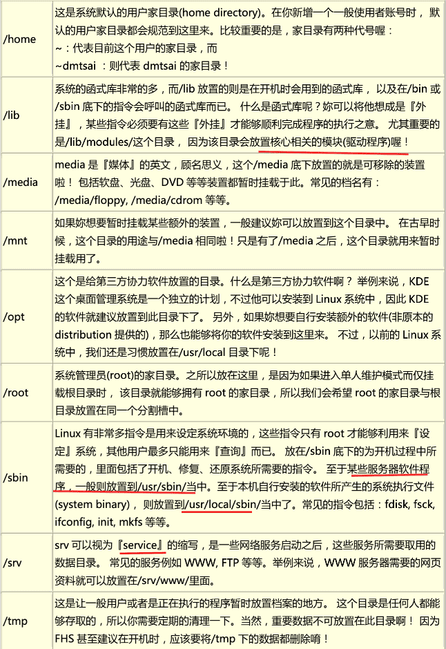

《鸟哥的Linux私房菜》笔记
-----------

更新为第四版


### 准备

学习环境：Mac的VMware Fusion虚拟机，CentOS 7 64位

查看IP地址的方法：

```shell
cat /etc/sysconfig/network-scripts/ifcfg-eth0
ifconfig
ip add
```


# 一、Linux 的规划与安装

## 0 计算器概论

### 0.1 电脑：辅助人脑的好工具

#### 计算机硬件的五大单元


输入单元、输出单元、CPU 内部的控制单元、算数逻辑单元、内存

#### 一切设计的起点： CPU 的架构

精简指令集（RISC）

复杂指令集（CISC）

#### 计算单位

> 1 Byte = 8 bits
>
> K M G T P E Z


网速常用的是bit为单位，Mbps（Mbits per second），常说100M网速，要除以8，大约12.5MBps

### 0.2 个人电脑架构与相关设备元件

#### CPU

#### 内存

#### 显卡

显卡又称为VGA（Video Graphics Array），影响图像的分辨率与色彩深度。显存

#### 硬盘与存储设备

传输接口： SATA、SAS、 IDE 与 SCSI ，了 USB, eSATA 等等

#### 扩展卡与接口

#### 主板

#### 电源供应器

### 0.3 数据表示方式

### 0.4 软件程序运行


#### 操作系统

操作系统核心的功能：

- 系统调用接口（System call interface）
- 程序管理（Process control）  cpu有效分配，cpu排程机制
- 内存管理（Memory management）
- 文件系统管理（Filesystem management）
- 设备的驱动（Device drivers）   可加载模块

#### 应用程序

### 小结

`cat /proc/cpuinfo`

`lspci`   显示系统中所有PCI总线设备或连接到该总线上的所有设备的工具


## 1 Linux是什么/如何学习

GNU 是 GNU is Not Unix 

GNU C Compiler(gcc)

自由软件基金会(FSF, Free Software Foundation)

GNU的通用公共许可证(General Public License, GPL) --- copyleft(相对于专利软件的copyright！)

POSIX是可携式操作系统接口(Portable Operating System Interface)，重点在规范核心与应用程序之间的接口。

Linux distributions：两大主流 1）使用RPM （Red Hat，Fedora，SuSE），2）使用dpkg(Debian,Ubuntu等)

linux上的图形界面： KDE ， GNOME

**平行运算**是将原本的工作分成多样，然后交给多部主机去运算，最终再将结果收集起来。

*要让linux解决问题*

Linux最强的地方在于**网络**，而Windows是赢在用户接口较为亲善。

*作为一个使用者，人要迁就机器；做为一个开发者，要机器迁就人。*

**TLDP**是 The Linux Documentation Project 。

异步的磁盘/内存数据传输模式。


`/usr/share/doc/`   Linux自己的文档存储位置

`/var/log/`   Linux系统日志

不同环境下，解决问题的方法有很多种，只要行的通，就是好方法。


## 2 主机规划与磁盘分区

### 2.1 Linux与硬件的搭配

#### 硬件设备在Linux中的文件名

> **在Linux系统中，每个设备都被当成一个文件来对待。**

*   IDE接口 /dev/hd[a-d] 
*   SATA接口（目前磁盘，u盘等） /dev/sd\[a-p][1-\] (a-p的顺序是安装磁盘被检测的先后，数字是分隔槽)


### 2.2 磁盘分区

##### 磁盘的组成

> sector 扇区，磁区(512字节)。  
> track 磁道。由于磁盘是旋转的，则连续写入的数据是排列在一个圆周上的。所以这个圆周上的所有sector组成一个track。  
> side/head 磁面/磁头。每个磁面都有一个用于读取存储数据的磁头，所以side数与head数相同  
> cylinder 磁柱，柱面(这个翻译貌似不好理解)。

*   磁盘的第一个sector： 1，主要启动记录区(Master Boot Record, MBR)：可以安装开机管理程序的地方，有446 bytes 2，分割表(partition table)：记录整颗硬盘分割的状态，有64 bytes 3，结束标志：2bytes
*   partition table 
    *   最多纪录四条分割信息（开始和结束的磁柱号码，主和延伸分割槽；其中延伸最多一个，可以进行逻辑分割）
    *   分隔槽最小单位是cylinder
    *   延伸分割槽使用额外的扇区来纪录分割信息（在延伸分隔槽中）

##### 开机流程与MBR 

由于**开机管理程序**是操作系统在安装的时候所提供的，所以他会认识硬盘内的文件系统格式。 
1.  BIOS：开机主动执行的韧体（写在硬件上的一个软件程序），会认识第一个可开机的装置；
2.  MBR：第一个可开机装置的第一个扇区内的主要启动记录区块，内含开机管理程序；
3.  开机管理程序(boot loader)：一支可读取 核心档案 来执行的软件；
4.  核心档案：开始操作系统的功能... 

##### 多重引导 

开机管理程序也可以安装在每个分隔槽的**启动扇区**(boot sector)

每个分割槽都拥有自己的启动扇区

实际可开机的核心档案是放置到各分隔槽中

windows安装程序会主动的覆盖掉MBR以及自己所在分割槽的启动扇区 ，所以先安装windows

##### 磁盘分区的选择 

**挂载** 就是利用一个目录当成进入点，将磁盘分隔槽的数据放置在该目录下

SAMBA （与windows文件共享） /home

邮件服务器 /var


## 3 安装CentOS7.x


## 4 首次登录与man page

#### 基础

`date` 

`cal`

`startx`

`bc`

ctrl-c 中断目前程序 

ctrl-z 把程序掉到背景中

ctrl-d 键盘输入结束 (End Of File, EOF 或 End Of Input) 类似于 exit

#### man page

man page 中第一行代号的意义（`man 7 man` 查看）：


man page中每个部分的含义：


`man -f command` 查看某个命令的所有相关说明文件， 类似于 `whatis` （需要有whatis数据库） 

 `man -k`(比-f更全,相关的) 类似于 `apropos` 

#### info page

类似man page，不过info page将文件数据拆成一个一个的段落。

#### 其它有用的文件

`/etc/man.config`中定义了man到哪寻找参考文件  
MANPATH /usr/man 
MANPATH /usr/share/man  
MANPATH /usr/local/man  
MANPATH /usr/local/share/man  
MANPATH /usr/X11R6/man

`info` /usr/share/info/

`/usr/share/doc/` 下有很多重要的文档 `/usr/share/doc/centos-release-notes-5.5/`  
`/usr/share/doc/bash-3.2/`

#### 文本编辑器

`nano` 

#### 正确关机方法

正常关机关注点：

1. 观察系统的使用状态:  `who`    `netstat -a`

2. 通知在线使用者关机的时刻:

3. 正确的关机指令使用:   `shutdown`   `reboot`


`sync` 将数据同步写入磁盘

`shutdown`  关机

```shell
[root@www ~]# shutdown -h now
立刻关机，其中 now 相当于时间为 0 的状态
[root@www ~]# shutdown -h 20:25
系统在今天的 20:25 分会关机，若在 21:25 才下达此指令，则隔天才关机 
[root@www ~]# shutdown -h +10
系统再过十分钟后自动关机
[root@www ~]# shutdown -r now
系统立刻重新启动
[root@www ~]# shutdown -r +30 'The system will reboot' 
再过三十分钟系统会重新启动，并显示后面的讯息给所有在在线的使用者 
[root@www ~]# shutdown -k now 'This system will reboot' 
仅发出警告信件的参数!系统并不会关机啦!吓唬人!
```


`reboot`,`halt`,`poweroff`   重新启动、关闭


#### 切换执行等级: init

`init 0` 关机，`init 5` 类似 `startx`


#### 文件系统错误的问题

`/etc/issue`中是开机显示信息，通过`man issue`(配置文件的档案内容格式，man page的代号为5) > `man mingetty`查看/etc/issue中变量的意义


#### 忘记root密码

# 二、Linux文件、目录与磁盘格式

 ## 5 linux文件权限与目录配置

### 5.1 使用者与群组


### 5.2 Linux文件权限

#### Linux文件属性


第一栏代表这个文件的类型与权限（permission）

第二栏表示有多少文件名链接到此节点（i-node）

第三栏表示这个文件（或目录）的“拥有者帐号”

第四栏表示这个文件的所属群组

第五栏为这个文件的容量大小，默认单位为Bytes

第六栏为这个文件的创建日期或者是最近的修改日期

第七栏为这个文件的文件名

#### 改变文件属性与权限

chgrp ：改变文件所属群组

chown ：改变文件拥有者

chmod ：改变文件的权限, SUID, SGID, SBIT等等的特性


`# chgrp [-R] group dirname/filename`   	改变文件所属组

`# chown [-R] user[:group] dirname/filename`	改变文件所有者

`# chmod [-R] xyz dirname/filename`    	

`# chmod u=rwx,go=rx .bashrc`  通过符号类型改变权限


#### 目录与文件的权限意义


文件的rwx， 主要针对『文件的内容』而言的

目录的r表示可以查询该目录下的文件名数据，即可以用`ls` 目录的w很重要，表示可以改变目录下的结构，即 1)建立新的档案与目录； 删除已经存在的档案与目录(不论该档案的权限为何！) 将已存在的档案或目录进行更名； 搬移该目录内的档案、目录位置。

目录的x表示能否进入目录使之成为工作目录，即可以`cd`

sudo -s

last /var/log/wtmp btmp


#### Linux文件种类与扩展名

##### 文件种类

1. 普通文件【-】。就是平常说的文件，分三类：

   纯文本（ASCII）

   二进制文件

   数据格式文件：一些特定文件，例如存储用户登录情况的文件`/var/log/wtmp`，命令`last`就是读取这个文件。

   ```shell
   # file /var/log/wtmp
   /var/log/wtmp: data
   # last
   root     pts/0        192.168.165.1    Sun Jun  7 17:41   still logged in
   root     tty1                          Sun Jun  7 17:40   still logged in
   reboot   system boot  3.10.0-1127.el7. Sun Jun  7 17:39 - 17:42  (00:02)
   root     pts/1        192.168.165.1    Tue Jun  2 17:04 - 20:59  (03:55)
   root     pts/0        192.168.165.1    Tue Jun  2 10:16 - 17:22  (07:05)
   root     tty1                          Tue Jun  2 10:16 - 23:24  (13:08)
   reboot   system boot  3.10.0-1127.el7. Tue Jun  2 10:15 - 23:24  (13:08)
   root     pts/0        192.168.165.1    Mon May 25 18:57 - down   (02:58)
   root     pts/0        192.168.165.1    Mon May 25 11:23 - 18:11  (06:47)
   root     pts/1        192.168.165.1    Sun May 24 17:01 - 19:53  (02:52)
   root     pts/0        192.168.165.1    Sun May 24 07:29 - 17:21  (09:52)
   root     pts/0        192.168.165.1    Sun May 24 07:14 - 07:28  (00:14)
   root     tty1                          Sun May 24 07:11 - 21:56 (1+14:45)
   reboot   system boot  3.10.0-1127.el7. Sun May 24 07:10 - 21:56 (1+14:45)
   root     pts/0        192.168.165.1    Sat May 23 17:22 - down   (01:41)
   root     tty1                          Sat May 23 12:15 - 19:03  (06:48)
   reboot   system boot  3.10.0-1127.el7. Sat May 23 12:08 - 19:03  (06:55)
   
   wtmp begins Sat May 23 12:08:07 2020
   ```

   

2. 目录 【d】


3. （软）链接【l】


4. 设备与装置文件

   通常在`/dev`下，分两类区块（block）设备文件【b】和字符设备文件【c】。

5. 资料接口文件【s】

   与客服端进行socket链接，通常在`/var/run`

6. 数据传送文件（FIFO，pipe）【p】


##### Linux文件扩展名

linux文件名只是为了让用户了解文件的用途。

##### Linux文件名长度限制

255

4096

##### Linux文件名命名限制


### 5.3 Linux目录配置

#### Linux目录配置的依据（FHS）

 [FHS](http://www.pathname.com/fhs/)(Filesystem Hierarchy Standard）是官方对不同Linux发行版目录的限制。


- 可分享的:可以分享给其他系统挂载使用的目录，所以包括执行文件与用户的邮件等数据， 是能够分享给网络上其他主机挂载用的目录;
- 不可分享的:自己机器上面运作的装置档案或者是与程序有关的 socket 档案等， 由于仅与自身机器有关，所以当然就不适合分享给其他主机了。
- 不变的:有些数据是不会经常变动的，跟随着 distribution 而不变动。 例如函式库、文件说明 文件、系统管理员所管理的主机服务配置文件等等;
- 可变动的:经常改变的数据，例如登录文件、一般用户可自行收受的新闻组等。

FHS仅定义的三个目录：

- **/** ( 根目录):与开机系统有关;
-  **/usr** (unix software resource):与软件安装/执行有关;
-  **/var** (variable):与系统运作过程有关。

##### 根目录的意义和内容

根目录是整个系统最重要的一个目录，因为不但所有的目录都是由根目录衍生出来的， 同时根目录也与**开机/还原/系统修复**等动作有关。 由于系统开机时需要特定的**开机软件、核心文件、开机所需程序、 函式库**等等文件数据，若系统出现错误时，根目录也必须要包含有能够修复文件系统的程序才行。

 因为根目录是这么的重要，所以FHS标准建议: **根目录(/)所在分割槽应该越小越好，且应用程序所安装的软件最好不要与根目录放在同一个分割槽内，保持根目录越小越好。**这样减少发生错误的机会。

根目录一般有如下次目录：

因此 FHS 标准建议: 根目录(/)所在分割槽应该越小越好， 且应用程序所安装的软件最好不要与根目录 放在同一个分割槽内，保持根目录越小越好。




FHS标准外需要了解的一些目录：


不可以与根目录分开的五个目录：

- **/etc**:配置文件
- **/bin**:重要执行档
- **/dev**:所需要的装置档案􏰮
-  **/lib**:执行档所需的函式库与核心所需的模块 􏰮 
- **/sbin**:重要的系统执行文件


##### /usr 的意义与内容

依据 FHS 的基本定义，/usr 里面放置的数据属于可分享的与不可变动的(shareable, static)， 如果你知 道如何透过网络进行分割槽的挂载(例如在服务器篇会谈到的 **NFS服务器**)，那么/usr 确实可以分享给局 域网络内的其他主机来使用喔!


##### /var的意义与内容

如果/usr 是安装时会占用较大硬盘容量的目录，那么/var 就是在系统运作后才会渐渐占用硬盘容量的目 录。 因为/var 目录主要针对**常态性变动的文件**，包括快取(cache)、登录档(log file)以及某些软件运作所产生的档案， 包括程序档案(lock file, run file)，或者例如 MySQL 数据库的档案等等。


##### 在FHS标准基础上，各家的distributions有所不同


#### 目录树


#### 绝对路径和相对路径


## 6 Linux文件与目录管理

### 6.1 目录与路径

`$PATH`

`cd`  `pwd`  `mkdir`  `rmdir`


### 6.2 文件与目录管理

`ls`

`cp`   `rm`   `mv`


### 6.3 文件内容查阅

`cat ` 

`tac` 

 `nl`

`more` 

 `less`

`head` 

 `tail`

`od`

`touch`

### 6.4 文件和目录的默认权限、隐藏权限

##### `umask`  文件预设权限

```shell
[root@www ~]# umask
0022 <==与一般权限有关的是后面三个数字! 
[root@www ~]# umask -S
u=rwx,g=rx,o=rx
```

##### 文件隐藏属性

`chattr`    配置文件案隐藏属性

```shell
[root@www tmp]# touch attrtest <==建立一个空档案
[root@www tmp]# chattr +i attrtest <==给予 i 的属性
[root@www tmp]# rm attrtest <==尝试删除看看
rm: remove write-protected regular empty file `attrtest'? y

rm: cannot remove `attrtest': Operation not permitted <==操作不许可 # 看到了吗?呼呼!连 root 也没有办法将这个档案删除呢!赶紧解除设定!

范例:请将该档案的 i 属性取消! 
[root@www tmp]# chattr -i attrtest
```


`lsattr`  显示档案隐藏属性

```shell
[root@www ~]# lsattr [-adR] 档案或目录
选项与参数:
-a :将隐藏文件的属性也秀出来;
-d :如果接的是目录，仅列出目录本身的属性而非目录内的文件名; -R :连同子目录的数据也一并列出来!

[root@www tmp]# chattr +aij attrtest 
[root@www tmp]# lsattr attrtest 
----ia---j--- attrtest
```


##### 文件的特殊权限： SUID，SGID，SBIT

```shell
[root@www ~]# ls -ld /tmp ; ls -l /usr/bin/passwd 
drwxrwxrwt 7 root root 4096 Sep 27 18:23 /tmp 
-rwsr-xr-x 1 root root 22984 Jan 7 2007 /usr/bin/passwd
```


##### 观察文件类型：`file` 


### 6.5 命令和文件的搜索

#### 命令文件名的搜寻

`which`

which 是根据用户所设定的 PATH 变量内的目录去搜寻可执行文件的!

#### 文件文件名的搜索

`whereis`  

```shell
[root@www ~]# whereis [-bmsu] 档案或目录名 
选项与参数:
-b	:只找二进制格式的文件
-m	：只找说明文件manual路径下的文件
-s	：只找Source来源文件
-u :搜寻不在上述三个项目当中的其他特殊档案
```


`locate`

 locat 寻找的数据是由『已建立的数据库 /var/lib/mlocate/』 里面的数据所搜寻到 的

#####   find

### 6.6 权限和命令间的关系


## 7 Linux磁盘与文件系统管理

#### 1、EXT2文件系统

🔖

#### 2、文件系统的简单操作

`df`  `du`

`ln`


#### 3、磁盘的分割、格式化、检验与挂载

`fdisk`  `partprobe`

`mkfs`  `mke2fs`

`fsck`  `badblocks`

`mount`  `umount`

`mknod`  `e2label`  `tune2fs`  `hdparm`


#### 4、设定开机挂载

`/etc/fstab`   `/etc/mtab`


#### 5、内存置换空间(swap)之建置


#### 6、文件系统的特殊观察与操作


## 8 文件的压缩与打包

#### 8.1 压缩文件的用途和技术


#### 8.2 常用压缩命令

`compress`

`gzip`  `zcat`

`bzip2`  `bzcat`


#### 8.3 打包命令

`tar`


#### 8.4 完整备份工具

`dump`

`restore`


#### 8.5 光盘写入工具

`mkisofs`

`cdrecord`

#### 8.6 其它压缩和备份工具


# 三、学习Shell和Shell脚本

## 9 Vim

#### 9.1 vi与vim

在 Linux 世界中，绝大部分的配置文件是以 ASCII 纯文本形态存在，因此利用简单的文字编辑软件就能够修改设定了! 

太多 Linux 上指令使用 vi 作为数据接口。


#### 9.2 vi的使用

##### 三种模式：

- 一般模式
- 编辑模式。 i/I、o/O、a/A（插入），r/R（取代）。
- 命令模式。【:  /  ?  】 搜索、读取、存储、大量取代字符、离开、显示行号等动作。

##### 按键说明

###### 一般模式下


###### 一般模式切换到编辑模式


###### 一般模式切换到命令模式


##### 练习

!!

🔖

#### 9.3 vim的额外功能


#### 9.4 其他vim使用注意事项


## 10 Bash


## 11 正则表达式与文件格式化处理


#### 文件的格式化与相关处理

`printf`

`awk`

`diff`  `cmp`  `patch`

`pr`


## 12 Shell脚本


# 四、Linux使用者管理


## 13 Linux账号管理与ACL权限控制


## 14 磁盘配额（Quota）与进阶文件系统管理


## 15 例行性工作调度 (**crontab**)


## 16 程序管理与SELinux初探

#### 16.1 什么是程序（process）

在 Linux中，<u>**触发任何一个事件**时，系统都会将他定义成一个程序，并且给予这个程序一个ID ，成为**PID**，同时依据这个程序的用户与相关属性关系，给予这个PID一组有效的权限设定</u>。从此以后，这个PID能够在系统上进行的动作，就与这个PID的权限有关了。

##### process  与 program

两者都可以翻译为程序，program通常就是指二进制文件；而process就是加载到内存中运行的program，操作系统给process分配了PID，process有时也翻译成进程。

同样的program`/bin/bash`在不同用户登录时，执行为不同的process，分配了不同的PID：


###### 子程序与父程序

Parent PID(PPID)

执行`bash`，进入子程序环境中，`ps -l`：

```shell
# ps -l
F S   UID    PID   PPID  C PRI  NI ADDR SZ WCHAN  TTY          TIME CMD
4 S     0   3732   3721  0  80   0 - 28886 do_wai pts/0    00:00:00 bash
4 S     0   3812   3732  0  80   0 - 28886 do_wai pts/0    00:00:00 bash
0 R     0   3823   3812  0  80   0 - 38337 -      pts/0    00:00:00 ps
```

> 平常一个程序被关闭后，会再运行，大概率（也有可能是crontab）是被一个父程序调用运行。

###### fork 和 exec：程序调用的流程


###### 系统或网络服务：常驻在内存的程序

一般`touch`，`ls`，`rm`等程序执行完就结束了。

也有一只在内存中运行的程序，叫服务（daemon）或守护进程。如**crond**（每分钟都会扫描/etc/crontab等文件）、syslog等，还有负责网络方面httpd、postfix、vsftpd等等。


##### Linux的多人多任务环境

🔖

#### 16.2 工作管理（job control）


#### 16.3 程序管理


#### 16.4 特殊文件与程序


#### 16.5 SELinux


# 五、Linux系统管理员


## 17 系统服务（daemon）

`/etc/services`    服务与端口号（和协议）的对应

执行文件、配置文件、执行环境等等。

服务启动后会把PID保存在`/var/run/`目录下，类似`/var/run/yum.pid`这样。

`/etc/init.d/`（or`/etc/rc.d/init.d/`）存放系统几乎所有的服务启动脚本。

`/etc/sysconfig/*` :各服务的初始化环境配置文件

`/var/lib/*` :各服务产生的数据


##### 观察服务

`netstat -tulp`      目前系统开放的『网络服务』有哪些  (-n  显示端口)

`netstat -lnp`		所有的有监听网络的服务 (包吨 socket 状态)

`service --status-all`

##### 设置开机启动服务

一般开启服务的两种方法： `service   *** start`  和 `/etc/init.d/* start `

Linux一般开机流程

1. 打开计算机电源，开始读取BIOS并迚行主机的自我测试;
2. 透过BIOS取得第一个可开机装置，读取主要开机区(MBR)取得开机管理程序;
3. 透过开机管理程序的设定，取得kernel并加载内存且侦测系统硬件;
4. 核心主动呼叫init程序;
5. init程序开始执行系统初始化(/etc/rc.d/rc.sysinit)
6. 依据 init 的设定进行 daemon start (/etc/rc.d/rc[0-6].d/*)
7. 加载本机设定(/etc/rc.d/rc.local)

可以在第6步以不动的执行等级（run level）启动服务。

CentOS 7之后 渐渐用systemctl 替代service 和chkconfig


services --status-all

netstat -anl 

pstree


## 18 认识、分析登录文件

登录文件可以记录系统在什么时间、哪个主机、哪个服务、出现了什么讯息等信息， 这些信息也包括用户识别数据、系统故障排除须知等信息。`/var/log/`

透过 1.察看屏幕上面的错误信息与 2.登录文件的错误信息，几乎可以解决大部分的 Linux 问题!

/var/log/cron

/var/log/dmesg:   记录系统在开机的时候核心硬件检测过程所产生的各项信息

/var/log/messages:  	相当的重要，几乎系统发生的错误讯息 (或是重要的信息) 都会记录在这个档案中

/var/log/secure:	基本上，只要牵涉到『需要输入账号密码』的软件，那么当登入时 (不管登入正确戒错诨) 都会被记录在此档 案中。 

`/var/log/httpd/*`, `/var/log/news/*`, `/var/log/samba/*`:


CentOS 提供 syslogd 这个服务来统一管理登录档喔!

syslogd:主要登录系统不网绚等朋务的讯息;
klogd:主要登录核心产生的各项信息;
logrotate:主要在迚行登录文件的轮替功能。


`syslog`

`/etc/syslog.conf`


`logrotate`

`/etc/logrotate.conf`

`/etc/logrotate.d/`


#### 分析登录档

`logwatch`


## 19 开机流程、模块管理与Loader


## 20 网络设置与备份策略

#### 1、CentOS 系统设定工具: setup


#### 2、利用CUPS设定Linux打印机


####  3、硬件数据收集不驱劢，及 lm_sensors

kernel 在开机时就能够侦测主机硬件并加载适当的模块来驱动硬件了。 而核心所侦测到的各项硬件装置，后来就会被记录在 /proc 与 /sys 当中了。 包括 /proc/cpuinfo, /proc/partitions, /proc/interrupts 等等。

- fdisk:  第八章曾经谈过，可以使用 fdisk -l 将分割表列出;
- hdparm:  第八章，可观察硬盘的信息与测试读写速度;
- dmesg:  第十七章谈过， 观察核心运作过程当中所显示的各项讯息记录;
- vmstat:  第十七章谈过，可分析系统 (CPU/RAM/IO) 目前的状态;
- lspci:  列出整个 PC 系统的 PCI 接口装置!很有用的指令;
- lsusb:  列出目前系统上面各个 USB 端口口的状态，与连接的 USB 装置;
- iostat: 与vmstat 类似，可实时列出整个 CPU 不接口设备的 Input/Output 状态。


lm_sensors，是一款基于linux系统的[硬件监控](https://baike.baidu.com/item/硬件监控/6458294)的软件。可以监控主板，CPU的工作电压，温度等数据。


## 21 软件安装：源代码与Tarball

了解如何将开 放源码的程序设计、加入函数库的原理、通过编译而成为可以执行 的 binary program，最后 该可执行文件可被我们所使用的一连串过程!

#### 1、源码安装

Linux系统中的真正可执行文件都是二进制文件，例如/usr/bin/passwd，/bin/touch等。shell scripts是利用shell（如bash）程序来执行的。

```shell
# file /bin/bash
/bin/bash: ELF 64-bit LSB executable, x86-64, version 1 (SYSV), dynamically linked (uses shared libs), for GNU/Linux 2.6.32, BuildID[sha1]=85e3da5a087950e7aaeb7893c056218a8874d2e5, stripped

# file /etc/init.d/network
/etc/init.d/network: Bourne-Again shell script, ASCII text executable
```

如果二进制文件是可以执行的时候，就会显示执行文件类别 (**ELF 64-bit LSB executable**)， 同时会说明是否使用动态函数库 (shared libs)。

一般的shell脚本，就会显示ASCII text executables。如果第一行是#!/bin/bash，还会显示Bourne-Again shell script。

##### make 与 configure

执行 make 时，make 会在当前目录下搜寻 Makefile/makefile)这个文本文件，而 Makefile 里面则记录了原始码如何编译的详细信息! make 会自动的判别原码是否经过变动了，而自动更新执行档。

源代码安装程序的过程：

1. 下载源码

2. 解压缩

3. 执行 ./configure   -> 生成 makefile 文件

4. make    ->  对makefile 文件 操作

5. make install 

#### 2源码安装范例

```shell
# vim hello.c 
#include <stdio.h>
int main(void) {
	printf("Hello World\n"); 
}
# gcc hello.c
# ll hello.c a.out
-rwxr-xr-x. 1 root root 8360 6月   2 11:21 a.out
-rw-r--r--. 1 root root   64 6月   2 11:20 hello.c
# ./a.out
Hello World
```

gcc 是编译程序，上面gcc的过程可以分两步：

```shell
# gcc -c hello.c
# gcc -o hello hello.o
# ll hello*
-rwxr-xr-x. 1 root root 8360 6月   2 11:32 hello 	 <==编译得到的可执行文件!
-rw-r--r--. 1 root root   64 6月   2 11:20 hello.c
-rw-r--r--. 1 root root 1496 6月   2 11:32 hello.o  <==产生的目标文件
# ./hello
Hello World
```

##### 子程序的编译和链接

```shell
# vim thanks.c
#include <stdio.h>
int main(void) {
  printf("Hello World\n");
  thanks_2();
}

# vim thanks_2.c
#include <stdio.h>
void thanks_2(void) {
  printf("Thank you!\n"); 
}

# gcc -c thanks.c thanks_2.c
# ll thanks*
-rw-r--r--. 1 root root   70 6月   2 11:37 thanks_2.c
-rw-r--r--. 1 root root 1504 6月   2 11:38 thanks_2.o
-rw-r--r--. 1 root root   79 6月   2 11:36 thanks.c
-rw-r--r--. 1 root root 1560 6月   2 11:38 thanks.o
# gcc -o thanks thanks.o thanks_2.o
# ./thanks
Hello World
Thank you!
```

由于源码文件有时有很多歌，所以无法直接编译， 这时就需要先产生目标文件，然后再以链接制作成为二进制可执行文件。

如果单个源码文件更新了，只需要重新生成单个目标文件，然后重新链接，可节省时间。


##### 链接外部函数库

```shell
# vim sin.c
#include <stdio.h>
int main(void) {
  float value;
  value = sin ( 3.14 / 2 );
  printf("%f\n",value);
}

# gcc sin.c
sin.c: In function 'main':
sin.c:5: warning: incompatible implicit declaration of built-in function 'sin' /tmp/ccsfvijY.o: In function `main':
sin.c:(.text+0x1b): undefined reference to `sin'
collect2: ld returned 1 exit status
# 注意看到上面最后一行，会有个错诨讯息，代表没有成功!

# gcc sin.c -lm -L/lib -L/usr/lib
# ./a.out
1.000000
```

C语言里面的sin函数是写在 libm.so 这个函数库中。

l: 是“加入某个函数库”的意思

m: 是指 libm.so 函数库


#### 3、用make进行宏编译


#### 4、Tarball的管理


#### 5、函数库管理


#### 6、检验软件的正确性


## 22 软件安装：RPM、SRPM、YUM


## 23 X Window介绍


## 24 Linux核心编译


