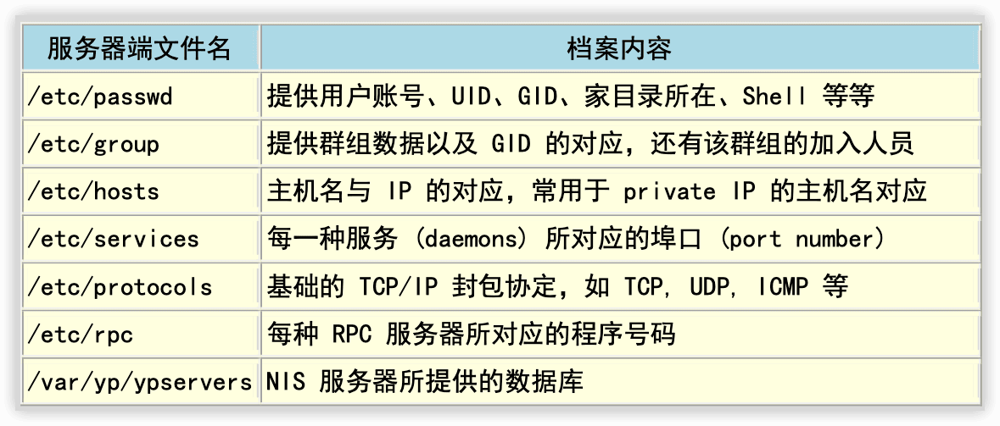

# 鸟哥的Linux私房菜服务器架设篇

(第三版)

# 一、网络基础

## 1 架设服务器前的准备工作

### 1.1 前言：Linux有啥功能

1.1.1 只想用 Linux 架设服务器需要啥能力？

1.1.2 架设服务器难不难呢？


### 1.2 基本架设服务器流程

#### 1.2.1 网络服务器成功联机的分析

#### 1.2.2 一个常见的服务器设定案例分析

##### 1️⃣了解网络基础


##### 2️⃣服务器本身的安装规划与架站目的的搭配：全新安装


##### 3️⃣服务器本身的基本操作系统操作：建立账号, 修改权限, Quota, LVM


##### 4️⃣服务器内部的资源管理与防火墙规划


##### 5️⃣服务器软件设定：学习设定技巧与开机是否自动执行


##### 6️⃣细部权限与SELinux


#### 1.2.3 系统安全与备份处理


### 1.3 自我评估是否已经具有架设服务器的能力


## 2 基础网络概念

### 2.1 网络是什么


### 2.2 TCP/IP的链路层相关协议

#### 2.2.1 广域网使用的设备


#### 2.2.2 局域网络使用的设备——以太网络

速度与标准, RJ45 接头 (跳线/并行线)


#### 2.2.3 以太网络的传输协议：CSMA/CD


#### 2.2.4 MAC的封装格式


#### 2.2.5 MTU最大传输单位


#### 2.2.6 集线器、交换器与相关机制


### 2.3 TCP/IP的网络层相关封包和数据

#### 2.3.1 IP封包的封装


#### 2.3.2 IP地址的组成与分级：网域, IP 与门牌关连, 分级 (Class A, B, C)


#### 2.3.3 IP的种类与取得方式： loopback, IP 的取得方式


#### 2.3.4 Netmask, 子网与 CIDR (Classless Interdomain Routing)


#### 2.3.5 路由概念


#### 2.3.6 观察主机路由： route


#### 2.3.7 IP 与 MAC：链结层的 ARP 与 RARP 协定：arp


#### 2.3.8 ICMP 协定

Internet Control Message Protocol, 因特网讯息控制协议

ICMP 的类别：

| 类别代号 | 类别名称与意义                                               |
| -------- | ------------------------------------------------------------ |
| 0        | Echo Reply (代表一个响应信息)                                |
| 3        | Destination Unreachable (表示目的地不可到达)                 |
| 4        | Source Quench (当 router 的负载过高时，此类别码可用来让发送端停止发送讯息) |
| 5        | Redirect (用来重新导向路由路径的信息)                        |
| 8        | Echo Request (请求响应消息)                                  |
| 11       | Time Exceeded for a Datagram (当数据封包在某些路由传送的现象中造成逾时状态，此类别码可告知来源该封包已被忽略的讯息) |
| 12       | Parameter Problem on a Datagram (当一个 ICMP 封包重复之前的错误时，会回复来源主机关于参数错误的讯息) |
| 13       | Timestamp Request (要求对方送出时间讯息，用以计算路由时间的差异，以满足同步性协议的要求) |
| 14       | Timestamp Reply (此讯息纯粹是响应 Timestamp Request 用的)    |
| 15       | Information Request (在 RARP 协议应用之前，此讯息是用来在开机 |
| 16       | Information Reply (用以响应 Infromation Request 讯息)        |
| 17       | Address Mask Request (这讯息是用来查询子网 mask 设定信息)    |
| 18       | Address Mask Reply (响应子网 mask 查询讯息的)                |
|          |                                                              |


### 2.4 TCP/IP的传输层相关封包和数据

#### 2.4.1 可靠联机的 TCP 协议

通讯端口口,

特权端口 (Privileged Ports),

Socket Pair

#### 2.4.2 TCP的三次握手


#### 2.4.3 非连接导向的 UDP 协议


#### 2.4.4 网络防火墙与 OSI 七层协议


### 2.5 连上 Internet 前的准备事项

#### 2.5.1 用 IP 上网？主机名上网？DNS 系统？

#### 2.5.2 一组可以连上 Internet 的必要网络参数


## 3 局域网络架构简介


## 4 连上Internet


#### 4.1.3 Linux网络相关配置文件


 ## 5 linux常用网络指令🔖

### 5.1 网络参数设定命令

- `/etc/sysconfig/network-scripts/`目录中各种配置脚本
- `ifconfig`

		[root@localhost network-scripts]# ifconfig
		eno16777736: flags=4163<UP,BROADCAST,RUNNING,MULTICAST>  mtu 1500
		        inet 192.168.30.160  netmask 255.255.255.0  broadcast 192.168.30.255
		        inet6 fe80::20c:29ff:fef0:632b  prefixlen 64  scopeid 0x20<link>
		        ether 00:0c:29:f0:63:2b  txqueuelen 1000  (Ethernet)
		        RX packets 27115  bytes 5969948 (5.6 MiB)
		        RX errors 0  dropped 0  overruns 0  frame 0
		        TX packets 3387  bytes 1719224 (1.6 MiB)
		        TX errors 0  dropped 0 overruns 0  carrier 0  collisions 0
		
		lo: flags=73<UP,LOOPBACK,RUNNING>  mtu 65536
		        inet 127.0.0.1  netmask 255.0.0.0
		        inet6 ::1  prefixlen 128  scopeid 0x10<host>
		        loop  txqueuelen 0  (Local Loopback)
		        RX packets 80  bytes 5020 (4.9 KiB)
		        RX errors 0  dropped 0  overruns 0  frame 0
		        TX packets 80  bytes 5020 (4.9 KiB)
		        TX errors 0  dropped 0 overruns 0  carrier 0  collisions 0
	
  +  `eth0` 网卡代号 ，cetos7改成`eno16777736`,lo是loopback
  +   MTU (Maximum Transmission Unit,最大传输单位)
  +   txqueuelen：用来传输数据的缓冲区的存储长度
  +   RX：网络有启动到目前的封包接收情况
  +   TX：封包传送情况
  +   collisions：封包碰撞情况，太多表示网络不好

  - `ifconfig eth0 192.168.100.100` 临时改变网卡ip，远程终端修改会掉线
  - `ifconfig eth0 192.168.100.100  netmask 255.255.255.128 mtu 8000` 同时设定不同网络接口
  - `ifconfig eth0 up | down`
  - `/etc/init.d/network restart` 以上手动设定的网络参数全部失效，会以`/etc/sysconfig/network-scripts/ifcfg-eno16777736`等的设定为标准
  - `ifup eth0`,`ifdown eth0` 这两个程序搜索/etc/sysconfig/network-scripts目录下ifcfg-*来启动与关闭。 当目前的网络参数与ifcfg-*不相符，就不能执行，也就是用ifconfig临时修改网络参数要已`ifconfig eth0 down`来关闭
  - 查看局域网中的ip `sudo yum install nmap` `nmap -sP 192.168.30.0/24`
  -  `route`   路由 ？？？
  -  `ip` 网络参数综合指令    
     + `ip link` 装置接口相关设定  （osi第二层）
     	 + `ip link show`
     	 + `ip -s link show eth0`
     	 + `ip link set eth0 up | down`
     	 + `ip link set eth0 mtu 1000`
     	 + `ip link set eno16777736 name andy` 修改网络卡名，需关闭
     + `ip address` 额外的ip相关设定 （osi第三层）
     	 + `ip address show` 
     	 + `ip address add`
     	 + `ip address del`
     + `ip route` 路由的相关设定
     	 + `ip route show`
     	 + `ip route add`
     	 + `ip route del`
   - 无线网络： `iwlist` `iwconfig`
   - `dhclient eno16777736` 手动设定网卡亿dhcp协议去尝试取得ip


### 5.2 网络侦错与观察指令

> - `ping` 两部主机沟通。ICMP封包（type 0,8），IP封包，TTL属性
>    + `ping -c 3 168.192.30.140` 发送3次包
>    + `ping`最简单功能是传送ICMP封包去要求对方主机回应是否存在于网络环境
>    + 测试某个网域中主机是否响应 ping.sh  

				#! /bin/bash
				for siteip in $(seq 1 254)
				do
				        site="192.168.30.${siteip}"
				        ping -c1 -W1 ${site} &> /dev/null
				        if [ "$?" == "0" ]; then
				                echo "$site is UP"
				        else
				                echo "$site is DOWN"
				        fi
				done
	  + 主机和待测主机在同一网域时，TTL是64，否则是255
	  + 用ping追踪路径中的最大MTU数值 `ping -c 2 -s 1000 -M do 192.168.30.212`
	  + 不同接口的MTU值是不同
   - `traceroute` 两主机间各个节点分析
	      > -n 主机名称  
	 >     > -U 默认是UDP的port 33434  
	 >     > -I 使用ICMP方式进行侦测  
	 >     > -T TCP 默认port 80  
	 >     > -w 限制时间  
	 >     > -p 端口  
	 >     > -i -g  
      + `traceroute -n tw.yahoo.com`
      +  回传星号的，代表该 node 可能设有某些防护措施，让我们发送的封包信息被丢弃所致。 因为我们是直接透过路由器转递封包，并没有进入路由器去取得路由器的使用资源，所以某些路由器仅支持封包转递， 并不会接受来自客户端的各项侦测.
      + `traceroute -w 1 -n -T tw.yahoo.com`
   - `netstat` 本机网络连接状况
      + `netstat -rn` 路由表状态，类似`route -n`
      + `netstat -an` 列出所有网络联机状态 。两部分（TCP/IP的网络接口部分，传统的Unix socket部分）
      + 两个问题：目前开了多少port在等待客户端的联机？ 有多少联机已建立或产生问题？  
        
	  + 上图划线处表示目前putty客户端和虚拟机之间的网络链接
	  + Client 端是随机取一个大于 1024 以上的port 进行联机，只有 root 可以启动小于 1024 以下的 port 
	  + `/etc/services` 保存着port和number一一对应
   - `host` `nslookup` 主机名与ip对应
      + `host tw.yahoo.com` 根据`/etc/resolv.conf`中规定的DNS服务器查询主机ip，也可以指定dns服务器
      + `host tw.yahoo.com 168.95.1.1`
      + `nslookup www.google.com`
      + `nslookup 168.95.1.1` 找出168.95.1.1的主机名
      


### 5.3 远程联机指令与实时通讯软件

- telnet
- `ftp 192.168.30.30 44446`	ftp会使用两个port分别进行命令与数据的交流
- `lftp`
- `pidgin`


### 5.4 文字接口网页浏览

- `links` 文字浏览器 类似于`lynx`
   + `links http://www.kernel.org`
   + `links /usr/share/doc/HTML/index.html`
   + `links -dump http://tw.yahoo.com > yahoo.html`
- `wget`
- `wget  http://www.kernel.org/pub/linux/kernel/v2.6/linux-2.6.39.tar.bz2`  通过http下载
- `/etc/wgetrc`


### 5.5 封包截取功能

- `tcpdump`
- `wireshark`
- `nc` `netcat`


## 6 linux网络侦错

### 6.1 无法联网原因分析

#### 6.1.1 硬件问题：网络线材、网络设备、网络布线等


#### 6.1.2 软件问题：IP参数设定、路由设定、服务与防火墙设定等


#### 6.1.3 问题的处理


### 6.2 处理流程

#### 6.2.1 步骤一：网络卡工作确认

```sh
ifconfig
ping
```


#### 6.2.2 步骤二：局域网络内各项连接设备检测


#### 6.2.3 步骤三：取得正确的IP参数


#### 6.2.4 步骤四：确认路由表的规则


#### 6.2.5 步骤五：主机名与IP查询的DNS错误


#### 6.2.6 步骤六：Linux的NAT服务器或IP分享器出问题


#### 6.2.7 步骤七：Internet的问题


#### 6.2.8 步骤八：服务器的问题


# 二、主机的简易安全防护措施

## 7 网络安全与主机基本防护: 限制端口口, 网络升级与SELinux

### 7.1 网络封包联机进入主机的流程

#### 7.1.1 封包进入主机的流程


#### 7.1.2 常见的攻击手法与相关保护： 

猜密码, 漏洞, 社交工程, 程序误用,rootkit, DDoS


#### 7.1.3 主机能作的保护：软件更新、减少网络服务、启动SELinux


### 7.2 网络自动升级软件

#### 7.2.1 如何进行软件升级


#### 7.2.2 CentOS 的 yum 软件更新、映像站使用的原理


#### 7.2.3 yum 的使用： 安装, 软件群组, 全系统更新


#### 7.2.4 挑选特定的映射站：修改 yum 配置文件与清除 yum 快取


### 7.3 限制联机端口 (port)

#### 7.3.1 什么是 port


#### 7.3.2 端口的观察： netstat, nmap


#### 7.3.3 端口与服务的启动/关闭及开机时状态设定： 服务类型, 开机启动


#### 7.3.4 安全性考虑-关闭网络服务端口口


### 7.4 SELinux 管理原则

委任式访问控制 (Mandatory Access Control, MAC) 

#### 7.4.1 SELinux 的运作模式： 安全性本文, domain/type


#### 7.4.2 SELinux 的启动、关闭与观察： getenforce, setenforce


#### 7.4.3 SELinux type 的修改： chcon, restorecon, semanage


#### 7.4.4 SELinux 政策内的规则布尔值修订： seinfo, sesearch, getsebool,setsebool


#### 7.4.5 SELinux 登录文件记录所需服务-以 httpd 为范例： setroubleshoot,sealert


### 7.5 被攻击后的主机修复工作

#### 7.5.1 网管人员应具备的技能

- 了解什么是需要保护的内容
- 预防黑客 (Black hats) 的入侵
- 主机环境安全化
- 防火墙规则的订定
- 实时维护你的主机
- 良好的教育训练课程
- 完善的备份计划


#### 7.5.2 主机受攻击后复原工作流程


## 8 路由观念与路由器设定

### 8.1 路由

#### 8.1.1 路由表产生的类型


#### 8.1.2 一个网卡绑多个 IP：IP Alias 的测试功能


#### 8.1.3 重复路由的问题


### 8.2 路由器架设

#### 8.2.1 什么是路由器与 IP 分享器： 

sysctl.conf


#### 8.2.2 何时需要路由器


#### 8.2.3 静态路由之路由器


### 8.3 动态路由器架设：`quagga` (zebra + ripd)


### 8.4 特殊状况：路由器两边界面是同一个 IP 网段：ARP Proxy


## 9 防火墙与NAT服务器

### 9.1 认识防火墙

防火墙就是透过订定一些有顺序的规则，并管制进入到我们网域内的主机 (或者可以说是网域) 数据封包的一种机制！

更广义的来说，只要能够分析与过滤进出我们管理之网域的封包数据， 就可以称为防火墙。

硬件防火墙与本机的软件防火墙

#### 9.1.1 开始之前来个提醒事项

#### 9.1.2 为何需要防火墙

#### 9.1.3 Linux 系统上防火墙的主要类别

- Netfilter (封包过滤机制)
- TCP Wrappers (程序控管)
- Proxy (代理服务器)


#### 9.1.4 防火墙的一般网络布线示意

Netfilter 机制做些什么：

- 单一网域，仅有一个路由器
- 内部网络包含安全性更高的子网，需内部防火墙切开子网
- 在防火墙的后面架设网络服务器主机
- 分析硬件地址 (MAC) 来决定联机与否


#### 9.1.5 防火墙的使用限制


- 拒绝让 Internet 的封包进入主机的某些端口口

- 拒绝让某些来源 IP 的封包进入

- 拒绝让带有某些特殊旗标 (flag) 的封包进入

  


### 9.2 TCP Wrappers

#### 9.2.1 哪些服务有支持： ldd

#### 9.2.2 `/etc/hosts.{allow|deny}` 的设定方式


### 9.3 Linux 的封包过滤软件： iptables

#### 9.3.1 不同 Linux 核心版本的防火墙软件


#### 9.3.2 封包进入流程：规则顺序的重要性！


#### 9.3.3 iptables 的表格 (table) 与链 (chain)


#### 9.3.4 本机的 iptables 语法

9.3.4-1 规则的观察与清除

9.3.4-2 定义预设政策 (policy)

9.3.4-3 封包的基础比对：IP, 网域及接口装置： 信任装置, 信任网域

9.3.4-4 TCP, UDP 的规则比对：针对埠口设定

9.3.4-5 iptables 外挂模块：mac 与 state

9.3.4-6 ICMP 封包规则的比对：针对是否响应 ping 来设计

9.3.4-7 超阳春客户端防火墙设计与防火墙规则储存


#### 9.3.5 IPv4 的核心管理功能：/proc/sys/net/ipv4/*


### 9.4 单机防火墙的一个实例

#### 9.4.1 规则草拟

#### 9.4.2 实际设定


### 9.5 NAT 服务器的设定

#### 9.5.1 什么是 NAT？ SNAT？ DNAT？


#### 9.5.2 最阳春 NAT 服务器： IP 分享功能


#### 9.5.3 iptables 的额外核心模块功能


#### 9.5.4 在防火墙后端之网络服务器 DNAT 设定


## 10 申请合法的主机名

### 10.1 为何需要主机名

#### 10.1.1 主机名的由来


#### 10.1.2 重点在合法授权


#### 10.1.3 申请静态还是动态 DNS 主机名


### 10.2 注册一个合法的主机名

#### 10.2.1 静态 DNS 主机名注册：以 Hinet 为例


#### 10.2.2 动态 DNS 主机名注册：以 no-ip 为例


# 三、局域网络常见的服务器架设

## 11 远程链接SSH/XDMCP/VNC/RDP

### 11.1 远程联机服务器

11.1.1 什么是远程联机服务器

11.1.2 有哪些可供登入的类型？

### 11.2 文字接口联机服务器：SSH 服务器

#### 11.2.1 联机加密技术简介： 产生新的公钥

#### 11.2.2 启动 ssh 服务

#### 11.2.3 ssh 客户端联机程序 - Linux 用户 

ssh, ~/.ssh/known_hosts, sftp,scp

#### 11.2.4 ssh 客户端联机程序 - Windows 用户

pietty, psftp, filezilla

#### 11.2.5 sshd服务器细部设定


#### 11.2.6 制作不用密码可立即登入的 ssh 用户

ssh-keygen


#### 11.2.7 简易安全设定


### 11.3 最原始图形接口：Xdmcp服务的启用

11.3.1 X Window 的 Server/Client 架构与各组件

11.3.2 设定 gdm 的 XDMCP 服务

11.3.3 用户系统为 Linux 的登入方式： Xnest

11.3.4 用户系统为 Windows 的登入方式： Xming


### 11.4 华丽的图形接口： VNC服务器

#### 11.4.1 预设的 VNC 服务器：使用 twm window manager

vncserver, vncpasswd


#### 11.4.2 VNC 的客户端联机软件

vncviewer, realvnc


#### 11.4.3 VNC 搭配本机的 Xdmcp 画面


#### 11.4.4 开机就启动 VNC server 的方法


#### 11.4.5 同步的 VNC ：可以透过图示同步教学


### 11.5 仿真的远程桌面系统： XRDP 服务器


### 11.6 SSH 服务器的进阶应用

#### 11.6.1 启动 ssh 在非正规埠口 (非 port 22)


#### 11.6.2 以 rsync 进行同步镜相备份

```sh
[root@www ~]# rsync [-avrlptgoD] [-e ssh] [user@host:/dir] [/local/path]
选项与参数：
-v ：观察模式，可以列出更多的信息，包括镜像时的档案档名等；
-q ：与 -v 相反，安静模式，略过正常信息，仅显示错误讯息；
-r ：递归复制！可以针对『目录』来处理！很重要！
-u ：仅更新 (update)，若目标档案较新，则保留新档案不会覆盖；
-l ：复制链接文件的属性，而非链接的目标源文件内容；
-p ：复制时，连同属性 (permission) 也保存不变！
-g ：保存源文件的拥有群组；
-o ：保存源文件的拥有人；
-D ：保存源文件的装置属性 (device)
-t ：保存源文件的时间参数；
-I ：忽略更新时间 (mtime) 的属性，档案比对上会比较快速；
-z ：在数据传输时，加上压缩的参数！
-e ：使用的信道协议，例如使用 ssh 通道，则 -e ssh
-a ：相当于 -rlptgoD ，所以这个 -a 是最常用的参数了！
更多说明请参考 man rsync 的解说！
```


#### 11.6.3 透过 ssh 通道加密原本无加密的服务


#### 11.6.4 以 ssh 信道配合 X server 传递图形接口


## 12 DHCP服务器

### 12.1 DHCP 运作的原理

动态主机设定协议(Dynamic Host Configuration Protocol)  

#### 12.1.1 DHCP 服务器的用途

连上网络的必要参数 `IP, netmask, network, broadcast, gateway, DNS, IP`


#### 12.1.2 DHCP 协议的运作方式： 

IP 参数, 租约期限, 多部 DHCP 服务器


#### 12.1.3 何时需要架设 DHCP 服务器


### 12.2 DHCP 服务器端的设定

12.2.1 所需软件与档案结构

12.2.2 主要配置文件 /etc/dhcp/dhcpd.conf 的语法

12.2.3 一个局域网络的 DHCP 服务器设定案例

12.2.4 DHCP 服务器的启动与观察

12.2.5 内部主机的 IP 对应


### 12.3 DHCP 客户端的设定

12.3.1 客户端是 Linux

12.3.2 客户端是 Windows


### 12.4 DHCP 服务器端进阶观察与使用

12.4.1 检查租约档案

12.4.2 让大量 PC 都具有固定 IP 的脚本

12.4.3 使用 ether-wake 实行

12.4.4 DHCP 与 DNS 的关系


## 13 文件服务器之一：NFS

NFS 为 Network FileSystem 的简称，它的目的就是想让不同的机器、不同的操作系统可以彼此分享各自的文件。

基本上， Unix Like主机连接到另一部 Unix Like 主机来分享彼此的档案时，使用 NFS 要比 SAMBA 这个服务器快速且方便的多了。只需要启动RPC就行了。

### 13.1 NFS 的由来与其功能

#### 13.1.1 什么是 NFS ( Network FileSystem )


#### 13.1.2 什么是 RPC ( Remote Procedure Call )


#### 13.1.3 NFS 启动的 RPC daemons


#### 13.1.4 NFS 的文件访问权限


### 13.2 NFS Server 端的设定

#### 13.2.1 所需要的软件

RPC 主程序：rpcbind

NFS 主程序：nfs-utils


#### 13.2.2 NFS 的软件结构

- 主要配置文件：/etc/exports

- NFS 文件系统维护指令：/usr/sbin/exportfs

- 分享资源的登录档：/var/lib/nfs/*tab

- 客户端查询服务器分享资源的指令：/usr/sbin/showmount


#### 13.2.3 /etc/exports 配置文件的语法与参数


#### 13.2.4 启动 NFS

rpcinfo


#### 13.2.5 NFS 的联机观察

showmount, /var/lib/nfs/etab, exportfs


#### 13.2.6 NFS 的安全性

防火墙与端口, 关机注意事项


### 13.3 NFS 客户端的设定

#### 13.3.1 手动挂载 NFS 服务器分享的资源


#### 13.3.2 客户端可处理的挂载参数与开机挂载： 特殊参数


#### 13.3.3 无法挂载的原因分析


#### 13.3.4 自动挂载 autofs 的使用


## 14 账号管控：NIS

### 14.1 NIS 的由来与功能

Network Information Service

#### 14.1.1 NIS 的主要功能：管理帐户信息



#### 14.1.2 NIS 的运作流程：透过 RPC 服务


### 14.2 NIS server 端的设定

#### 14.2.1 所需要的软件

由于 NIS 服务器需要使用 RPC 协议，且 NIS 服务器同时也可以当成客户端，因此它需要的软件有：

- yp-tools ：提供 NIS 相关的查寻指令功能
- ypbind ：提供 NIS Client 端的设定软件
- ypserv ：提供 NIS Server 端的设定软件
- rpcbind ：就是 RPC 一定需要的数据啊！


#### 14.2.2 NIS服务器相关的配置文件

/etc/ypserv.conf

/etc/hosts

/etc/sysconfig/network

/var/yp/Makefile


#### 14.2.3 一个实作案例


#### 14.2.4 NIS master的设定与启动


#### 14.2.5 防火墙设置


### 14.3 NIS client端的设定

#### 14.3.1 NIS client 所需软件与软件结构


#### 14.3.2 NIS client 的设定与启动


#### 14.3.3 NIS client 端的检验： yptest, ypwhich, ypcat


#### 14.3.4 使用者参数修改： yppasswd, ypchfn, ypchsh


### 14.4 NIS 搭配 NFS 的设定在丛集计算机上的应用


## 15 时间服务器：NTP

在网络上，如何让我们的主机随时保持正确的时间信息？

### 15.1 关于时区与网络校时的通讯协议

15.1.1 什么是时区？全球有多少时区？GMT 在那个时区？

15.1.2 什么是夏季节约时间 (daylight savings)？

15.1.3 Coordinated Universal Time (UTC)与系统时间的误差

15.1.4 NTP 通讯协议

15.1.5 NTP 服务器的阶层概念


### 15.2 NTP 服务器的安装与设定

15.2.1 所需软件与软件结构

15.2.2 主要配置文件 ntp.conf 的处理

15.2.3 NTP 的启动与观察： ntpstat, ntpq

15.2.4 安全性设定


### 15.3 客户端的时间更新方式

15.3.1 Linux 手动校时工作： date, hwclock

15.3.2 Linux 的网络校时： ntpdate

15.3.3 Windows 的网络校时


## 16 文件服务器之二：SAMBA

共享文件，Linux之间最简单的方式就是NIS；Windows之间则是『网络上的芳邻』。

Windows与Linux之间共享文件则使用Samba服务器。

### 16.1 什么是 SAMBA

#### 16.1.1 SAMBA 的发展历史与名称的由来


#### 16.1.2 SAMBA 常见的应用


#### 16.1.3 SAMBA 使用的 NetBIOS 通讯协议


#### 16.1.4 SAMBA 使用的 daemons


#### 16.1.5 联机模式的介绍 (peer/peer, domain model)


### 16.2 SAMBA 服务器的基础设定

#### 16.2.1 Samba 所需软件及其软件结构


#### 16.2.2 基础的网芳分享流程与 smb.conf 的常用设定项目：

服务器整体参数, 分享资源参数, 变数特性


#### 16.2.3 不需密码的分享 (security = share, 纯测试) (testparm, smbclient)


#### 16.2.4 需账号密码才可登入的分享 (security = user) (pdbedit, smbpasswd)


#### 16.2.5 设定成为打印机服务器 (CUPS 系统) (cupsaddsmb)


#### 16.2.6 安全性的议题与管理： SELinux, iptables, Samba 内建, Quota


#### 16.2.7 主机安装时的规划与中文扇区挂载


### 16.3 Samba 客户端软件功能

#### 16.3.1 Windows 系统的使用： 

WinXP 防火墙, port 445


#### 16.3.2 Linux 系统的使用： 

smbclient, mount.cifs, nmblookup, smbtree,

smbstatus

### 16.4 以 PDC 服务器提供账号管理

Primary Domain Controller (PDC)

#### 16.4.1 让 Samba 管理网域使用者的一个实作案例


#### 16.4.2 PDC 服务器的建置


#### 16.4.3 Wimdows XP pro. 的客户端


#### 16.4.4 Wimdows 7 的客户端


#### 16.4.5 PDC 之问题克服


### 16.5 服务器简单维护与管理

16.5.1 服务器相关问题克服

16.5.2 让用户修改 samba 密码同时同步更新 /etc/shadow 密码

16.5.3 利用 ACL 配合单一使用者时的控管


## 17 代理服务器：Proxy


## 18 网络驱动器装置: iSCSI 服务器


# 四、常见因特网服务器架设


## 19 DNS服务器


## 20 www服务器


## 21 文件服务器之三：FTP服务器


## 22 邮件服务器：Postfix